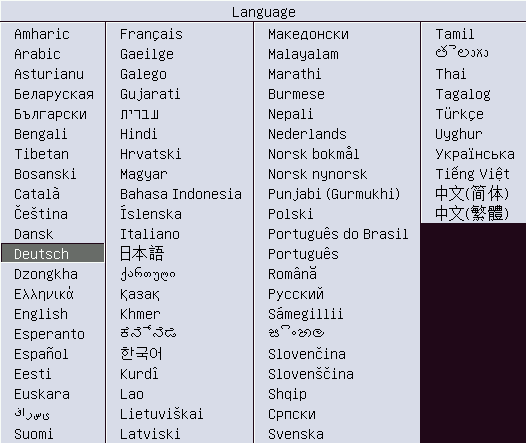
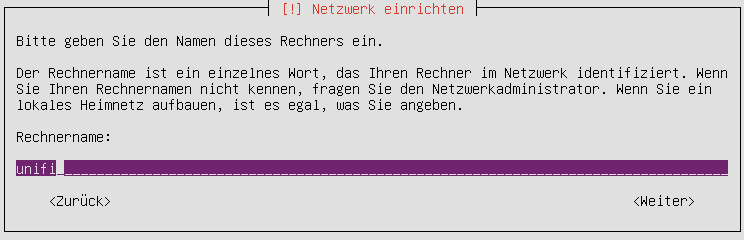
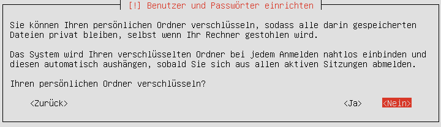
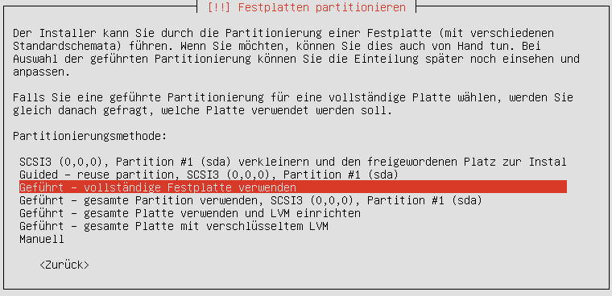
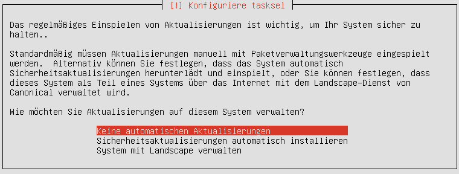

Die Installation
================

Hardwareanforderungen
---------------------

- 3 GB RAM
- Eine Netzwerkkarte im Schulnetz (VLAN 16)
- 10 GB Festplatte (bei mir im Schulbetrieb sind 3,3 GB vom 40 GB belegt).

Die Grundinstallation
---------------------

Bevor die Installation begonnen werden kann, muss ein Ubuntu-Server 16.04 64-Bit auf dem späteren Unifi-Kontroller installiert werden.

Schritt für Schritt
-------------------

Starten Sie vom Installationsmedium und wählen Sie die Sprache.

Wählen Sie `Ubuntu Server installieren`.

Bestätigen Sie die Installation in der gewählten Sprache.

Ist der Rechner bereits in `/etc/linuxmuster/workstations`, so ist der Rechnername bereits in der Eingabemaske eingetragen.

Wählen Sie einen Benutzer, seinen Benutzernamen und das Passwort.

Verschlüsseln Sie Ihren persönlichen Ordner **nicht**!

Wählen Sie `vollständige Festplatte verwenden` und bestätigen Sie die Partitionierung.

Es ist zu empfehlen, `keine automatischen Aktualisierungen` zu wählen, da Sie dann nicht von unerwarteten Aktualisierungen überrascht werden.

An Software gibt es nichts Besonderes zu wählen.

.. figure:: media/u06.png
   :alt: Softwareauswahl

Beenden Sie die Installation und starten Sie den Rechner neu.

Die Installation der Unifi-Pakete
---------------------------------

Der Rechner muss upgedatet, die Paketquellen müssen ergänzt und das Unifi-Paket installiert werden.

Schritt für Schritt
-------------------

Die englische Anleitung von Unifi finden Sie `hier <https://help.ubnt.com/hc/en-us/articles/220066768-UniFi-How-to-Install-Update-via-APT-on-Debian-or-Ubuntu>`_.

Melden Sie sich an.

öffnen Sie eine root-shell mit `sudo -i`

Updaten Sie den Rechner mit

::

  apt-get update
  apt-get dist-upgrade

Editieren Sie die Datei `/etc/apt/sources.list` und fügen Sie die folgende Zeile hinzu:

::

  deb http://www.ubnt.com/downloads/unifi/debian stable ubiquiti

Fügen Sie den GPG-key hinzu:

::

  apt-key adv --keyserver hkp://keyserver.ubuntu.com:80 --recv 06E85760C0A52C50

Nochmal updaten, unifi installieren und neu starten:

::

  sudo apt-get update
  sudo apt-get install unifi
  reboot

