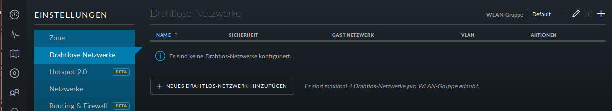
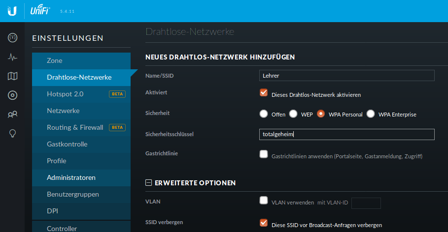

Einrichtung des Lehrer-WLANs
============================

Im Lehrer-WLAN sind alle schuleigenen Geräte und die Geräte der Lehrer. 

So könnte beispielsweise ein Lehrer mit seinem Smartphone eine Aufgabe abfotografieren und zum Beamer schicken. Oder er könnte einen Film per Smartphone direkt über einen Beamer abspielen.

.. attention:: All diese Geräte müssen in die Datei `workstations` aufgenommen sein.

.. hint:: Schülergeräte haben in diesem Netzwerk nichts zu suchen. Denn Schüler sollen nicht in der Lage sein, Filmchen per Handy zu starten.

Schritt für Schritt
-------------------

Öffnen Sie von einem Rechner im Schulnetz den Unifi-Kontroller `<https://unifi:8443>`_ und melden Sie sich an. 

.. figure:: media/u13.png
   :alt: Einstellungen

Klicken Sie unten links auf `Einstellungen`. Gehen Sie auf `drahtlose Netzwerke` .

Es ist bereits eine WLAN-Gruppe `Default` eingerichtet. Die wird Ihnen für den Betrieb in einer Schule ausreichen.

Wie erwartet sind noch keine drahtlosen Netzwerke eingerichtet. Für Ihr erstes WLAN klicken Sie auf `NEUES DRAHTLOSES NETZWERK HINZUFÜGEN`.

Geben Sie dem Lehrernetz einen Namen (z.B. Lehrer).

Wählen Sie die Verschlüsselung `WPA Personal` und ein Passwort.

Wählen sie **nicht** Gastrichtlinie. Im Schulnetz wollen Sie keine Gäste!

Wenn Sie möchten, verbergen Sie die SSID. Was Schüler nicht sehen, macht sie nicht neugierig.

Speichern Sie die Einstellungen.

Das Lehrernetz ist nun eingerichtet und wird auf alle APs ausgerollt.

