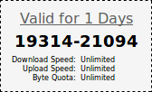
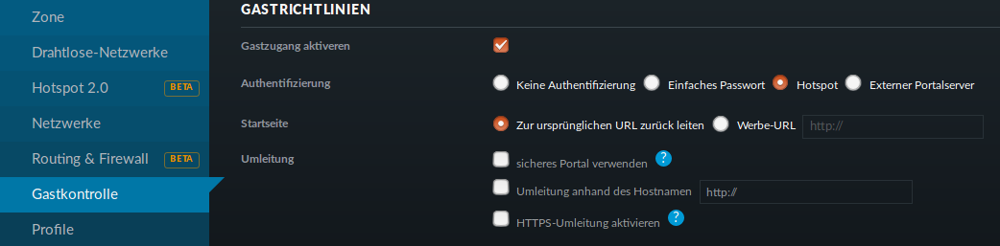
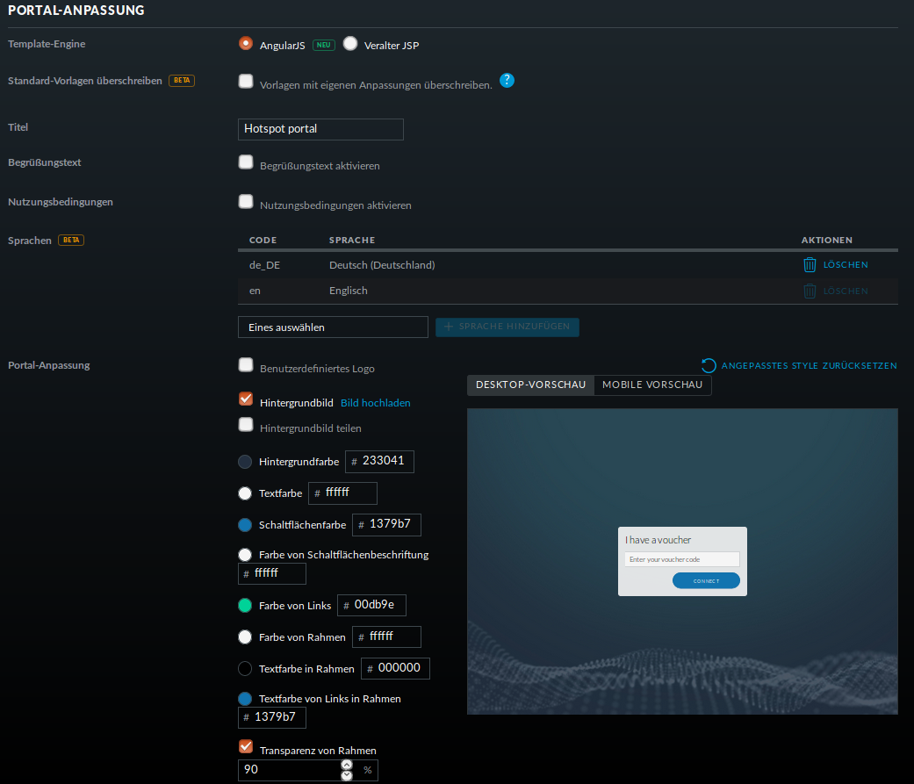
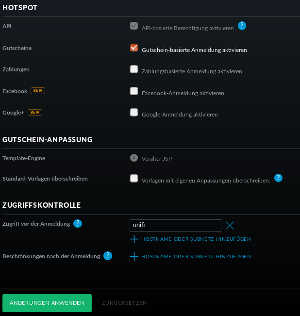
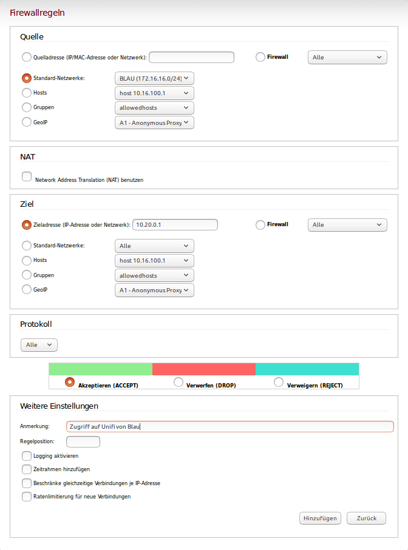
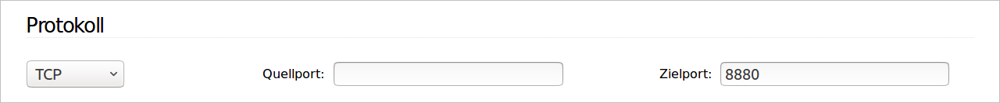
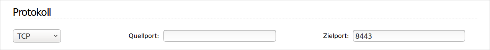

Gast-WLAN mit Gutschein / Voucher
==================================

Unifi unterstützt auch WLAN-Gutscheine (WLAN-Voucher).

Bei einem WLAN-Gutschein meldet man sich, wie in einigen Hotels, an einem unverschlüsselten Gästenetz an und wird auf eine Anmeldeseite umgeleitet. Dort gibt man einen Gutschein-Code ein.

Der Unifi-Controller unterstützt zwei Arten von Gutscheinen:

Einmaliger Gebrauch:
   Der Gutschein-Code ist nur für ein Gerät gültig. Nach der Anmeldung kann man mit seinem Gerät so lange ins Internet, bis der Gutschein abgelaufen ist. Das Gerät kann sich in dieser Zeit unbegrenzt mit dem Gäste-WLAN neu verbinden.

Mehrmaliger Gebrauch:
   Der Gutschein-Code ist für beliebig viele Geräte gültig. Sobald sich das erste Gerät mit dem Gutschein-Code angemeldet hat, beginnt die Gültigkeit des Gutscheins abzulaufen. Solche Gutscheine eignen sich beispielsweise für VHS-Kurse, die keine Accounts im Schulnetz haben.

Schritt für Schritt
-------------------

Melden Sie sich an und gehen Sie auf `Einstellungen` -> `Gastkontrolle`.

Im Bereich Gastrichtlinien setzen Sie ein Häkchen bei `Gastzugang aktivieren`.

Bei `Authentifizierung` wählen Sie `Hotspot`. 

Hat `HTTPS-Umleitung aktivieren` ein Häkchen, so werden Clients auch dann umgeleitet, wenn Sie auf HTTPS-Seiten surfen. Leider erhält man dann eine Zertifikatswarnung, da der Unifi-Kontroller mit einem selbstsignierten Zertifikat arbeitet. Allerdings leiten viele Betriebsysteme von selbst auf das Gastportal um.

In der Portal-Anpassung wählen Sie die Template-Engine AngularJS und fügen die Sprache Deutsch hinzu.

Den Rest der Einstellungen können Sie so lassen.

Unter `HOTSPOT` setzen Sie ein Häkchen bei Gutscheine.

In der `Zugriffskontrolle` müssen Sie den Zugriff auf den Unifi-Kontroller noch vor der Anmeldung erlauben, da man sonst nicht auf die Anmeldeseite kommt.

Gehen Sie auf `ÄNDERUNGEN ANWENDEN`. Damit werden die Änderungen gespeichert und auf die APs ausgerollt.

Firewall-Regeln für den IPFire
------------------------------

Damit die Clients überhaupt auf den Unifi-Kontroller zugreifen können, muss eine neue Firewallregel für den IPFire angelegt werden:

Schritt für Schritt
-------------------

Öffnen Sie den IPFire `<https://ipfire:444>`_ und melden Sie sich an.

Gehen Sie auf `Firewall`->`Firewallregeln`.

Wahlen Sie `Neue Regel erstellen`.

Machen Sie die folgenden Eingaben:

Quelle:
   Standard-Netzwerk: BLAU

Ziel:
   Zieladresse: `IP-Adresse des Unifi-Kontrollers`

Protokoll:
   Alle

Weitere Einstellungen:
   Setzen Sie einen Haken bei `Regel aktivieren`.

Speichern Sie die Regel mit `Hinzufügen` und vergessen Sie nicht, die Änderungen zu übernehmen.

Bemerkung
---------

Statt alle Protokolle zu erlauben, reicht es, die Zielports 8880 und 8443 freizugeben. Dazu müssen Sie für jeden Port eine Regel definieren.

 

