.. _linuxmuster-openvpn-label:

=====================
OpenVPN konfigurieren
=====================

.. sectionauthor:: `@dorian <https://ask.linuxmuster.net/u/dorian>`_, Ergänzungen `@cweikl <https://ask.linuxmuster.net/u/cweikl>`_

Um Schülern und Lehrern die Möglichkeit zu geben, sich via VPN in das Schulnetz "einzuwählen", beschreibt diese Dokumentation die Einrichtung des OpenVPN-Dienstes auf der Firewall OPNsense®. Sowie die Anmeldung via LDAP über den linuxmuster Server.

Voraussetzungen
===============

Die Firewall OPNsense® wurde erfolgreich in Verbindung mit dem linuxmuster.net Server (v7) eingerichtet. Sofern "vor" der OPNsense® ein Router zur Verwaltung der externen Verbindung eingesetzt wird, muss dieser ein Port - Forwarding ermöglichen, der Anfragen auf dem für VPN genutzten Port (z.B. 1194) auf die externe Schnittstelle der OPNsense® ermöglicht. Zudem muss die OPNsense® aus dem externen Netz via URL (DynDNS oder eigene Domain) erreichbar sein.

LDAP-Anbindung
==============

Melde Dich an der GUI der OPNsense® als Benutzer ``root`` an.

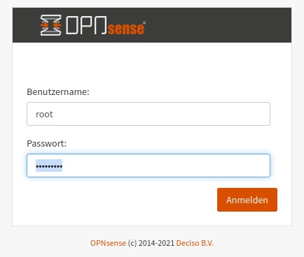

Wähle links im Menü unter dem Eintrag ``System`` --> ``Zugang`` --> ``Server`` , um einen neuen Server-Eintrag für die LDAP-Authentifizierung hinzuzufügen.

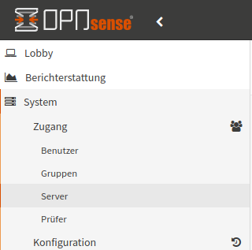

Um die LDAP-Anbindung auf der OPNsense® für Schüler und Lehrer einzurichten, durchläufst Du folgende Schritte:

Server hinzufügen
-----------------

Unter ``System`` --> ``Zugang`` --> ``Server`` einen Server hinzufügen (oben rechts). Es sind folgende Einträge vorzunehmen:

1. Beschreibender Name: ``Linuxmuster VPN Zugang``
2. Typ: LDAP
3. Hostname oder IP-Adresse: ``server.linuxmuster.lan``
4. Port-Wert: 636
5. Transport: SSL - Verschlüsselt
6. Protokollversion: 3
7. Bind-Zugangsdaten:

.. code::

   Benutzer DN: CN=global-binduser,OU=Management,OU=GLOBAL,DC=linuxmuster,DC=lan
   Suchbereich: Kompletter Unterbaum

DC-Werte wie unter 8. auf den eigenen Bind anpassen.

8. Basis-DN: ``DC=linuxmuster,DC=lan``
9. Authentifizierungscontainer: ``DC=linuxmuster,DC=lan``

DC-Werte wie unter 8. auf den eigenen Bind anpassen.

Nachstehende Abb. verdeutlicht die Anwendung der o.g. Einstellungen:

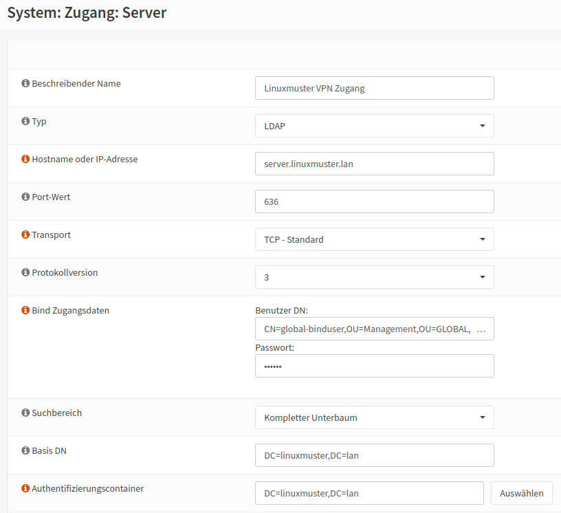

10. Erweiterte Abfrage: ``Schüler und Lehrer``:

.. code::

   |(memberof=CN=role-student,OU=Groups,OU=GLOBAL,DC=linuxmuster,DC=lan)(memberof=CN=role-teacher,OU=Groups,OU=GLOBAL,DC=linuxmuster,DC=lan)

O D E R

Erweiterte Abfrage: ``Nur Lehrer``:

.. code::

  (memberof=CN=role-teacher,OU=Groups,OU=GLOBAL,DC=linuxmuster,DC=lan)

11. Benutzerbennenungsattribut: ``sAMAccountName``

Nachstehende Abb. verdeutlicht die Anwendung der o.g. Einstellungen:

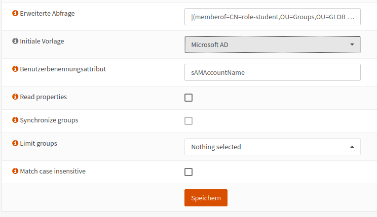

Danach sollte der Login mit beliebigen Nutzern getestet werden. Erst nachdem die Tests erfolgreich waren fortgahren.
Dies kann unter ``System > Zugang > Prüfer`` und der Auswahl des vorhin angelegten Authentifizierungsservers für den  Linuxmuster VPN-Zugang erfolgen.

Zertifikate erstellen
=====================

Der OpenVPN Server braucht eine CA, um das Serverzertifikat zu erstellen. Man kann entweder eine neue CA generieren, oder die vom linuxmuster Setup erzeugte CA verwenden. In dieser Dokumentation wird die Erstellung einer neuen CA dargestellt, die nur für das VPN verwendet werden soll.

CA erstellen
------------
Unter ``System`` --> ``Zugang`` --> ``Sicherheit`` --> ``Aussteller``

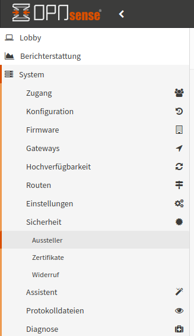

ist ein Aussteller hinzuzufügen (oben rechts).
Es sind folgende Einstellungen vorzunehmen:

1.  Beschreibender Name: ``Linuxmuster VPN CA`` <eigener Name> 
2.  Vorgehen: Erstelle eine interne Zertifizierungsstelle
3.  Key Type: RSA
4.  Schlüssellänge: 4096
5.  Hash-Algorithmus: SHA512
6.  Lebenszeit (Tage): <frei wählbar>

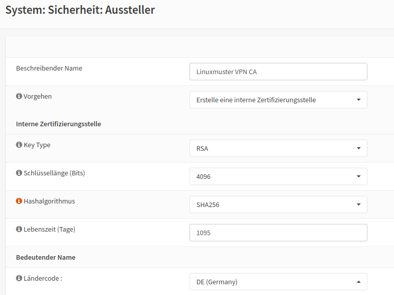

7.  Bedeutender Name: <dein bedeutender Name für die CA>

Die erstellte CA findet sich unter ``System`` --> ``Zugang`` --> ``Sicherheit`` --> ``Aussteller`` wie in nachstehender Abb. dargestellt:

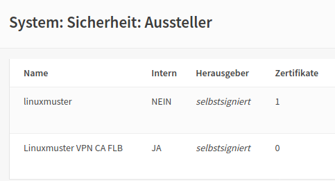

Zertifikat hinzufügen
---------------------

Danach ist unter Unter ``System`` --> ``Sicherheit`` --> ``Zertifikate`` ein Zertifikat hinzuzufügen (oben rechts).

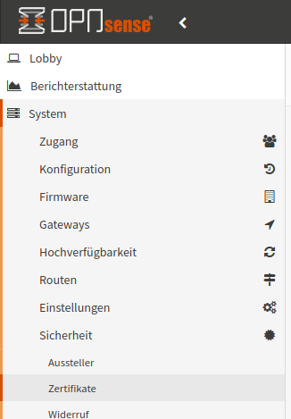

Folgende Eingaben sind zu treffen:

1.  Vorgehen: Erstelle ein neues internes Zertifikat
2.  Beschreibender Name: Linuxmuster VPN Server
3.  Zertifizierungsstelle: Linuxmuster VPN CA
4.  Type: Serverzertifikate
5.  Key Type: RSA
6.  Schlüssellänge: 4096
7.  Hash-Algorithmus: SHA512
8.  Lebenszeit (Tage): frei wählbar!
9.  Private Key Location: Save on this firewall
10. Bedeutender Name: <dein bedeutender Name für das Zertifikat>

Folgende Abb. gibt diese Einstellungen wieder:

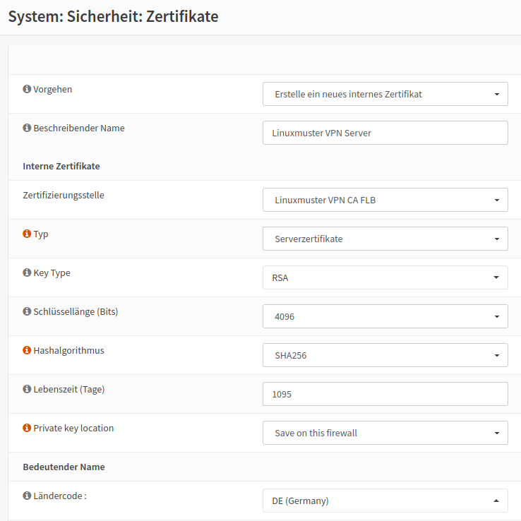

OpenVPN-Server erstellen
========================

Unter ``VPN`` --> ``OpenVPN`` --> ``Server`` ist ein OpenVPN-Server zu erstellen (oben rechts).

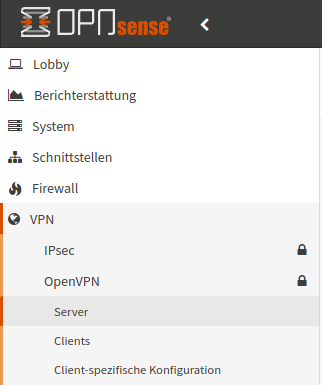

Es sind folgende Eingaben sind zu treffen:

1.   Beschreibender Name: ``Linuxmuster VPN``
2.   Servermodus: Remotezugriff (Benutzerauthentifizierung)
3.   Backend Authentifizierung: Linuxmuster VPN Zugang
4.   Lokale Gruppe erzwingen (keiner)
5.   Protokoll: UDP
6.   Gerätemodus: tun
7.   Schnittstelle: WAN
8.   Lokaler Port: (frei wählbar) 25008
9.   TLS Authentifikation: Beides angehakt lassen
10.  Peer-Zertifizierungsstelle: Linuxmuster VPN CA
11.  Peerzertifikatsrückrufliste: Keine
12.  Serverzertifikate: Linuxmuster VPN Server

Nachstehende Abb. verdeutlicht diese Einstellungen:

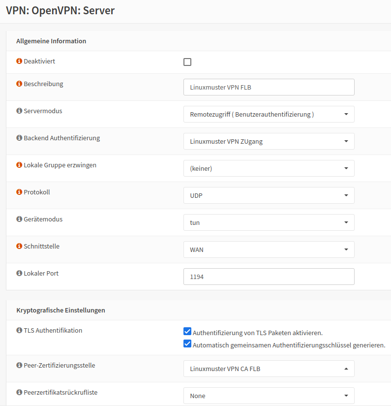

13.  DH Parameterlänge: 4096
14.  Verschlüsselungsalgorithmus: AES-256-CBC (256-bit key, 128-bit block)
15.  Authentifizierungs-Digestalgorithmus: SHA512 (512-bit)
16.  Hardwarekryptografie: No Hardware Crypto Acceleration
17.  Zertifikatstiefe: Eins (Client+Server)

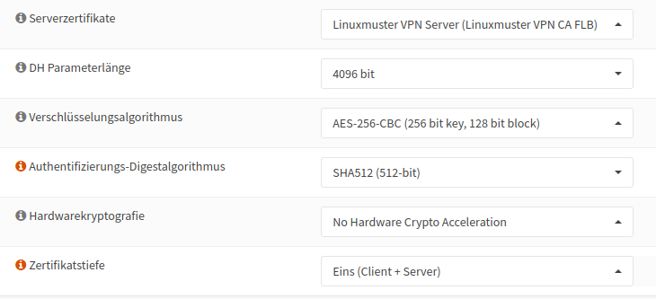

18.  IPv4 Tunnelnetzwerk: Ein Netzbereich in dem die VPN Clients ihre IP bekommen z.B. 172.30.1.0/24 oder 192.168.100.0/24
19.  IPv6 Tunnelnetzwerk:
20.  Weiterleitungs Gateway:
21.  Lokales IPv4-Netzwerk: 10.0.0.0/16 --> hier ist das beim Setup gewählte linuxmuster-Netz anzugeben
22.  Lokales IPv6-Netzwerk:
23.  Fernes IPv4-Netzwerk:
24.  Fernes IPv6-Netzwerk:
25.  Konkurrierende Verbindungen:
26.  Komprimierung: Aktiviert mit adaptiver Kompression

27.  Typ des Dienstes:
28.  Inter-Client-Kommunikation:
29.  Doppelte Verbindungen:
30.  IPv6 deaktivieren:
31.  Für den Rest: Standardwerte!

Hast Du den VPN-Server erfolgreich hinzugefügt, so wird dieser in der Übersicht angezeigt. Siehst Du vor der Angabe des Protokolls ein ``grünes`` Dreieck, dann läuft der VPN-Server.

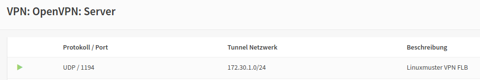

Firewall Regeln
===============

Es müssen nun Regeln definiert werden, die die VPN-Anfragen an die Firewall weitergeben und nach erfolgreicher Authentifizierung den VPN-Datenverkehr zulassen.

Unter ``Firewall`` --> ``Regeln`` --> ``WAN`` eine neue Regel anlegen (oben rechts).
Folgende Eingaben sind zu treffen:

1.  Protokoll: UDP
2.  Ziel: Diese Firewall
3.  Zielportbereich: von: 25008 bis: 25008 (ggf. anpassen an eigene Portwahl -> in der Abb. 1194)
4.  Für den Rest: <Standardwerte>

In der Regelansicht stellt sich diese wie folgt dar:

.. image:: media/15-vpn-add-openvpn-fw-rule-wan-interface.png
   :alt: Add VPN rule on WAN interface for VPN Port
   :align: center

Danach unter ``Firewall`` --> ``Regeln`` --> ``OpenVPN`` eine neue Regel anlegen (oben rechts).
Hier findet sich jetzt nach der Anlage des VPN-Servers eine neuer Menüeintrag für OpenVPN:

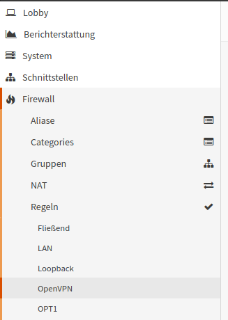

Es sind folgende Eingaben vorzunehmenn:

1.  Quelle: 172.30.1.0/24 -> das VPN-Netz, das Du für den OpenVPN-Server zuvor eingerichtet hast.
2.  Für den Rest: <Standardwerte>

Änderungen übernehmen (rechts im blauen Kasten).

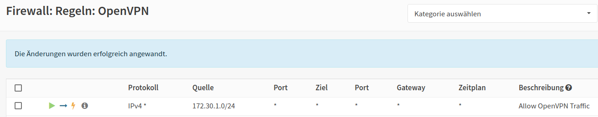

Sollte ein Router das externe Netz bedienen und befindet sich die OPNsense® "hinter" dem Router, so so muss auf dem Router eine POrt-Forwarding Regeln für den gewünschten VPN-Port und das TCP-Protokoll eingerichtet werden, so dass alle externen Pakete auf diesem Port via UDP zur externen Schnittstelle der OPNsense® weitergeleitet werden.

In der OPNsense® ist dann unter ``Firewall`` --> ``NAT`` --> ``Portweiterleitung`` eine Regel hierzu anzulegen.

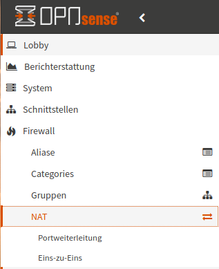

Hier legst Du nun eine Regel an, die UDP-Pakete, die an diese Firewall auf dem gewählten VPN-Port (hier in dem Beispiel Port 1194) ankommen, an die externe Schnittstelle (IP aus einem privaten Netz) der Firewall und den hier konfigurierten Port weitergegeben werden.

Nachstehende Abb. verdeutlicht diese Regel:

Zwischen dem Router, der die externe Verbindung bedinet und der externen Schnittstelle der Firewall wird i.d.R. ein privates Netz (z.B. 192.168.200.0/24) verwendet. Daher muss hier eine Weiterleitungsregel für NAT angelegt werden, sonst werden die eingehenden Pakete vom Router nicht an die Firewall weitergegeben.

Konfiguration exportieren
=========================

Für die Verbidnung mit den Clients muss nun ein Export des Profils für den Benutzer erfolgen.

Dazu gehst Du zu ``VPN`` --> ``OpenVPN`` --> ``Clientexport``.
Dort gibst Du Folgerndes an:

1.  Ferner Zugriffsserver: ``Linuxmuster VPN UDP:25008`` --> Server aus der Liste auswählen, Port wie von Dir vorher angegeben.
2.  Export type: Nur Datei
3.  Hostname: URL unter dem die Firewall erreichbar ist, z.B: vpn.meineschule.de
4.  Port: 25008 (ggf. anpassen an eigene Portwahl)
5.  Für den Rest: <Standardwerte>

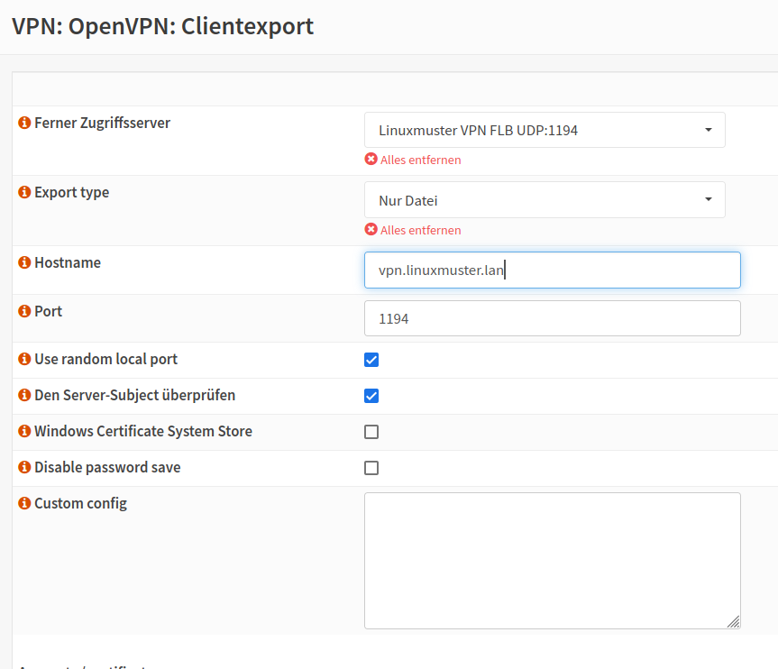

Danach drückst Du unter ``Accounts / certificates`` bei Linuxmuster VPN Server ganz rechts auf das Downloadsymbol.

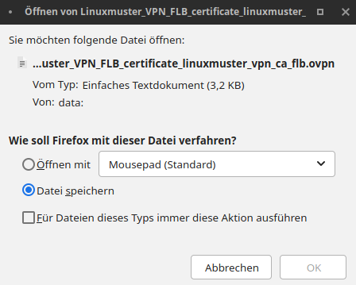

Diese Konfigurationseinstellungen kannst Du nun allen Nutzern (z.B. Lehrern und Schülern), die Zugriff auf der Schulnetz via VPN haben sollen, im Intranet oder via Messenger zur Verfügung stellen.

mit VPN verbinden
=================

Bevor Du nun die Verbindung mit einem Client zum VPN-Server testest, überprüfe zuerst, ob der Dienst läuft.
In der GUI der OPNsense® klickst Du links auf den Menüeintrag ``Lobby`` und siehst rechts alle Dienste mit ihrem Status aufgelistet. Hier muss für OpenVPN Server ein ``grünes`` Dreieck zu sehen sein. Dies weist daraufhin, dass der Dienst läuft.

OpenVPN Client
--------------

Installiere Dir auf Deinem Gerät (PC, Tablet, Smartphone) den OpenVPN Client. Die heruntergeladene Datei muss nun auf das Endgerät heruntergeladen und dort in die App OpenVPN Connect (für alle Plattformen) importiert werden. Nach dem Import kann durch Eingabe von Benutzername und Passwort eine VPN-Verbindung hergestellt werden.

Auf der OPNsense® kannst Du den Verbindungsstatus der VPN-Verbindungen unter ``VPN`` --> ``OpenVPN`` --> ``Verbindungsstatus`` überprüfen.

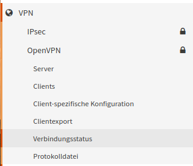

Hier werden dann die Benutzer mit den zugeordneten VPN-Verbindungen angezeigt:

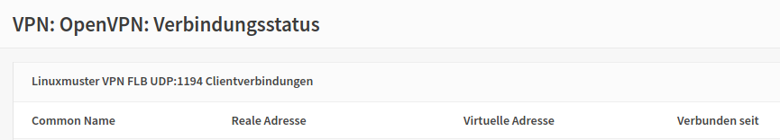

Troubleshooting
---------------

Sollte die Verbindung nicht erfolgreich aufgebaut werden können, prüfe Folgendes ab:

1. Ist die OPNsense® von extern via URL erreichbar ?
2. Antwortet die OPNsense® auf dem eingestellten VPN Port ?
3. Kommen die VPN - Pakete (ggf. Prot-Forwarding) auf der OPNsense® an?
4. Werden die VPN-Pakete auf der WAN-Schnittstelle zugelassen (siehe Live-Logs)?

