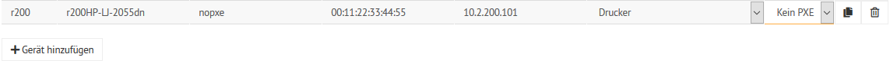

Drucker via Schulkonsole hinzufügen
===================================

.. sectionauthor:: `@cweikl <https://ask.linuxmuster.net/u/cweikl>`_

Viele Printserver und Netzwerkdrucker sind in der Lage, Ihre IP-Adresse von einem DHCP-Server zu beziehen.
Zuerst muss der Drucker am Server mithilfe der Schulkonsole hinzugefügt werden.
Hierbei wird dem Drucker ein Name sowie eine IP-Adresse zugewiesen.

Für das folgende Beispiel nehmen wir an, der Drucker stehe in Raum
"r200", bekomme den Namen "r200-pr01", habe die MAC-Adresse
"00:11:22:33:44:55" und bekomme entsprechend einem IP-Adressschema die
IP-Adresse 10.2.200.101.

Melde Dich als ``global-admin`` in der `Schulkonsole (https://10.0.0.1) <https://10.0.0.1>`_ an.
Wähle dort links im Menü ``Geräteverwaltung`` das Untermenü ``Geräte`` aus.

.. image:: media/add-printer-devices_01_schulkonsole.png
   :alt: Schulkonsole devices
   :align: center

Klicke unterhalb der Geräteliste auf den Eintrag ``Gerät hinzufügen``.

Es wird eine leere Zeile zur Liste hinzugefügt.

.. image:: media/add-printer-devices_02_schulkonsole.png
   :alt: Schulkonsole neuer Drucker
   :align: center

Die Option PXE ist zu deaktivieren, da die Drucker nicht via PXE starten. Als Gruppe ist ``nopxe`` einzutragen.

Für o.g. Beispieldrucker stellt sich der Eintrag wie folgt dar:

Bestätige den Eintrag mit ``speichern & importieren``.

.. attention::

   Den hier vergebenen Druckernamen musst Du später in identischer Schreibweise in CUPS angeben (siehe nächstes Unterkapitel).

Es erscheint ein Fenster, in dem der Vorgang bestätigt wird.

.. image:: media/add-printer-devices_04_schulkonsole.png
   :alt: Schulkonsole: Drucker hinzugefügt
   :align: center

Danach ist ein Neustart des Druckers empfehlenswert, damit dieser die neue IP-Adresse übernimmt.

Die Erreichbarkeit des Druckers sollte nach dem Neustart des Druckers vom Server aus vorab
mithilfe des ping-Befehl überprüft werden.
