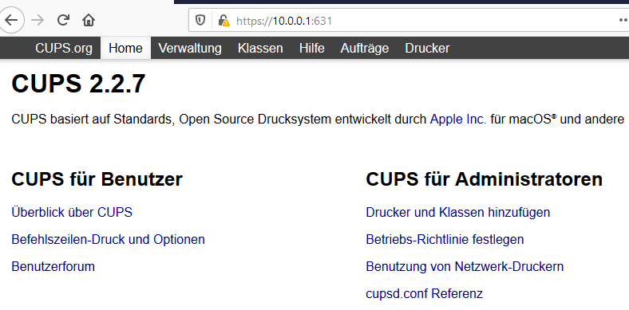
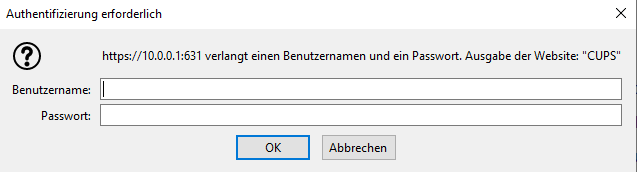
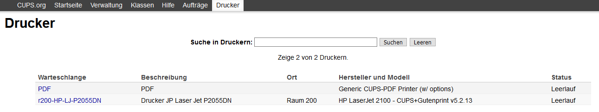

Drucker auf dem Server hinzufügen
=================================

.. sectionauthor:: `@cweikl <https://ask.linuxmuster.net/u/cweikl>`_

Um die als Geräte bereits importieren Netzwerkdrucker einzurichten, sind diese auf dem linuxmuster.net Server mithilfe von CUPS einzurichten und bereitzustellen. Die gesamte Druckersteuerung erfolgt via Active Directory für alle Betriebssysteme, so dass diese zunächst auf dem Server bereitgestellt, den AD-Gruppen zugewiesen und ggf. Anpassungen pro Client Betriebssystem vorgenommen werden müssen.

Starte auf einem Rechner einen Browser, um das sog. CUPS-Webinterface des Servers zur weiteren Einrichtung der Drucker aufzurufen. Hierzu füge nachstehende URL in der Adresszeile deines Browsers ein:

.. code::

   https://10.0.0.1:631

Da meist nur ein selbst-signiertes Zertifikat auf dem Server installiert ist, ist es i.d.R. erforderlich, dem benutzten Browser die sichere Kommunikation ausnahmsweise zu erlauben (SSL-Zertifikat akzeptieren).

Es erscheint die Login-Aufforderung von CUPS auf dem Server:

Melde dich als ``root`` dort an.

Drucker hinzufügen
------------------

Nach der Anmeldung an CUPS wähle den Menüpunkt ``Verwaltung`` aus.

.. image:: media/07-printers-cups-add-printer.png
   :alt: CUPS: add printer
   :align: center

Rufe den Untermenüpunkt ``Drucker hinzufügen`` aus. Es erscheint nachstehende Maske. Wähle als Netzwerkdrucker i.d.R. LPD/LPR-Host aus und klicke auf ``weiter``.

.. image:: media/08-printer-cups-add-printer-01.png
   :alt: add printer 1/5
   :align: center

Gebe als Verbindung die IP-Adresse und den Port des LPD-Druckers wie in der Abb. an:

.. image:: media/09-printer-add-printer-02.png
   :alt: add printer 2/5
   :align: center

Klicke auf ``weiter``. Wähle nun den geeigneten Druckertreiber für deinen Drucker aus:

.. image:: media/10-printer-add-printer-02.png
   :alt: add printer 3/5
   :align: center

Hierzu wähle den Hersteller aus, dann erscheint eine Liste mit den verfügbaren Druckertreibern. Wähle in der Liste den korrekten Drucker aus. Sollte dieser in der Liste nicht enthalten sein, so klicke auf 
``PPD-Datei bereitstellen -> Durchsuchen``. Wähle nun die PPD-Datei mit dem korrekten Druckertreiber aus, den Sie zuvor von der Website des Herstellers heruntergeladen hast.

.. image:: media/11-printer-add-printer-05.png
   :alt: add printer 4/5
   :align: center

Drucker konfigurieren
---------------------

Danach erscheinen die Standardeinstellungen für den hinzugefügten Drucker. Wähle hier die gewünschten Einstellungen aus und speichere diese als ``Standardeinstellungen festlegen``. Gebe unter  ``Fehlerbehandlung``  **abort-job** an, um sicherzustellen, dass CUPS im Fehlerfall den Druckjob löscht.

.. image:: media/12-printer-define-standard-printing-options.png
   :alt: add printer 5/5
   :align: center

Damit der Drucker nur von berechtigten Nutzern verwendet werden kann, muss noch der Kreis der erlaubten Benutzer festgelegt werden: Gebe unter ``Erlaubte Benutzer festlegen`` die Gruppe ``@printing`` an. Lehrer sind standardmäßig in der Gruppe. Bei Schülern wird die Zugehörigkeit über die Spalte **Drucken** in der Schulkonsole gesteuert.

.. image:: media/15-printer-define-allowed-users.png
   :alt: printer: allowed user
   :width: 200
   :align: center

Danach findet sich der neue Drucker in der Druckerliste in CUPS.

Nun wird dein Netzwerkdrucker vom Server den Clients bereitgestellt.

Angesprochen wird obiger Drucker über folgende URL:

.. code::

   http://10.0.0.1:631/printers/r200-HP-LJ-P2055DN

