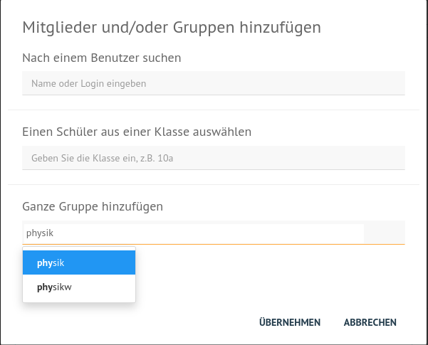
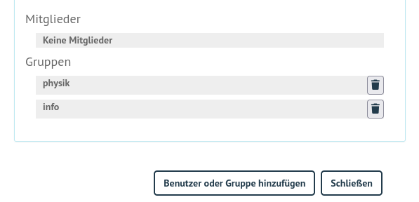

.. include:: /guided-inst.subst
.. _add-ad-group-label:

Drucker einzelnen Räumen zuweisen
=================================

.. sectionauthor:: `@cweikl <https://ask.linuxmuster.net/u/cweikl>`_, `@rettich <https://ask.linuxmuster.net/u/rettich>`_

Die Zuordnung der Drucker auf die Räume wird mit Hilfe der Schulkonsole gemacht.

Melde dich dazu als ``global-admin an`` der Schulkonsole an und gehe unter Klassenzimmer auf Einschreiben.

Es werden dir deine Drucker angezeigt. Klicke den Drucker an, den du einem Raum zuordnen möchtest. In unserem Beispiel klicke ich auf ``physiklaser1``.

.. image:: media/configure-ad-group_02.png
   :alt: Schulkonsole Klassenzimmer Einschreiben physiklaser1
   :align: center

Im Augenblick ist unter Gruppen noch keine Gruppe eingetragen. Damit ist der Drucker noch keinem Raum zugeordnet. Das änderst du, indem du auf ``Benutzer oder Gruppe hinzufügen`` klickst.

Gib den Namen des Raums, dem der Drucker zugewiesen werden soll, ein und bestätige mit einem Klick auf ``ÜBERNEHMEN``.

Danach sollten die Raumnamen, denen der Drucker zugewiesn ist unter Gruppen aufgeführt sein. Natürlich kann man einen Drucker auch zwei Räumen zuweisen. Das macht dann Sinn, wenn sich mehrere Räume einen Drucker teilen. 

Alle Rechner, die im Physikraum stehen, werden ab „jetzt“ Zugriff auf den PhysikLaser1 haben.
Allerdings kann es eine ganze Weile dauern, bis sich dieser Eintrag auf die Druckerverteilung auswirkt. Starte am besten Deinen Client neu.
