.. _add-ad-group-label:

Drucker einzelnen Räumen zuweisen
=================================

.. sectionauthor:: `@cweikl <https://ask.linuxmuster.net/u/cweikl>`_, `@rettich <https://ask.linuxmuster.net/u/rettich>`_

.. attention::

   Sobald diese Funktion in der Schulkonsole zur Verfügung steht, wird dieser Teil der Dokumentation ergänzt.
   
Für die Raumzuweisung von Druckern eignet sich am besten das `Apache Directory Studio`. Das `Apache Direktory Studio` braucht das Java Development Kit. Lade dafür von 
`www.oracle.com <https://www.oracle.com/de/java/technologies/javase-downloads.html>`_
die Installationsdatei und installiere sie.
Lade anschließend von `directory.apache.org <https://directory.apache.org/studio/>`_ die aktuelle Version des `Apache Direktory Studios` herunter und installiere sie ebenfalls.

.. hint::

   Auf dem Ubuntu-Client kann das `Apache Directory Studio` direkt ausgeführt werden.

Schauen wir uns mit dem `Apache Directory Studio` die AD-Struktur etwas genauer an. Dazu müssen wir zunächst eine Verbindung zum Server aufbauen.

Starte das `Apache Directory Studio` und gehe in der Menü-Leiste auf ``Datei → Neu``.

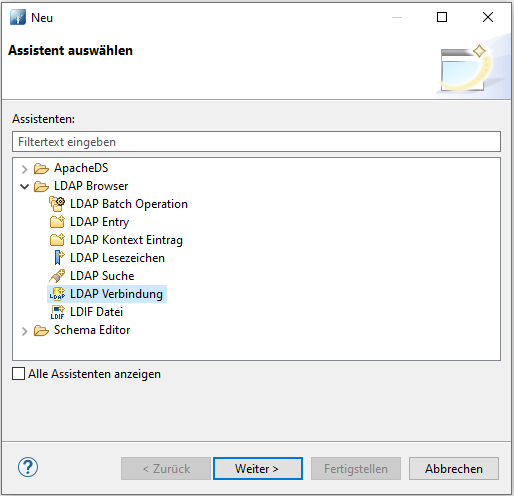

Wähle ``LDAP-Verbindung`` und klicke auf ``weiter``.

Gib der Verbindung einen Namen und trage die Verbindungsdaten des Servers ein.

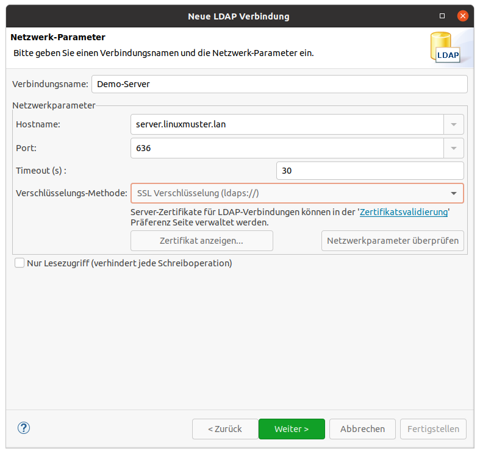

Klicke auf Netzwerkparameter überprüfen. Falls der Server nur ein selbst signiertes Zertifikat hat, erscheint der folgende Dialog: 

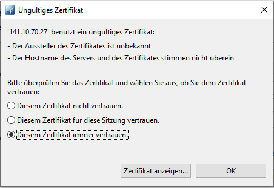

Wähle ``Diesem Zertifikat immer vertrauen`` und klicke auf ``ok``.
Wenn Du jetzt auf Netzwerkparameter überprüfen klicken, sollte die Verbindung erfolgreich aufgebaut werden.
       
Nachdem Du auf ``weiter`` geklickt hast, erscheint ein neues Dialogfenster in dem die Anmeldeinformationen abgefragt werden.

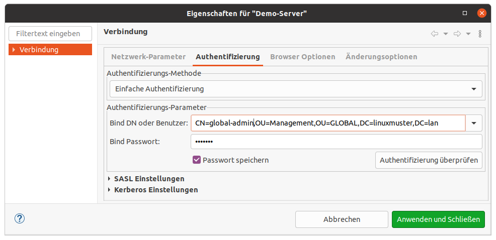

Als Bind DN trägst Du ``CN=global-admin,OU=Management,OU=GLOBAL,`` gefolgt von Deiner DN ein. In diesem Beispiel ist das
``CN=global-admin,OU=Management,OU=GLOBAL,DC=linuxmuster,DC=lan``.

.. hint::

   Du nutzt hier den global-admin, weil Du Schreibrechte brauchst. Sicherheitshalber solltest Du vor Deiner Arbeit einen Snapshot des Servers machen. 
     
Klicke auf ``Anwenden und Schließen``.

Der Baum des AD wird geladen und angezeigt.

Schreib Dich in der Schulkonsole bei den Druckern ein.

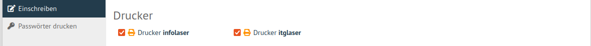

Im AD-Baum sieht das dann so aus:

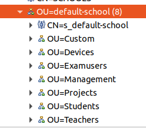

In ``Devices`` findest Du Klassenräume und ihre Rechner. Und es gibt dort auch die ``printer-groups`` in der die Drucker zu finden sind.
In ``Students`` sind die Klassen und ihre Schüler.
Und in ``Teachers`` findest Du die Lehrer.
 
Im Eintrag des Benutzers sind die Drucker als memberOf eingetragen.

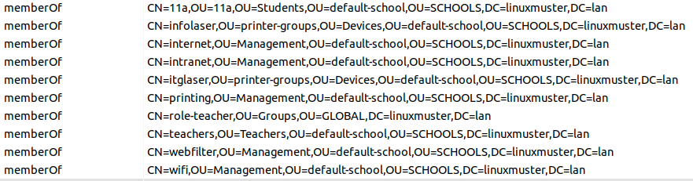

Beim Eintrag des Druckers ist der Benutzer als member eingetragen.

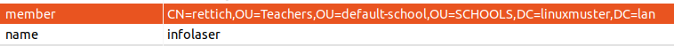

Genau so tragen wir die Gruppe eines Raums als Member in die Gruppe eines Druckers ein. Im Beispiel soll der Informatikraum in die Gruppe des InfoLasers eingetragen werden.

Navigiere zum Gruppeneintrag des Informatik-Raums.

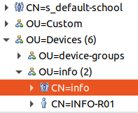

Im mittleren Fenster werden die Einträge der Gruppe info angezeigt.
Kopiere mit einem Rechtsklick den ``distinguishedName``.

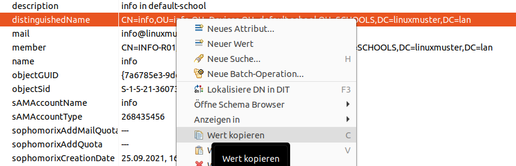
       
Navigiere zur Gruppe des Druckers.

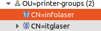

und klicke auf ``Neues Attribut...``

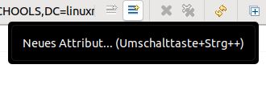

Als Attribut-Typ gibst Du ``member`` ein und klickst anschließend auf ``Fertigstellen``.

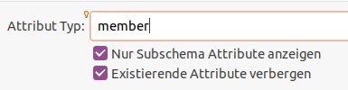

Jetzt Fügst Du mit <Strg>+V den vorher kopierten distinguishedName ein und klickst anschließend auf ``OK``. 

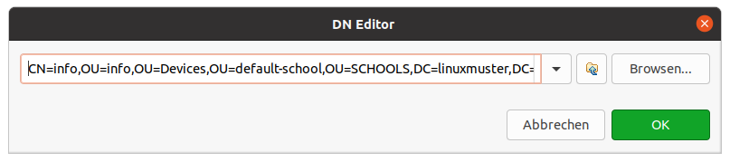

Alle Rechner die im Informatikraum stehen, werden ab „jetzt“ Zugriff auf den InfoLaser haben.
Allerdings kann es eine ganze Weile dauern, bis sich dieser Eintrag auf die Druckerverteilung auswirkt. Starte am besten Deinen Client neu.
