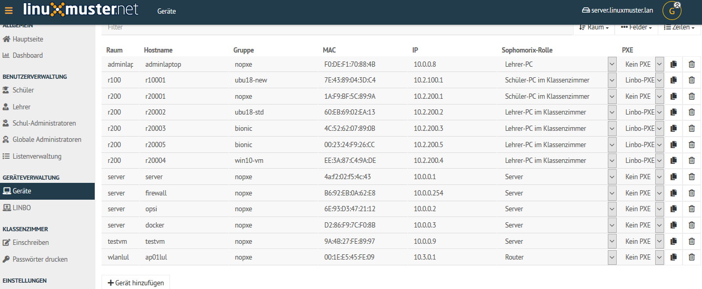
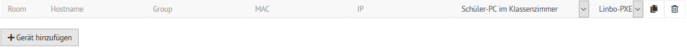
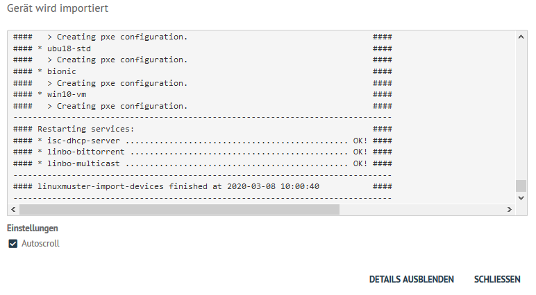

Wie füge ich Drucker hinzu?
===========================

.. sectionauthor:: `@cweikl <https://ask.linuxmuster.net/u/cweikl>`_

Viele Printserver und Netzwerkdrucker sind in der Lage Ihre IP-Adresse von einem DHCP-Server zu beziehen.
Zuerst muss der Drucker am Server mithilfe der Schulkonsole hinzugefügt werden.
Hierbei wird dem Drucker ein Name sowie eine IP-Adresse zugewiesen.

Für das folgende Beispiel nehmen wir an, der Drucker stehe in Raum
"R203", bekomme den Namen "r203-pr01", habe die MAC-Adresse
"00:11:22:33:44:55" und bekomme entsprechend einem IP-Adressschema die
IP-Adresse 10.16.203.101.

Melden Sie sich als **global-admin** in der `Schulkonsole (https://10.0.0.1) <https://10.0.0.1>`_ an.
Wählen Sie dort links im Menü ``Geräteverwaltung`` das Untermenü ``Geräte`` aus.

Klicken Sie unterhalb der Geräteliste auf den Eintrag ``Gerät hinzufügen``.

Es wird eine leere Zeile zur Liste hinzugefügt.

Die Option PXE ist zu deaktivieren, da die Drucker nicht via PXE starten. Als Gruppe ist nopxe einzutragen.

Für o.g. Beispieldrucker stellt sich der Eintrag wie folgt dar:

.. image:: media/03-printer-devices-add-example.png
   :alt: Schulkonsole Eintragungen für den Beispieldrucker
   :align: center

Bestätigen Sie den Eintrag mit ``speichern & importieren``.

Es erscheint ein Fenster, in dem der Vorgang bestätigt wird.

Danach ist ein Neustart des Druckers empfehlenswert, damit dieser die neue IP-Adresse übernimmt.

Die Erreichbarkeit des Druckers sollte nach dem Neustart des Druckers vom Server aus vorab
mithilfe des ping-Befehl überprüft werden.
