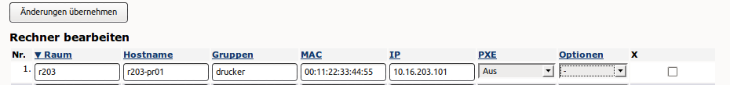

Wie füge ich Drucker hinzu?
===========================

Viele Printserver und Netzwerkdrucker sind in der Lage Ihre IP-Adresse von einem DHCP-Server zu beziehen.
Zuerst muss der Drucker am Server mithilfe der Schulkonsole hinzugefügt werden.
Hierbei wird dem Drucker ein Name sowie eine IP-Adresse zugewiesen.

Für das folgende Beispiel nehmen wir an, der Drucker stehe in Raum
"R203", bekomme den Namen "r203-pr01", habe die MAC-Adresse
"00:11:22:33:44:55" und bekomme entsprechend einem IP-Adressschema die
IP-Adresse 10.16.203.101.

Melden Sie sich als **administrator** in der `Schulkonsole (https://server:242) <https://server:242>`_ an.
Wählen Sie dort die Reiterkarte "Hosts" aus und fügen Sie den Drucker gemäß dem nachstehenden Schema hinzu:

Die Option PXE ist zu deaktivieren, da die Drucker nicht via PXE starten.

Bestätigen Sie den Eintrag mit "Änderungen übernehmen".

Ein Neustart des Druckers ist empfehlenswert, damit dieser die neue IP-Adresse übernimmt.

..
   ...auf der Konsole ändern
   -------------------------

   Melden Sie sich auf der Kosole des linuxmuster.net Servers an. Rufen Sie mit einem Editor Ihrer Wahl die
   Datei /etc/linuxmuster/workstations auf.

   Mit vi:

   .. code-block:: bash

     vi /etc/linuxmuster/workstations

   In der Datei ist der Drucker nach folgendem Schema hinzuzufügen:

   .. code-block:: bash

     Raum;Hostname;Gruppe;MAC;IP-Adresse;Subnetmask;0;0;0;0;PXE

   Dies sieht mit Beispieldaten wie folgt aus:

   .. code-block:: bash

     h109drucker;h109drucker121;drucker;12:34:45:78:9A:BC;10.24.109.101;255.240.0.0;0;0;0;0;0

   Die Ziffer 22 im letzten Feld bedeutet, dass das Gerät via PXE started. Für Drucker sollte der Wert daher auf 0 gesetzt werden.

   Die Änderungen sind zu speichern.

   Auf der Konsole des linuxmuster.net Servers ist danach nachstehender Befehl auszuführen, um die Drucker zu importieren:

   .. code-block:: bash

     import_workstations

   Wurde der Drucker erfolgreich hinzugefügt, so ist dieser nun mithilfe der IP-Adresse anzusteuern.
   Dies kann wie folgt getestet werden:

   .. code-block:: bash

      ping <IP-Adresse> |z.B. ping 10.24.109.101

   Bei erfolgreicher Einrichtung, antwortet der Drucker auf den ping-Befehl.
