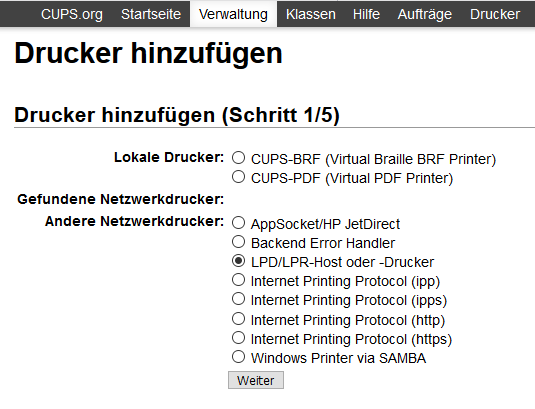
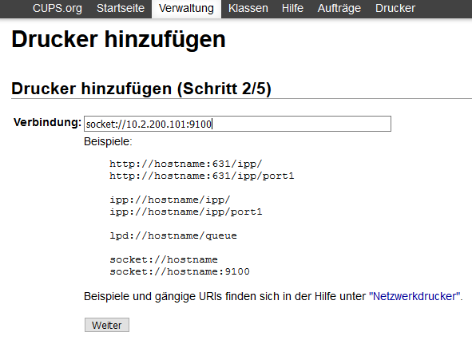

Wie richte ich Drucker am Server ein?
=====================================

.. sectionauthor:: `@cweikl <https://ask.linuxmuster.net/u/cweikl>`_

Um die eingesetzten Netzwerkdrucker serverseitig einzurichten, sind diese mithilfe eines Browsers hinzuzufügen und einzurichten.

Starten Sie auf einem Rechner einen Browser, um das sog. CUPS-Webinterface des Servers zur weiteren Einrichtung der Drucker 
aufzurufen. Hierzu fügen Sie nachstehende URL in der Adresszeile Ihres Browsers ein:

https://10.0.0.1:631

Da meist nur ein selbst-signiertes Zertifikat auf dem Server installiert ist, ist i.d.R. erforderlich, dem benutzten Browser 
die sichere Kommunikation ausnahmsweise zu erlauben (SSL-Zertifikat akzeptieren).

.. image:: media/05-printer-cups-setup.png
   :alt: CUPS aufrufen
   :align: center

Es erscheint die Login-Aufforderungvon CUPS auf dem Server:

.. image:: media/06-printer-cups-login.png
   :alt: CUPS: Anmeldung
   :align: center

Melden Sie sich als ``root`` dort an.

Drucker hinzufügen
------------------

Nach der Anmeldung an CUPS wählen Sie den Menüpunkt ``Verwaltung`` aus.

.. image:: media/07-printers-cups-add-printer.png
   :alt: CUPS: Drucker hinzufügen
   :align: center

Rufen Sie den Untermenüpunkt ``Drucker hinzufügen`` aus.
Es erscheint nachstehende Maske. Wählen Sie als Netzwerkdrucker i.d.R. LPD/LPR-Host aus und klicken Sie
auf ``weiter``.

Geben Sie als Verbindung die IP-Adresse und den Port des LPD-Druckers wie in der Abb. an:

Klicken Sie auf ``weiter``. Wählen Sie nun den geeigneten Druckertreiber für Ihren Drucker aus:

.. image:: media/10-printer-add-printer-02.png
   :alt: Drucker: hinzufügen 3/5
   :align: center

Hierzu wählen Sie den Hersteller aus, dann erscheint eine Liste mit den verfügbaren Druckertreibern. Wählen
Sie in der Liste den korrekten Drucker aus. Sollte dieser in der Liste nicht enthalten sein, so klicken Sie auf 
``PPD-Datei bereitstellen - Durchsuchen``. Wählen Sie nun die PPD-Datei mit dem korrekten Druckertreiber aus, 
den Sie zuvor von der Website des Herstellers heruntergeladen haben.

.. image:: media/11-printer-add-printer-05.png
   :alt: Drucker: hinzufügen 4/5
   :align: center

Drucker konfigurieren
---------------------

Danach erscheinen die Standardeinstellungen für den hinzugefügten Drucker. Wählen Sie hier die gewünschten 
Einstellungen aus und speichern Sie diese als ``Standardeinstellungen festlegen``. Geben Sie unter 
"Fehlerbehandlung"  **abort-job** an, um sicherzustellen, dass CUPS im Fehlerfall den Druckjob löscht.

.. image:: media/12-printer-define-standard-printing-options.png
   :alt: Drucker: hinzufügen 5/5
   :align: center

Danach findet sich der neue Drucker in der Druckerliste in CUPS.

.. image:: media/13-printer-added-printers-list.png
   :alt: Drucker: hinzufügen
   :align: center

Nun ist Ihr Netzwerkdrucker betriebsbereit und kann auf den Arbeitsstationen eingerichtet werden.

Angesprochen wird obiger Drucker über folgende URL:

http://10.0.0.1:631/printers/r200-HP-LJ-P2055DN

PDF-Drucker aktivieren
----------------------

Der standardmäßig eingerichtete PDF-Drucker wird über folgende URL

http://10.0.0.1:631/printers/PDF

angesprochen. Jetzt kann auch über den PDF-Drucker in eine PDF-Datei gedruckt werden.

