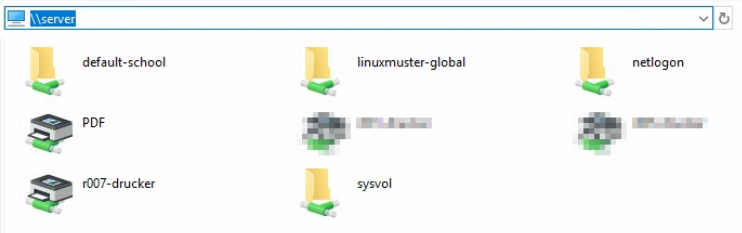

Wie richte ich Drucker am Client ein?
=====================================

Windows Clients
---------------

.. attention::

   linuxmuster.net v7 bietet im AD Gruppen für Drucker. Diese werden für Windows-Clients mithilfe von 
   Gruppenrichtlinien bestimmten Nutzern und Räumen zugewiesen. 
   siehe hierzu auch: https://ask.linuxmuster.net/t/frage-zu-den-gruppenrichtlinien/5918

Nachdem die Drucker auf dem Server eingerichtet wurden, sind diese auf Windows-Clients nun als Freigaben sichtbar.

Die Treiber sind nun über die Microsoft Management Console (MMC) hinzuzufügen.
Dies erfolgt in der MMC im Menü `Druckerverwaltung` -> `hinzufügen`. 

.. hint::
   Zuerst sind Treiber hochzuladen. Es können ausschließlich v3 Druckertreiber verwendet werden. V4 Druckertreiber 
   werden Stand Samba 4.7 (September 2019) noch nicht unterstützt.

Falls o.g. Weg nicht funktionieren sollte, ist der Treiber manuell auf Windows Client zu installieren. 

Anschließend ist der Druckertreiber dem Drucker auf dem Server zuzuweisen.

Hierzu sind die eingerichteten Drucker auf dem Server zunächst auszugeben:

.. code::

   rppclient 10.0.0.1 -U "LINUXMUSTER\global-admin" -c "enumdrivers 3"

LINUXMUSTER stellt den Namen der eigenen Samba-Domäne dar, global-admin ist der Administrator auf dem Server, 
10.0.0.1 ist die IP des Server.

Danach ist der lokale Druckertreiber dem Drucker zuzuordnen - in nachstehendem Beispiel ist dies
der Druckertreiber `HP Universal Printing PS`:

.. code::

   rppclient 10.0.0.1 -U "LINUXMUSTER\global-admin" -c 'setdriver "DemoPrinter" "HP Universal Printing PS"'

Das Ergebnis kann mit dem zuvor genannten Befehl kontrolliert werden:

.. code::

   rppclient 10.0.0.1 -U "LINUXMUSTER\global-admin" -c "enumdrivers 3"

Danach ist der Druck zu testen. Funktioniert der Drucker wie gewünscht ist ein neues Image für den Windows-Client zu erstellen.

Linux-Clients
-------------

.. attention::

   linuxmuster.net v7 bietet für Windows-Clients Gruppenrichtlinien an, um Drucker bestimmten Nutzern und 
   Räumen zuzuweisen. 
   Für den Linux-Client ist hier ein anderes Vorgehen zu wählen. Um die Drucker zentral zu verwalten, sind
   diese auf dem Server in CUPS einzurichten und hinsichtlich der Zugriffsrechte zu konfigurieren. 
   Dem Linux-Client ist nur noch in der Konfiguration des lokalen CUPS mitzuteilen, dass der Server 
   genutzt werden soll, anstelle des localhost. 

Vorgehen
^^^^^^^^

1. Drucker - wie zuvor dokumentiert - auf dem Server einrichten.
2. Eine Datei `/etc/cups/client.conf` in den Postsync-Dateien einrichten.
3. In der Datei `/etc/cups/cupsd.conf` auf dem Server den Druckerzugriff ergänzen.
4. Auf dem Server cupsd neu starten.
5. Linux-Client neu synchronisieren.
6. Nach der Anmeldung Drucker testen.

client.conf Datei einrichten
""""""""""""""""""""""""""""

**Linux-Client**

Um dem Linux-Client mitzuteilen, dass CUPS den Server nutzen soll, ist auf dem Client folgende Datei auf dem Linux-Client 

.. code::

  /etc/cups/client.conf

anzulegen.

Die Datei muss folgenden Inhalt aufweisen:

.. code::

  ServerName 10.0.0.1

Danach ist ein neues Cloop des Linux-Clients zu erstellen.

**Postsync auf dem Server**

Alternativ kann diese Datei auch mithilfe des Postsync auf den Client angewendet werden.
Hierzu wechselst du auf dem Server in folgendes Verzeichnis:

.. code::

  /srv/linbo/linuxmuster-client/<meinehwk>/common/etc

Anmerkung: <meinehwk> bitte durch den Namen für die eigene Hardwareklasse für die Linux-Clients ersetzen.

Hier legst Du ein Unterverzeichnis `cups` an. In dem Unterverzeichnis erstellst du die neue Datei 
`client.conf` mit folgendem Inhalt:

.. code::

  ServerName 10.0.0.1

Speichere die Änderungen ab.

Diese wird nach dem Neustart und der Synchronisation des Clients mithilfe der Postsync-Skripte auf den Client angewendet.

Server: cupsd.conf ACLs ergänzen
""""""""""""""""""""""""""""""""

Melde dich auf dem Server mit ssh an und rufe die Datei `/etc/cups/cupsd.conf` in einem Texteditor auf.
Suche die Einträge 

.. code::

  <Location >
  ....
  </Location>

Füge nach diesen Einträgen weitere Einträge für jeden Drucker hinzu, die du zuvor auf dem Server via CUPS eingerichtest hast.

Nachstehend findest du die Ergänzungen für zwei Beispieldrucker. Diese definieren sog. access lists (ACLs) zur Zugriffssteuerung. 

.. code::

  <Location /printers/PDF-Printer>
    Order Deny,Allow
    Deny From All
    Allow From 127.0.0.1
    Allow From 10.17.1.*
    Allow From 10.17.154.*
    Allow From 10.17.103.*
    Allow From 10.17.61.*
    Allow From 10.18.126.*
    Allow From 10.17.27.*
    Allow From 10.17.100.*
    Allow From 10.17.101.*
    Allow From 10.17.61.*
    Allow From 10.17.102.*
    Allow From 10.17.155.*
    Allow From 10.17.145.*
    Allow From 10.0.0.*
   Allow From 10.0.0.1
  </Location>
  <Location /printers/r102p1>
    Order Deny,Allow
    Deny From All
    Allow From 127.0.0.1
    Allow From 10.0.0.*
    Allow From 10.17.101.*
    Allow From 10.17.102.*
    Allow From 10.0.0.1
  </Location>

Die Angaben `Allow From` definieren, aus welchem IP-Netz oder von welcher IP auf den Drucker zugegriffen werden darf. Dies ist insbesondere bei Subnetting wichtig.

Es sollte das Servernetz - hier: `10.0.0.*` -, der Localhost `127.0.0.1`, der Server `10.0.0.1` und ggf. weitere Subnetze angegeben werden, aus denen ebenfalls auf den Drucker zugegriffen werden soll.

In o.g. Beispiel kann aus allen Subnetzen auf den Default-Drucker `PDF-Printer` zugegriffen werden. Bei dem zweiten Drucker `r102p1` kann nur aus bestimmten Subnetzen zugegriffen werden.

Gedruckt wird durch dieses Vorgehen zentral über den Druckerserver auf dem Server. Auf diese Wiese können die Druckaufträge auf dem Server verwaltet werden.

Der o.g. PDF-Printer auf dem Server stellt die erstellte PDF-Datei dem Benutzer in seinem `HOME-Verzeichnis` im Unterordner `PDF` bereit.  

.. hint::

   Die IPs, Netze und Druckerbezeichnungen sind auf die eigene Situation anzupassen.

Nach dem Speichern der Änderungen in der Datei muss der CUPS-Daemon auf dem Sever neu gestartet werden.

Dies erfolgt als Benutzer `root` mit dem Befehl: 

.. code::

  systemctl restart cups

Drucker testen
""""""""""""""

Nachdem der Linux-Client neu gestartet und synchronisiert wurde, meldest du dich an und prüfst, ob unter `Drucker` alle zuvor eingerichteten Drucker angezeigt werden. Dies muss der Fall sein, sofern aus dem jeweiligen Raum oder von dem jeweiligen PC ein Zugriff auf dem Drucker überhaupt gewünscht ist und zuvor eingerichtet wurde.

Markiere einen Drucker, klicke mit der rechten Maustaste und wähle im Kontextmenü den Punkt `Eigenschaften` aus. 
Klicke unterhalb von `Tests und Wartungen` den Button `Testseite drucken` aus. 

Führe das Verfahren aus allen Räumen und von allen PCs durch, für die du vorher spezielle ACLs festgelegt hast.

Apple Mac OS X -Clients
------------------------

Bei der Standardkonfiguration kann es passieren, dass die Kommunikation mit dem Drucker nicht funktioniert und zum Beispiel nach der Installation jeder Druck auf einen Fehler läuft:

.. code::

  Waiting for Authentication...

Wenn ein Drucker unter MacOS mit dem Drucker-Dialog hinzufügt wird, kann nur das IPP-Protokoll ausgewählt (Reiter "IP") werden. 
Bei "Address" ist dann die Server-IP mit dem CUPS-Port ``10.0.0.1:631`` einzutragen. Bei "Queue" ``/printers/printer-name`` ist der Druckername anzugeben (z.B. /printers/lz-drucker).

.. hint::

   Sollte dies nicht funktionieren, ist zunächst die Weboberfläche von CUPS local auf dem Mac zu aktivieren (localhost:631) und anschließend dort der Drucker per IPP-Protokol und http://10.0.0.1:631/printers/printer-name hinzuzufügen. Gibt es Treiberprobleme und der Drucker druckte nur Kauderwelsch, kann es helfen, statt den generischen Postscript-Treiber den generischen PCL-Treiber auszuwählen, oder ggf. die Installation der Originaltreiber (in dem Fall von Kyocera) auszuführen. Ein ähnliches Problem mit dem Drucker und MacOS X wird hier veschrieben: https://ask.linuxmuster.net/t/mac-os-x-clients-an-cups/1176

