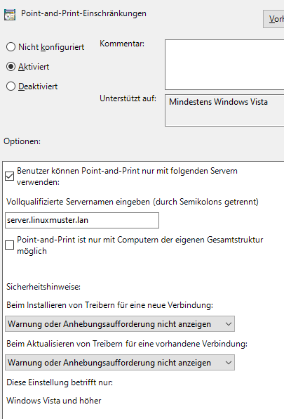
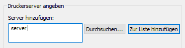
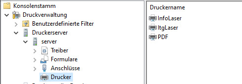

Drucker am Windows - Client
===========================

.. sectionauthor:: `@cweikl <https://ask.linuxmuster.net/u/cweikl>`_, `@rettich <https://ask.linuxmuster.net/u/rettich>`_

Nachdem die Drucker auf dem Server eingerichtet wurden, sind diese auf Windows-Clients nun als Freigaben sichtbar.

.. image:: media/printers-windows-clients_01.png
   :alt: Windows: Printer-Share
   :align: center

Die Treiber sind nun über die Microsoft Management Console (MMC) hinzuzufügen. 

Dem global-admin die nötigen Rechte einräumen
---------------------------------------------

Bevor es losgehen kann, müssen wir dem `global-admin` noch die nötigen Rechte auf dem Server einräumen. Melde Dich dazu als `root` auf dem Server an und führen Sie die folgenden Befehle aus:

.. code::
 
   net rpc rights grant "LINUXMUSTER\Domain Admins" SePrintOperatorPrivilege -U "LINUXMUSTER\global-admin"
   chgrp -R "LINUXMUSTER\Domain Admins" /var/lib/samba/printers/
   chmod -R 2775 /var/lib/samba/printers/

.. hint::

   Ersetze LINUXMUSTER durch den Samba-Domänennamen z.B. SCHULE, den Du beim Setup eingerichtet hast.

Dem Server vertrauen
--------------------

Seit Juli 2016 hat Windows10 ein neues Sicherheitsfeature. Es muss über GPOs festgelegt werden, dass die Windows-Clients unserem Server vertrauen. Dazu gehen wir wie folgt vor:

Melde Dich als global-admin am Windows-Client an und starte die Gruppenrichtlinienverwaltung (Wie Du sie installierts kannst Du :ref:`hier<install-RSAT-label>` nachlesen). 
Navigiere zur Default Domain Policy von linuxmuster.lan. 

.. image:: media/printers-windows-clients_02.png
   :alt: Default-Domain-Policy
   :align: center
   
Wähle mit einem Rechtsklick ``Bearbeiten``. Es öffnet sich der Gruppenrichtlinien-Editor.
Navigiere zu ``Computerkonfiguration → Richtlinien → Administrative Vorlagen → Drucker``.

.. image:: media/printers-windows-clients_03.png
   :alt: RSAT-Printer
   :align: center

Doppelklicke auf ``Point and Print Einschränkungen``, aktiviere die Richtlinie und setzen folgende Einstellungen:

       
Setze einen Haken bei ``Benutzer können Point and Print für Pakete – Genehmigte Server verwenden``.
Gib die FQDN des Servers bei ``Vollqualifizierte Servernamen`` ein und
wähle bei ``Beim Installieren von Treibern für eine neue Verbindung`` und bei ``Beim Aktualisieren von Treibern für eine vorhandene Verbindung`` die Einstellung ``Warnung oder Anhebungsaufforderung nicht anzeigen``.

Bestätige mit OK.

Doppelklicke auf ``Point and Print für Pakete – Genehmigte Server`` und aktiviere die Richtlinie.

.. image:: media/printers-windows-clients_05.png
   :alt: Print and Point gen. Server
   :align: center
       
Aktiviere die Richtlinie, klicken auf ``Anzeigen…`` und gib den FQDN des Servers ein.

Bestätige zwei mal mit OK.

Schließe den Gruppenrichtlinien-Editor und die Gruppenrichtlinien-Verwaltung

Starte den Rechner neu.

Druckertreiber auf dem Server installieren
------------------------------------------

Jetzt können wir die Druckertreiber auf dem Server installieren.

Öffne als global-admin das Programm mmc.exe, wähle ``Datei → snapin hinzufügen/entfernen`` und füge die Druckverwaltung hinzu.

   
Trage den Server ein, klicke auf ``zur Liste hinzufügen`` und anschließend auf ``Fertigstellen`` und ``OK``.

Wie man sieht, sind die Drucker dem Systems bekannt. Du musst nur noch die Druckertreiber installieren. 

Mache einen Rechtsklick auf ``Treiber`` und wähle ``Treiber hinzufügen``.
Gehe zu ``Weiter → Weiter → Datenträger… Durchsuchen → Ok`` und wähle den richtigen Druckertreiber. Es werden nur Microsoft zertifizierte Treiber akzeptiert. Falls Du mit einem Treiber Probleme haben solltest, versuche es eventuell mit einem etwas älteren Treiber. Die werden sehr oft akzeptiert. 

Klicke abschließend auf ``Fertigstellen``.

Einem Drucker einen Druckertreiber zuweisen
-------------------------------------------

Jetzt müssen wir nur noch den Druckern die Druckertreiber zuweisen.

Öffne als global-admin das Programm ``mmc.exe`` und navigiere zu ``Drucker``.

Mache einen Rechtsklick auf den Drucker, dem Du einen Druckertreiber zuweisen möchtest und wähle ``Eigenschaften…``
Falls Du gefragt wirst, ob Du einen Druckertreiber lokal installieren möchtest, antworte mit Nein.

Gehe zum Reiter ``Erweitert``, wähle bei Treiber den passenden Treiber für den Drucker und bestätige mit ``OK``.

.. image:: media/printers-windows-clients_08.png
   :alt: Eigenschaften von
   :align: center

Leider ändert Windows den Namen des Drucker in den Namen des Druckertreibers. Um wieder den richtigen Namen zu setzen, machst Du in mmc.exe einen Rechtsklick auf den Drucker und wählst ``Eigenschaften…``

Ändere unter dem Reiter ``Allgemein`` den Namen des Druckers auf den Namen, den er in CUPS hat und bestätige mit ``OK``.

.. image:: media/printers-windows-clients_09.png
   :alt: Eigenschaften Allgemein
   :align: center

Benutzern erlauben einen Druckertreiber zu installieren
-------------------------------------------------------

Die Windows-Clients erlauben normalen Benutzern nicht, einen Druckertreiber zu installieren. Das müssen wir ändern, da sonst normale Benutzer nicht drucken können. Am einfachsten geht das mit folgendem Registry-Eintrag:

.. code::

  HKEY_LOCAL_MACHINE\SOFTWARE\Policies\Microsoft\Windows NT\Printers\PointAndPrint
  RestrictDriverInstallationToAdministrators=0 (DWORD)

Erzeuge den Eintrag mit dem Registrierungs-Editor direkt in die Registry oder lege Dir die Datei ``win10.printer.reg`` mit folgendem Inhalt an:

.. code::

  Windows Registry Editor Version 5.00
  ; linuxmuster.net 7 version
  ; notwendig, damit Druckertreiber installieret werden können
  [HKEY_LOCAL_MACHINE\SOFTWARE\Policies\Microsoft\Windows NT\Printers\PointAndPrint]
  "RestrictDriverInstallationToAdministrators"=dword:00000000

Und doppelklicke als `global-admin` ``win10.printer.reg``.

Jetzt muss nur noch ein neues Image erzeugt und verteilt werden, damit die Firewall-Einstellungen und der Registry-Eintrag auf die Windows-Clients verteilt werden. 

Wenn alles geklappt hat, installieren sich die Druckertreiber auf den Windows-Clients sobald sich ein Benutzer anmeldet. Wie Du die Drucker-Raumzuweisung machst, kannst Du :ref:`hier<add-ad-group-label>` nachlesen.

Hat ein Lehrer in der Schulkonsole bei einem Drucker einen Haken gesetzt, wird der Drucker bei der Anmeldung des Lehrers zusätzlich installiert. Das ist dann sinnvoll, wenn beispielsweise ein Lehrer oft in der Nähe des Physik-Drucker unterrichtet. Dann kann er auch von jedem Laptop aus auf dem Physik-Drucker ausdrucken.     

Falls o.g. Weg nicht funktionieren sollte, ist der Treiber manuell auf dem Windows Client zu installieren. Anschließend ist der Druckertreiber dem Drucker auf dem Server zuzuweisen.

Hierzu sind die eingerichteten Drucker auf dem Server zunächst auszugeben:

.. code::

   rpcclient 10.0.0.1 -U "LINUXMUSTER\global-admin" -c "enumdrivers 3"

LINUXMUSTER stellt den Namen der eigenen Samba-Domäne dar, global-admin ist der Administrator auf dem Server, 10.0.0.1 ist die IP des Server.

Danach ist der lokale Druckertreiber dem Drucker zuzuordnen - in nachstehendem Beispiel ist dies der Druckertreiber `HP Universal Printing PS`:

.. code::

   rpcclient 10.0.0.1 -U "LINUXMUSTER\global-admin" -c 'setdriver "DemoPrinter" "HP Universal Printing PS"'

Das Ergebnis kann mit dem zuvor genannten Befehl kontrolliert werden:

.. code::

   rpcclient 10.0.0.1 -U "LINUXMUSTER\global-admin" -c "enumdrivers 3"

Danach ist der Druck zu testen. Funktioniert der Drucker wie gewünscht ist ein neues Image für den Windows-Client zu erstellen.

