.. _school-console-global-admin-label:

=============================
Schulkonsole des global-admin
=============================

.. sectionauthor:: `@maurice <https://ask.linuxmuster.net/u/Maurice>`_, `@cweikl <https://ask.linuxmuster.net/u/cweikl>`_,
            `@MachtDochNix (pics) <https://ask.linuxmuster.net/u/MachtDochNix>`_

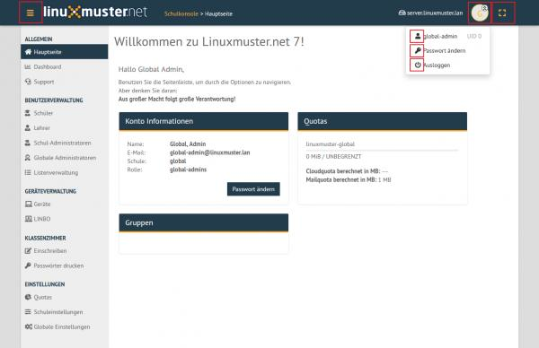

Allgemeine Bedienung
====================

Die Schulkonsole wird im Browser über https://10.0.0.1 aufgerufen. Je nachdem welcher Benutzer angemeldet ist, erscheinen zugehörige Menüpunkte. Alle verwaltungsspezifischen Menüpunkte stehen dem Benutzer ''global-admin'' bereit. Lehrer haben Zugriff auf alle pädagogischen Funktionen.

.. figure:: media/02_school-console_user-overview.png
   :align: center
   :alt: WebUI Welcome

Die Icons haben folgende Bedeutung:

* Menü ein- und ausklappen

.. figure:: media/03_school-console_extend-menue.png
   :align: center
   :alt: WebUI Extend Menue

* Benutzericon

* angemeldeter Benutzername

.. figure:: media/05_school-console_username.png
   :align: center
   :alt: WebUI Username

* eigenes Passwort ändern

.. figure:: media/06_school-console_change-password.png
   :align: center
   :alt: WebUI Change Password

* Abmelden

.. figure:: media/07_school-console_logout.png
   :align: center
   :alt: WebUI Logout

* Seitenverhältnis skalieren

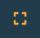

Das Menü können Sie durch Anklicken der drei Striche links neben dem linuxmuster.net-Symbol ein- und ausblenden.

.. hint:: 
   Bei Namenvergaben, beispielsweise von Kursen oder Projekten, sollte auf Umlaute und ß 
   verzichtet werden.

Allgemein
=========

Hauptseite
----------

Eine Übersicht über Account- & Speicherinformationen des angemeldeten Benutzer. Möglichkeit zur Änderung des eigenen Passworts über Passwort ändern-Funktion.

.. figure:: media/02_school-console_user-overview.png
   :align: center
   :alt: WebUI Overview

Dashboard
---------

Übersicht über aktive Serverkomponenten, wie CPU-Auslastung, Speicherauslastung und Laufzeit.

.. figure:: media/10_school-console_dashboard.png
   :align: center
   :alt: WebUI Dashboard

Benutzerverwaltung
------------------

.. figure:: media/11_school-console_user-management.png
   :align: center
   :alt: WebUI User Management

Hier können bereits aufgenommene Benutzer in den jeweiligen Bereichen Schüler, Lehrer, Schul-Administratoren verwaltet werden, sowie diese in der Listenverwaltung hinzufügt/entfernt werden. Im Bereich Globale Administratoren
können globale Admins verwaltet und hinzugefügt/entfernt werden.

Schüler, Lehrer, Schul-Administratoren, Globale Administratoren: Funktionen
---------------------------------------------------------------------------

Suche
-----

In den jeweligen Benutzer-Bereichen kann in der intelligenten Filterleiste nach Benutzern mit Kriterien wie Namen, Klassen, Projekten gefiltert und gesucht werden.

.. figure:: media/12_school-console_search.png
   :align: center
   :alt: WebUI Search

Passwort-Verwaltung
-------------------

Zu einzelnen Benutzern gibt es die Möglichkeiten über das Passwort-Menü rechts neben dem jeweiligen Namen.

* Erstpasswort anzeigen
* Erstpasswort wiederherstellen
* Erstpasswort zufällig festlegen
* Erstpasswort benutzerdefiniert festlegen
* Benutzerpasswort festlegen

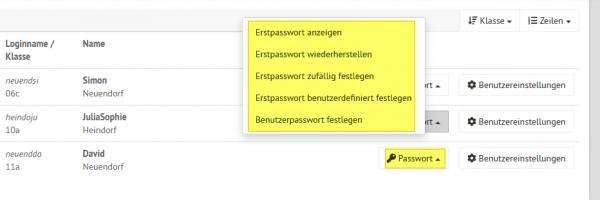

Durch Auswählen von mehreren Benutzern über Anklicken des Quadrats links neben dem Loginnamen oder über die Funktion ``Alle auswählen``, können Funktionen auf mehrere Benutzer gleichzeitig angewendet werden.

* Setze Zufallspasswort für Ausgewählte
* Setze Erstpasswort für Ausgewählte
* Benutzerdefiniertes Passwort für Ausgewählte

.. figure:: media/14_school-console_password-management-all-users.png
   :align: center
   :alt: WebUI Password All Users

Informationsübersicht
---------------------

Über das Benutzereinstellungen-Menü rechts neben der jeweiligen Person können über die Funktion
Benutzerinformationen benutzerbezogene Informationen angezeigt, wie Rolle und Gruppenzugehörigkeiten.

.. figure:: media/15_school-console_user-information.png
   :align: center
   :alt: WebUI Password User Information

Listenverwaltung
-----------------

In der Listenverwaltung können Benutzer von Schülern, Lehrern, und Extra-Schülern verwaltet werden, das bedeutet hinzugefügt, entfernet oder deren Daten und Zugehörigkeiten geändert werden. Benutzer können manuell über Eingabe von Vorname, Nachname und Geburtsdatum (und ggf. selbstdefinierten Benutzernamen für Lehrer) hinzugeügt werden und einzeln wiederum entfernt werden. Ebenso besteht die Möglichkeit auf schnellerem Wege eine vorhanden CSV-Liste mit
Benutzerdaten in die Schulumgebung zu importieren.

Manuelle Benutzeraufnahme
-------------------------
Unter den 3 Bereichen Schüler, Lehrer, Extra Schüler gibt es jeweils unten links der Seite (ggf. runterscrollen) eine ``hinzufügen``-Option drücken.

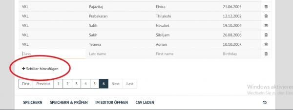

Drücken Sie dann ``Speichern & Prüfen``.

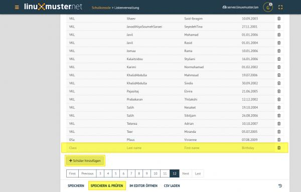

Haben Sie alle Benutzerinformationen eingegeben und ist kein Feld leer, überprüfen Sie die Eingaben mit Speichern & Überprüfen in der Prüfergebnis-Ansicht.

.. figure:: media/18_school-console_check-overview.png
   :align: center
   :alt: WebUI Check Overview

Eventuelle Fehler in der Fehleransicht auslesen, die Prüfergebnis-Ansicht abbrechen und die fehlerhaften Daten korrigieren und nochmals mit ``Speichern & Überprüfen`` testen.
Sind keine Fehler aufgetreten, über den Button Übernehmen die neuen Benutzer ins System übertragen.

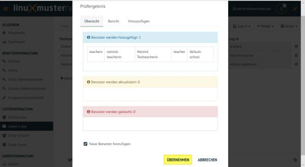

Benutzeraufnahme über vorhandene CSV-Datei
------------------------------------------

Über die integrierte Funktion, Benutzer simpel über eine CSV-Datei zu übernehmen und anzupassen, können so zahlreiche Benutzer schnell aufgenommen werden. Dafür in einer bestimmten Benutzerliste über die Funktion in der unteren Menüleiste CSV laden auswählen und die CSV-Datei hochladen.

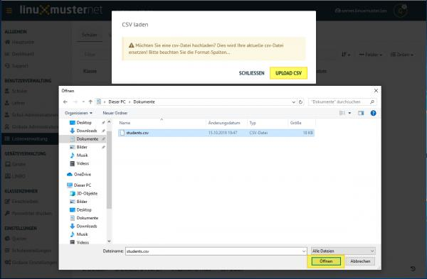

Falls die Spalten nicht in der richtigen Reihenfolge aufgelistet sind, gibt es die Möglichkeit diese graphisch per Ziehen mit der Maus umzuordnen, bevor sie mit Sortierung akzeptieren in die Liste übernommen werden.

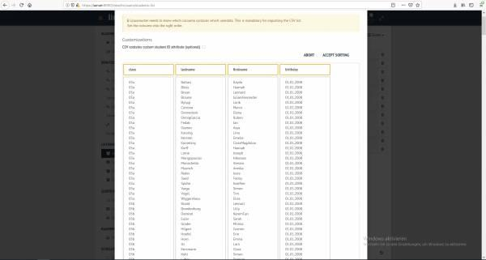

Falls die Spalten nicht in der richtigen Reihenfolge aufgelistet sind, gibt es die Möglichkeit diese graphisch per Ziehen mit der Maus umzuordnen, bevor sie mit Sortierung akzeptieren in die Liste übernommen werden.

Anschließend ``Speichern & Überprüfen`` und ganz unten auf der Listenübersicht (gegebenfalls runterscrollen) Übernehmen.

Benutzer entfernen
------------------

Sollen Benutzer entfernt werden, kann dies in der Listenansicht über das Papierkorb-Symbol rechts in der Benutzerzeile gemacht werden. Jeweilige Liste (Schüler-, Lehrer-, Extra-Schüler oder Extra-Kurse) öffnen Benutzer über den Papierkorb aus dessen Zeile entfernen.

* Jeweilige Liste (Schüler-, Lehrer-, Extra-Schüler oder Extra-Kurse) öffnen
* Benutzer über den Papierkorb aus dessen Zeile entfernen

.. figure:: media/22_school-console_delete-user.png
   :align: center
   :alt: WebUI Delete User

.. hint::

   Die Listenänderungen werden erst übernommen, wenn Speichern & Überprüfen erfolgreich 
   ausgeführt wurde. Mögliche unpassende Eingaben oder leere Felder werden rot gekennzeichnet und 
   sollten korrigiert werden, um dann nochmal Speichern & Überprüfen auszuführen.

Geräteverwaltung
================

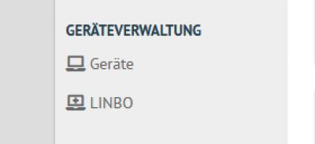

In der Geräteverwaltung gibt es unter Geräte eine Übersichtsseite aller angebunden Geräte inklusiver Informationen und der Möglichkeit diese zu ändern, weitere Geräte hinzuzufügen oder zu entfernen. Weiter finden Sie das LINBO-Menü zu desen Handhabung Sie die Anleitung LINBO & Domänenintegration verwenden können.

Geräte
------

Hier ist die graphische Gerätelistenverwaltung implementiert. Geräte können hier aufgenommen, bearbeitet oder entfernt werden. Jedem Gerät müssen die Informationen mitgegeben werden.

* Raum
* Hostname
* Gruppe (Hardwareklasse)
* MAC
* IP (jede IP nur einmal vergeben)
* Sophomorix-Rolle
* PXE (ermöglicht oder deaktiviert Netzwerkboot per LINBO)

Gerät hinzufügen
----------------

Über die Funktion Gerät hinzufügen unten links erscheint eine neue Zeile, in welcher die Informationen des neuen Gerätes eingegeben werden sollen.

.. figure:: media/24_school-console_add-device.png
   :align: center
   :alt: WebUI Add Device

Die Listenänderungen werden übernommen, wenn ``Speichern & Importieren`` erfolgreich ausgeführt wurde. Mögliche unpassende Eingaben oder leere Felder werden rot gekennzeichnet und sollten korrigiert werden, um dann nochmal ``Speichern & Importieren`` auszuführen.

Geräteansicht
-------------

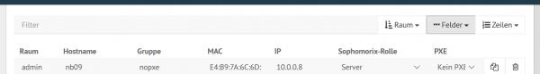

* Mit der Filterfunktion in der oberen Leiste kann über Eigenschaften, wie Namen und MAC, nach Geräten gefiltert werden. Rechts gibt es die Möglichkeit die Sortierweise nach Standardspalten, wie Raum und Gruppe, anzupassen. 
* Unter Felder können zusätzliche Spalten in der Geräteliste zur Anzeige ausgewählt werden.
* Die Anzahl der pro Seite aufgelisteten Geräte kann unter Zeilen angepasst werden.

Linbo
=====

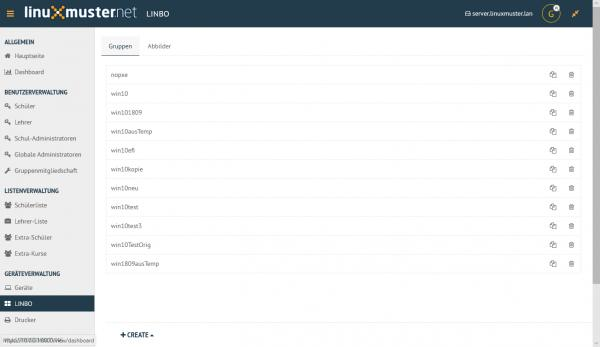

Unter dem Menü Gruppen können die Hardwareklassen bearbeitet werden, welche in der Gerätelistenverwaltung den jeweiligen Geräten zugeordnet werden. Im Menü `'Abbilder`` werden die enthaltenen Images aufgelistet, welche wiederum einer Hardwareklasse zugeordnet werden können. 

Klassenzimmer
=============

Einschreiben
------------

Dieser Abschnitt dient Lehrern oder global-admins dazu sich in Schulklassen, Projekte oder zu Druckern einzuschreiben. Der ``global-admin`` ist automatisch zu allen Klassen und Projekte sowie Druckern zugeteilt. Lehrer sollten sich den jeweiligen Klassen zuordnen.

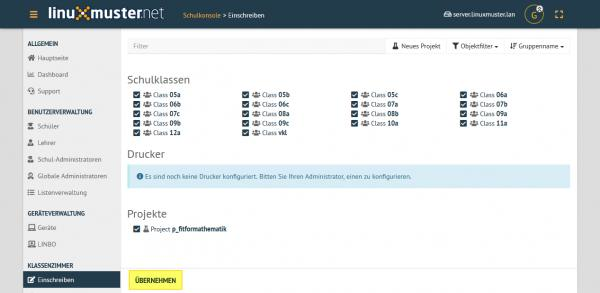

Ein jeweiliges Objekt zum Einschreiben auswählen oder den Haken entfernen um daraus auszutreten. Geänderte Einstellungen werden gelb angezeigt. Um die Änderungen anzuwenden, auf **Übernehmen** klicken.

Passwörter drucken
------------------

Hier gibt es die Möglichkeit, eine übersichtliche Liste von Benutzer- & Passwortinformationen per PDF oder CSV-Format ausdrucken zu lassen.

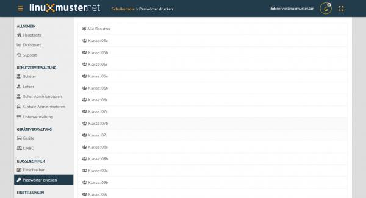

Die kann über Anklicken der jeweiligen Klasse klassenspezifisch, über Klasse: teachers auf alle Lehrer oder über die Option Alle Benutzer auf alle Benutzer der Schule angewendet werden. Als PDF werden die Benutzer neben dem zugehörigen Passwort in Kästchen angezeigt, wie in diesem Beispiel:

.. figure:: media/29_school-console_print-passwords-example.png
   :align: center
   :alt: WebUI Print Passwords Example

Um nicht jedes Kästchen einzeln ausschneiden zu müssen, gibt es vor dem Drucken die Option One per page, um pro Seite nur eine Benutzerinformation auszugeben. Um zu Drucken Ausdrucken wählen.

Einstellungen
=============

Quotas
------
Unter Standardwerte werden standarmäßige Speichergrößen von Standardquota, Cloudquota und Mailquota für Schüler, Lehrer und Schuladministratoren festgelegt.

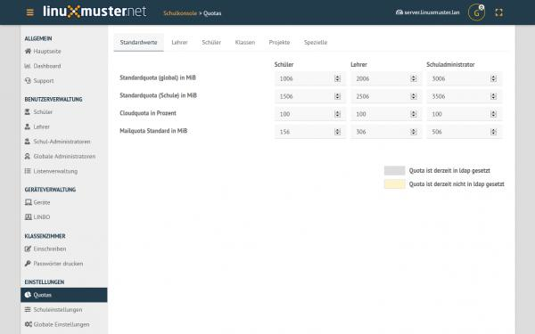

In den Bereichen **Lehrer** und **Schüler** daneben können von den Standwartwerten abweichend pro Benutzer eigene Werte eingestellt werden. Ebenso kann unter **Klassen** und **Projekte** einer jeweiligen Schulklasse/einem jeweiligen Projekt die Speichergröße festgelegt werden.

Schuleinstellungen
==================

Allgemeine Informationen, Einstellungen zum Linstenimport, Quotalimits und Druck-Daten-Werte können in der Schuleinstellungen verwaltet werden.

Unter ``Allgemein`` werden generelle Schuleinstellungen wie Namen oder E-Mail-Domänen für jeweilige Rollen angegeben und geändert.

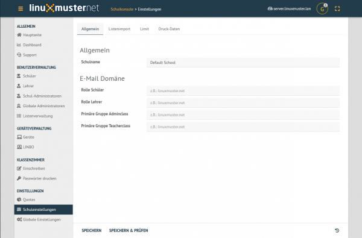

Änderungen über Speichern & Prüfen und anschließend Übernehmen anwenden.
Unter Listenimport können Standardwerte festgelegt werden, die beim Import einer CSV-Datei angewendet werden. Wird ein Haken unter der Funktion Nachname und Vorname im Benutzernamen umkehren für eine jeweilige Rolle, werden die Benutzernamen zuerst aus dem Vornamen und dann aus Nachnamen generiert. Wie viele Zeichen aus den jeweiligen Namen genommen werden, wird in den unteren Werten Nachname Zeichen und Vornamen Zeichen angegeben. Ältere Sicherungen könne über das Symbol

.. figure:: media/32_school-console_backup-icon.png
   :align: center
   :alt: WebUI Bacup Icon

unten rechts wiederhergestellt werden.

Globale Einstellungen
=====================

In diesem Bereich werden die globalen Einstellungen für die Schulkonsole der linuxmuster-Umgebung verwaltet, welche aber in der Regel nie geändert werden müssen.

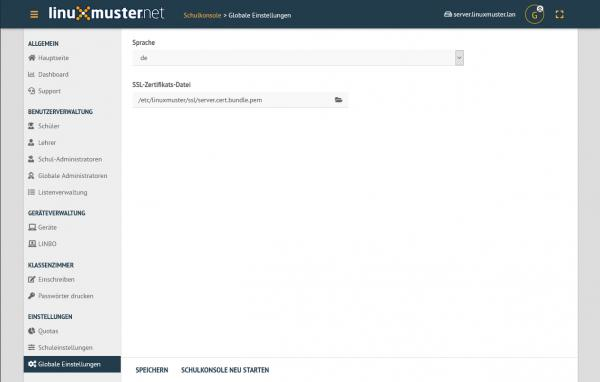

Zu den globalen Einstellungen gehören die für die Schulkonsole Sprache, welche unter Sprache geändert werden kann. Auch die Zertifikatsdatei könnte hier unter SSL-Zertifikats-Datei geändert werden. Um die Änderungen wirksam zu machen, muss die Schulkonsole über ``Schulkonsole neu starten`` neu gestartet und initialisiert werden.

