.. _school-console-global-admin-label:

=============================
Schulkonsole des global-admin
=============================

.. sectionauthor:: `@maurice <https://ask.linuxmuster.net/u/Maurice>`_, `@cweikl <https://ask.linuxmuster.net/u/cweikl>`_,
            `@MachtDochNix (pics) <https://ask.linuxmuster.net/u/MachtDochNix>`_, `@michael_kohls <https://ask.linuxmuster.net/u/michael_kohls>`_

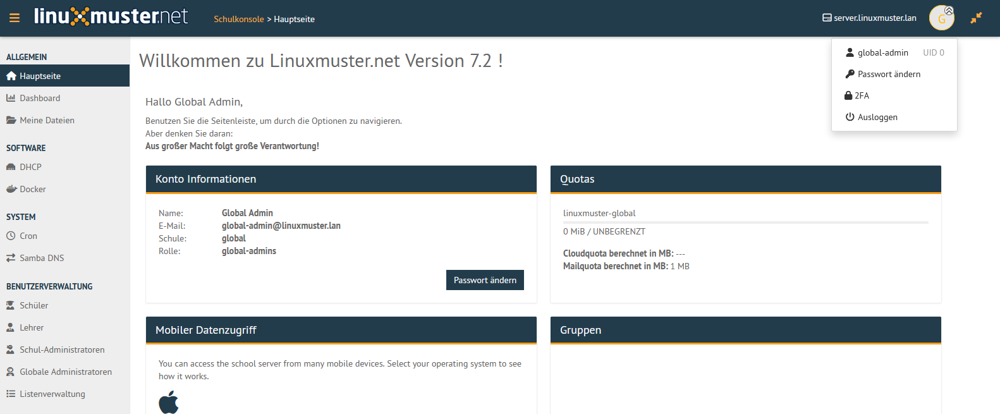

Allgemeine Bedienung
====================

Die Schulkonsole wird im Browser über https://10.0.0.1 aufgerufen. Je nachdem welcher Benutzer angemeldet ist, erscheinen zugehörige Menüpunkte. Alle verwaltungsspezifischen Menüpunkte stehen dem Benutzer ''global-admin'' bereit. Lehrer haben Zugriff auf alle pädagogischen Funktionen.

Die Icons haben folgende Bedeutung:

   Menü ein- und ausklappen

.. figure:: media/schoolconsole_03_user-icon.png
   :align: center
   :alt: WebUI User Icon

   Benutzericon

.. figure:: media/schoolconsole_04_username.png
   :align: center
   :alt: WebUI Username

   angemeldeter Benutzername

   eigenes Passwort ändern

   Verwaltung von TOTP

   Abmelden

   Seitenverhältnis skalieren

Allgemein
=========

Hauptseite
----------

   Eine Übersicht über Account- & Speicherinformationen des angemeldeten Benutzer. Möglichkeit zur Änderung des eigenen Passworts über Passwort ändern-Funktion.

Dashboard
---------

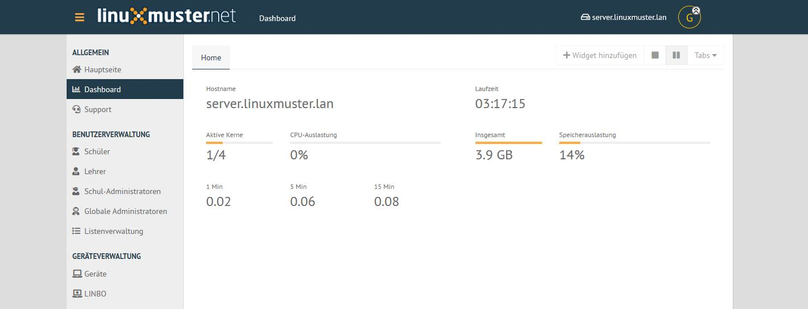

   Übersicht über aktive Serverkomponenten, wie CPU-Auslastung, Speicherauslastung und Laufzeit.

Meine Dateien
-------------

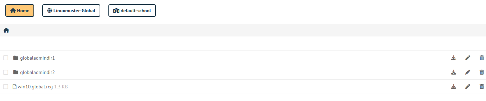

   Dateimanager mit Zugriff auf Samba-Freigaben des Schulservers.

Software
========

DHCP
----

Hier sind die Lease von Computern zu sehen, die nicht registriert sind. Über ``+`` können diese registriert werden.

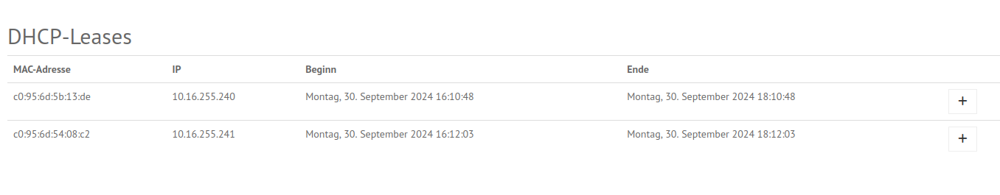

Docker
------

Hier können Docker-Container verwaltet werden. Laufen diese auf einem anderen Server, muss eine SSH-Verbindung stehen und die IP des Servers als ``dockerip``
in der Datei ``/var/lib/linuxmuster/setup.ini`` auftauchen.

System
======

Cron
----

Hier können für root bzw. den global-admin eingerichtete Cronjobs verwaltet werden. Wenn ein Cronjob in den Ferien nicht laufen soll, 
kann der Haken bei ``Ferien entfernen`` gesetzt werden. Dazu müssen die Feriendaten unter ``Schuleinstellungen/Feiertage`` gesetzt werden.

Samba DNS
---------

Hier können zusätzliche DNS-Einträge im Samba verwaltet werden.

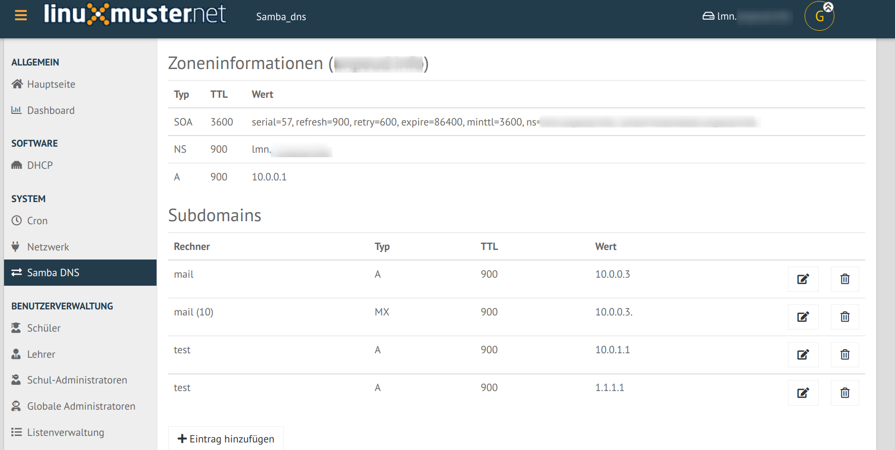

Die normalen Einträge für die Geräte erscheinen hier nicht, sondern werden über ``Geräte`` verwaltet.

Benutzerverwaltung
==================

Schüler, Lehrer, Schul-Administratoren, Globale Administratoren: Funktionen
---------------------------------------------------------------------------

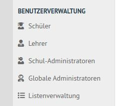

Hier können bereits aufgenommene Benutzer in den jeweiligen Bereichen Schüler, Lehrer, Schul-Administratoren verwaltet werden, sowie diese in der Listenverwaltung hinzufügt/entfernt werden. Im Bereich Globale Administratoren
können globale Admins verwaltet und hinzugefügt/entfernt werden.

Suche
-----

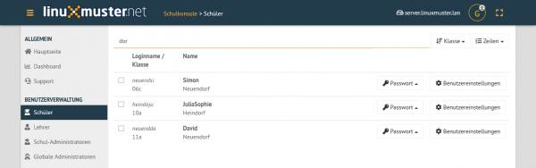

In den jeweiligen Benutzer-Bereichen kann in der intelligenten Filterleiste nach Benutzern mit Kriterien wie Namen, Klassen, Projekten gefiltert und gesucht werden.

Passwort-Verwaltung
-------------------

Zu einzelnen Benutzern gibt es die Möglichkeiten über das Passwort-Menü rechts neben dem jeweiligen Namen.

* Erstpasswort anzeigen
* Erstpasswort wiederherstellen
* Erstpasswort zufällig festlegen
* Erstpasswort benutzerdefiniert festlegen
* Benutzerpasswort festlegen

.. figure:: media/schoolconsole_17_password-management.png
   :align: center
   :alt: WebUI Password Management

Durch Auswählen von mehreren Benutzern über Anklicken des Quadrats links neben dem Loginnamen oder über die Funktion ``Alle auswählen``, können Funktionen auf mehrere Benutzer gleichzeitig angewendet werden.

* Setze Zufallspasswort für Ausgewählte
* Setze Erstpasswort für Ausgewählte
* Benutzerdefiniertes Passwort für Ausgewählte

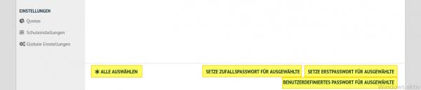

Informationsübersicht
---------------------

Über das Benutzereinstellungen-Menü rechts neben der jeweiligen Person können über die Funktion
Benutzerinformationen benutzerbezogene Informationen angezeigt, wie Rolle und Gruppenzugehörigkeiten.

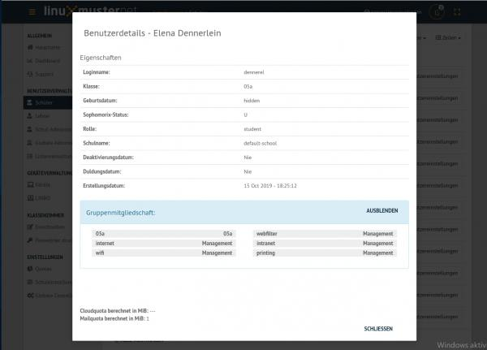

Listenverwaltung
-----------------

In der Listenverwaltung können Benutzer von Schülern, Lehrern, und Extra-Schülern verwaltet werden, das bedeutet hinzugefügt, 
entfernt oder deren Daten und Zugehörigkeiten geändert werden. Benutzer können manuell über Eingabe von Vorname, Nachname und Geburtsdatum 
(und ggf. selbstdefinierten Benutzernamen für Lehrer) hinzugefügt werden und einzeln wiederum entfernt werden. Ebenso besteht die Möglichkeit 
auf schnellerem Wege eine vorhanden CSV-Liste mit Benutzerdaten in die Schulumgebung zu importieren.

Manuelle Benutzeraufnahme
-------------------------
Unter den 3 Bereichen Schüler, Lehrer, Extra Schüler gibt es jeweils unten links der Seite (ggf. runterscrollen) eine ``hinzufügen``-Option.

.. figure:: media/schoolconsole_20_add-user.png
   :align: center
   :alt: WebUI Add User

.. figure:: media/schoolconsole_21_add-user-save-check.png
   :align: center
   :alt: WebUI Add User Save & Check

Hast du alle Benutzerinformationen eingegeben und ist kein Feld leer, überprüfe die Eingaben mit ``Speichern & Überprüfen``.

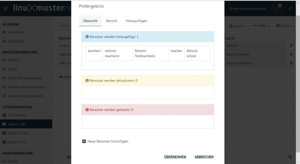

Eventuelle Fehler in der Fehleransicht auslesen, die Prüfergebnis-Ansicht abbrechen und die fehlerhaften Daten korrigieren und nochmals mit ``Speichern & Überprüfen`` testen.
Sind keine Fehler aufgetreten, über den Button werden die neuen Benutzer ins System übertragen.

Benutzeraufnahme über vorhandene CSV-Datei
------------------------------------------

Über die integrierte Funktion, Benutzer simpel über eine CSV-Datei zu übernehmen und anzupassen, können zahlreiche Benutzer schnell aufgenommen werden. 
Dafür in einer bestimmten Benutzerliste über die Funktion in der unteren Menüleiste ``CSV laden`` auswählen und die CSV-Datei hochladen.

.. figure:: media/schoolconsole_23_import-user-csv.png
   :align: center
   :alt: WebUI Import User CSV

.. figure:: media/schoolconsole_24_import-user-csv-overview.png
   :align: center
   :alt: WebUI Import User CSV Overview

Falls die Spalten nicht in der richtigen Reihenfolge aufgelistet sind, gibt es die Möglichkeit diese graphisch per Ziehen mit der Maus umzuordnen, 
bevor sie mit ``Sortierung akzeptieren`` in die Liste übernommen werden.

Anschließend mit ``Speichern & Überprüfen`` übernehmen.

Benutzer entfernen
------------------

Sollen Benutzer entfernt werden, kann dies in der Listenansicht über das Papierkorb-Symbol rechts in der Benutzerzeile gemacht werden. 
Jeweilige Liste (Schüler-, Lehrer-, Extra-Schüler oder Extra-Kurse) öffnen und Benutzer über den Papierkorb in dessen Zeile entfernen.

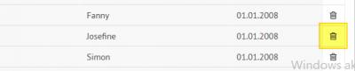

.. hint::

   Die Listenänderungen werden erst übernommen, wenn Speichern & Überprüfen erfolgreich 
   ausgeführt wurde. Mögliche unpassende Eingaben oder leere Felder werden rot gekennzeichnet und 
   sollten korrigiert werden, um dann nochmal Speichern & Überprüfen auszuführen.

Geräteverwaltung
================

In der Geräteverwaltung gibt es unter Geräte eine Übersichtsseite aller angebunden Geräte inklusiver Informationen und der Möglichkeit diese zu ändern, 
weitere Geräte hinzuzufügen oder zu entfernen. 

Geräte
------

Hier ist die graphische Gerätelistenverwaltung implementiert. Geräte können hier aufgenommen, bearbeitet oder entfernt werden.

Ausführliche Informationen hierzu findest du im Kapitel :ref:`Rechneraufnahme <hardware-registration-label>`.

Linbo 4
-------

Die Nutzung von Linbo wird im Abschnitt :ref:`Linbo 4 nutzen <using-linbo-label>` erklärt.

Device Manager
--------------

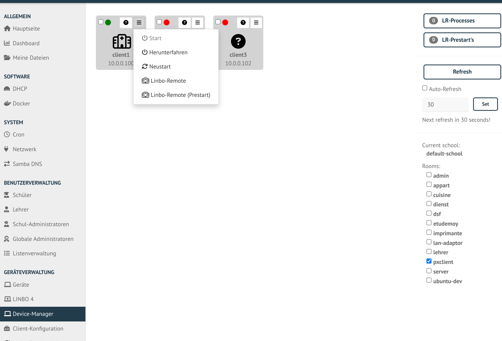

Hier können die Clients remote gesteuert werden. U.a. können sie eingeschaltet, heruntergefahren, neu gestartet und Linbo-Remote Befehle abgesetzt werden.

Client-Konfiguration
--------------------

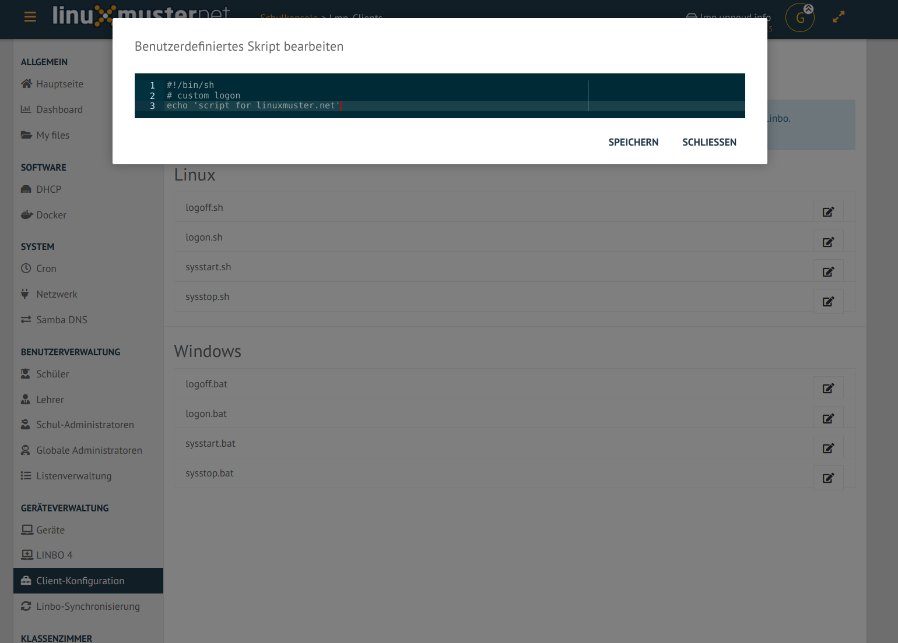

Hier können benutzerdefinierte Skripte für Linux und Windows bearbeitet werden.  

Außerdem können für die in Windows per GPO verbundenen Netzlaufwerk die Laufwerksbuchstaben geändert, entfernt bzw. gänzlich deaktiviert werden.

Linbo-Synchronisierung
----------------------

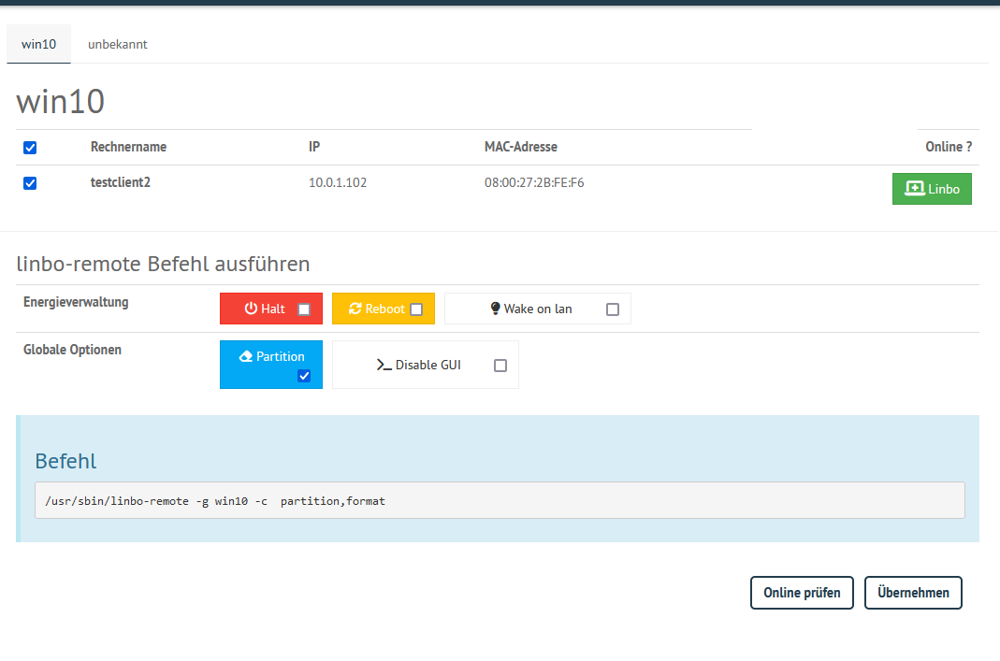

Hier können PC, welche Linbo gebootet haben, ferngesteuert werden. Z.B. ist es möglich Sie neu zu partitionieren. Dazu muss mindesten ein Client und ein Kommando ausgewählt werden. Mit ``Übernehmen`` wird der linbo-remote Befehl ausgeführt.

Klassenzimmer
=============

Einschreiben
------------

Dieser Abschnitt dient Lehrern oder global-admins dazu sich in Schulklassen, Projekte oder zu Druckern einzuschreiben. Der ``global-admin`` ist automatisch zu allen Klassen und Projekte sowie Druckern zugeteilt. Lehrer sollten sich den jeweiligen Klassen zuordnen.

.. figure:: media/schoolconsole_30_enrole.png
   :align: center
   :alt: WebUI Enrole

Ein jeweiliges Objekt zum Einschreiben auswählen oder den Haken entfernen um daraus auszutreten. Geänderte Einstellungen werden gelb angezeigt.

Passwörter drucken
------------------

Hier gibt es die Möglichkeit, eine übersichtliche Liste von Benutzer- & Passwortinformationen per PDF oder CSV-Format ausdrucken zu lassen.

.. figure:: media/schoolconsole_31_print-password.png
   :align: center
   :alt: WebUI Print Passwords

Die kann über Anklicken der jeweiligen Klasse klassenspezifisch, über Klasse: teachers auf alle Lehrer oder über die Option Alle Benutzer auf alle Benutzer der Schule angewendet werden. Als PDF werden die Benutzer neben dem zugehörigen Passwort in Kästchen angezeigt, wie in diesem Beispiel:

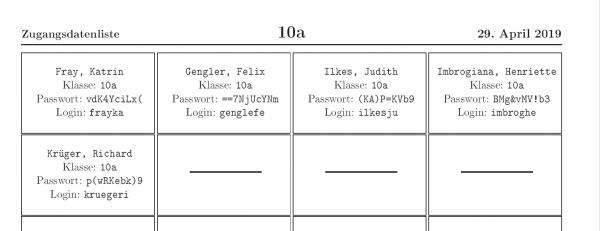

Um nicht jedes Kästchen einzeln ausschneiden zu müssen, gibt es vor dem Drucken die Option One per page, um pro Seite nur eine Benutzerinformation auszugeben. Um zu Drucken Ausdrucken wählen.

Einstellungen
=============

Extraquota
----------

Hier können für Benutzer von der Standardquota abweichende Extraquota eingerichtet werden. Dazu einen Benutzer über ``Search & add user`` hinzufügen und die individuelle Quota einrichten.
Die Standardquota werden unter Schuleinstellungen -> Kontingent vorgegeben. Direkt erreichbar über den Button ``Standardquota konfigurieren``.

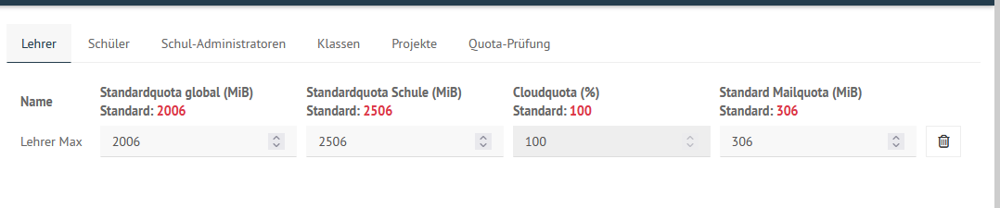

In den Bereichen **Lehrer** und **Schüler** daneben können von den Standwartwerten abweichend pro Benutzer eigene Werte eingestellt werden. Ebenso kann unter **Klassen** und **Projekte** einer jeweiligen Schulklasse/einem jeweiligen Projekt die Speichergröße festgelegt werden.

Schuleinstellungen
==================

Allgemeine Informationen, Einstellungen zum Listenimport, Standardquota, Druck-Daten-Werte, benutzerdefinierte Felder und Feiertage können in den Schuleinstellungen verwaltet werden.

Unter ``Allgemein`` werden generelle Schuleinstellungen wie Namen oder E-Mail-Domänen für jeweilige Rollen angegeben und geändert.

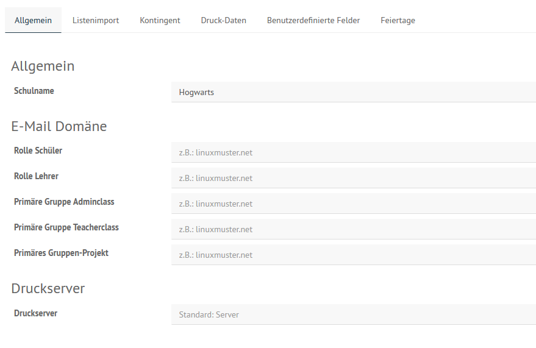

Änderungen über ``Speichern & Prüfen`` und anschließend ``Übernehmen`` anwenden.

Unter ``Listenimport`` können Standardwerte festgelegt werden, die beim Import einer CSV-Datei angewendet werden. Wird ein Haken unter der Funktion "Nachname und Vorname im Benutzernamen umkehren" für eine jeweilige Rolle gesetzt, werden die Benutzernamen zuerst aus dem Vornamen und dann aus Nachnamen generiert. Wie viele Zeichen aus den jeweiligen Namen genommen werden, wird in den unteren Werten Nachname Zeichen und Vornamen Zeichen angegeben. Ältere Sicherungen könne über das Symbol

unten rechts wiederhergestellt werden.

Unter ``Druck-Daten`` werden Informationen hinterlegt, welche automatisch in die Passwortlisten eingefügt werden. Es können auch eigene Latex-Vorlagen erstellt werden. Info's hierzu findest du im `Sophomorix-Wiki <https://github.com/linuxmuster/sophomorix4/blob/bionic/sophomorix-samba/lang/latex/README.latextemplates>`_.

.. note::

   Schlägt der Druck mit selbsterstellten Vorlagen fehl, liegt es oft an fehlenden Bibliotheken. In diesem Fall hilft: `apt-get install texlive-latex recommended`

Unter ``benutzerdefnierte Felder`` können freie Felder im LDAP mit zusätzlichen Funktionen belegt werden:

* proxyAddresse für die Email
* Custom 1 → 5 für freie Strings
* Multicustom 1 → 5 für Listen von Daten.

Unter ``Feiertage`` werden die Tage festgelegt, an denen Cronskripte nicht laufen sollen. Siehe Abschnitt Cron.

Globale Einstellungen
=====================

Im Bereich ``Allgemein`` werden die globalen Einstellungen für die Schulkonsole der linuxmuster-Umgebung verwaltet.

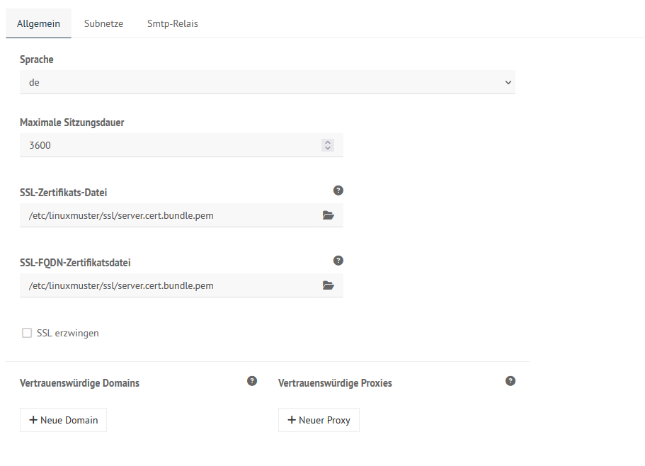

Zu den globalen Einstellungen gehören die Sprache für die Schulkonsole. Auch die Zertifikatsdatei kann hier unter SSL-Zertifikats-Datei geändert werden. Um die Änderungen wirksam zu machen, muss die Schulkonsole über ``Schulkonsole neu starten`` neu gestartet und initialisiert werden.

Unter ``Subnetze`` kann das verwendete Subnetz geändert werden. Bitte sehr vorsichtig sein und nach Möglichkeit vorher ein Snapshot erstellen!

Uner ``SMTP-Relay`` können die Daten für einen SMTP-Server hinterlegt werden, über den die Nachrichten zum Zurücksetzen des Passworts versendet werden. Dazu müssen die Benutzer ihre E-Mail-Adresse in der Schulkonsole hinterlegt haben. Im Moment ist dies nur bei Lehrern möglich. 

