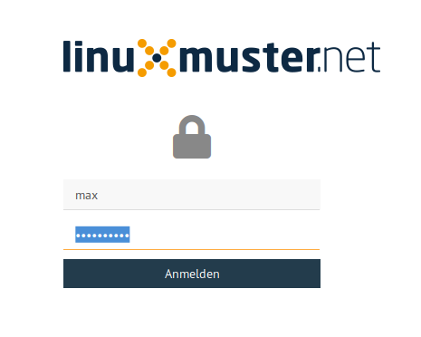
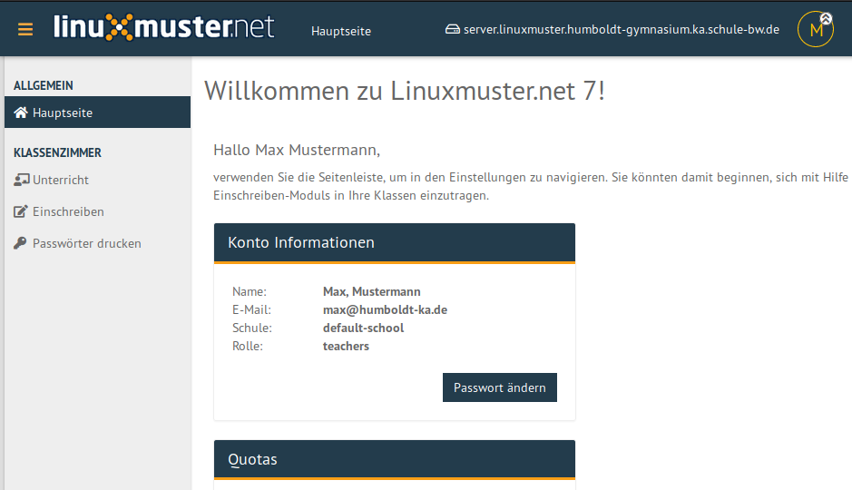
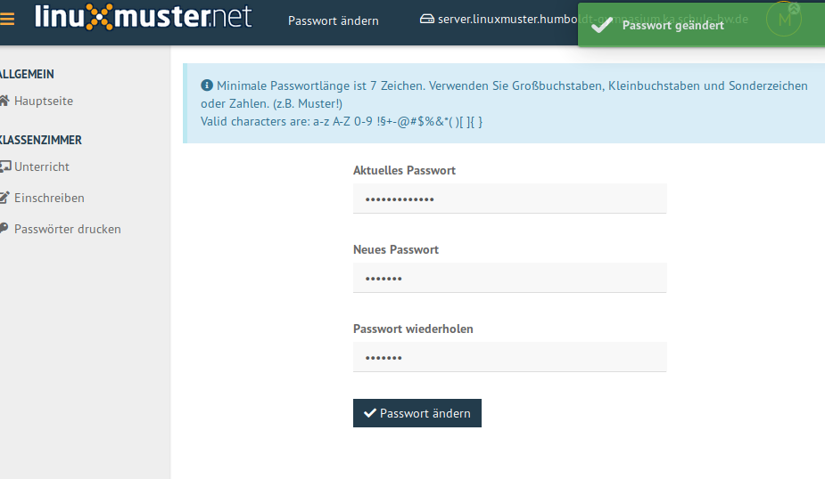
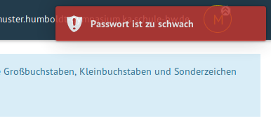
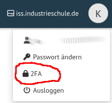

.. _howto-change-own-passwords-label:

===============================
 Ändern des eigenen Passwortes
===============================

.. sectionauthor:: `@Tobias <https://ask.linuxmuster.net/u/Tobias>`_,

Melde Dich an der Schulkonsole an, d.h. besuche mit dem Browser die
Webseite ``https://server.linuxmuster.lan`` oder die an Deiner Schule
äquivalent vom Administrator eingerichtete Seite und melde Dich mit
den Schulkontodaten an.

.. hint:: Dein Benutzername besteht nur aus Kleinbuchstaben und
          eventuell Zahlen.

Klicke auf der Hauptseite auf "Passwort ändern"

Gib das aktuelle und zweimal ein neues Passwort ein. Beachte die
Anforderungen an das neue Passwort, die von Schule zu Schule abweichen
können. Informiere dafür Dich bei deinem
Netzwerkberater. Standardmäßig gibt es folgende Regeln

  * Folgende Zeichen sind erlaubt:

    .. code::

       a-z A-Z 0-9 ! § + - @ # $ % & * ( )[ ]{ }

    (D.h. Umlaute oder diakritische Zeichen sind nicht erlaubt)
  * Die Mindestlänge des Passwortes sind 7 Zeichen.
  * Das Passwort muss aus Großbuchstaben, Kleinbuchstaben und entweder
    Zahlen oder Sonderzeichen (oder beidem) bestehen.

    Beispiele sind: ``Muster!`` oder ``HundKatzeMau5``

Das erfolgreiche Ändern des Passwortes wird mit einer Meldung bestätigt.

Falls die Änderung nicht erfolgreich war, erhalten Sie eine
Fehlermeldung mit einem Hinweis auf den Fehler.

In dieser Beispielfehlermeldung bestand das Passwort nur aus
Kleinbuchstaben, Zahlen und Sonderzeichen. Es enthielt keine
Großbuchstaben.

Jetzt kannst Du Dich ausloggen. Rechts oben, wo in einem Kreis dein
Bild oder Buchstabe steht erreicht man das persönliche Menü.

.. figure:: media/selma-logout-menu.png

Mit dem neuen Passwort kannst Du Dich an allen Diensten anmelden, die
im Schulnetzwerk mit dem Schulkonto verbunden sind, z.B. auch die
Anmeldung an PCs.

.. _configure_2FA_label:

Einrichtung 2FA
===============

Als zusätzliche Absicherung ist die Einrichtung einer Zweifaktorauthentifizierung möglich.
Dies empfiehlt sich besonders, wenn die Schulkonsole aus dem Internet zugänglich ist.
Du benötigst eine Authenticator-App. Es eignet sich jede App, welche zeitbegrenzte Einmalpasswörter unterstützt.

Klicke auf den Kontobutton und wähle "2FA".

Klicke auf ``TOTP hinzufügen``.

Scanne den QR-Code mit der App und gib die aktuell angezeigt PIN bei ``Überprüfen`` ein. Speichere die Konfiguration.

Sollte das Konto in der Authenticator-App versehentlich gelöscht worden sein, muss die Konfiguration für den betroffenen Benutzer 
manuell in der Datei ``/etc/ajenti/tfa.yml`` gelöscht werden.
