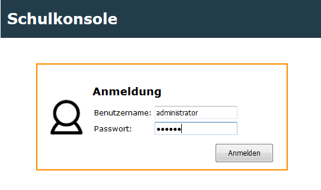
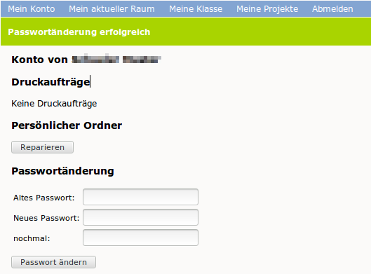

====================================
(v6.2) Ändern des eigenen Passwortes
====================================

Benutzernamen und Passwörter werden in der linuxmuster.net zentral verwaltet, d.h. Sie können sich an den Computern, an der Schulkonsole und in Horde mit dem selben Passwort anmelden.
Um Ihr Passwort zu ändern melden Sie sich mit Ihrem Benutzernamen (bestehend aus Kleinbuchstaben und event. Zahlen) und dem aktuellen Passwort an der Schulkonsole an.

Geben Sie unter „Passwortänderung“ nochmals Ihr aktuelles Passwort ein, sowie zweimal das neue Passwort.
Beachten Sie die Anforderungen an das neue Passwort:

  * Nicht alle Sonderzeichen können verwendet werden. Folgende Zeichen
    funktionieren **nicht**:

    .. code::

       ä ö ü ß { } [ ] + # 

    Folgende Sonderzeichen dürfen ebenso nicht verwendet werden:

    .. code::

       $ & !

Darüberhinaus können bei Ihrer Schule folgende Einschränkungen gelten:

  * Die Mindestlänge des Passwortes sind 6 Zeichen. (Mindestlänge kann der Netzwerkberater vorgeben).
  * Das Passwort muss mindestens zwei unterschiedliche Zeichenklassen
    enthalten. Zeichenklassen sind Großbuchstaben, Kleinbuchstaben,
    Zahlen und Sonderzeichen. (Abschaltbar vom Netzwerkberater).

    Beispielsweise sollte das Passwort dann aus Groß- und
    Kleinbuchstaben oder Zahlen und Kleinbuchstaben bestehen, etc.

.. 
   Meine Tests wiedersprechen der bisherigen Doku (z.B. im Basiskurs), dass

   ::

      äöüß$&{}![]+#

   verboten wäre.
   Tatsäclhich funktioniert aber

   ::
      
      $&!
   
   Im Ticket #134 http://www.linuxmuster.net/flyspray/task/134  haben wir das erörtert.
   Ticket zur Lokalisierung: http://linuxmuster.net/flyspray/task/552
   Status quo schließt: http://www.linuxmuster.net/flyspray/task/597
    
Das erfolgreiche Ändern des Passwortes wird mit einer grünen Leiste unterhalb der Menüleiste bestätigt.

Falls die Änderung nicht erfolgreich war erhalten Sie eine Fehlermeldung mit einem Hinweis auf den Fehler.

.. image:: media/04.png

In dieser Beispielfehlermeldung bestand das Passwort nur aus Kleinbuchstaben.

