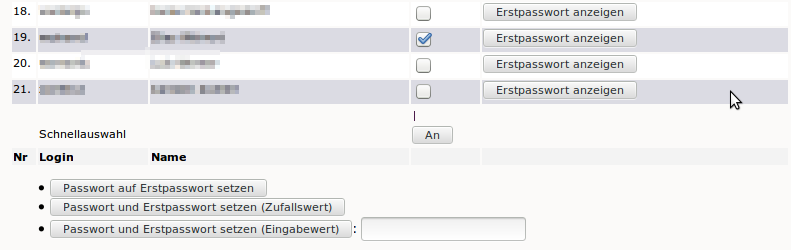
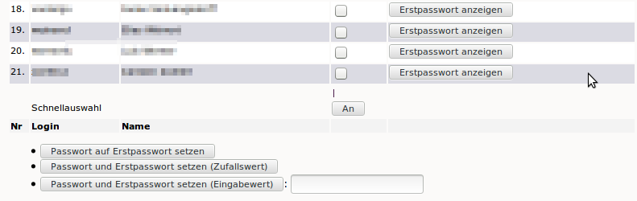

.. _howto-change-student-passwords-label:

==============================================
Schüler-Passwörter zurücksetzen und ausdrucken
==============================================

Vergisst ein Schüler sein Passwort, kann jede Lehrkraft das Passwort des Schülers über die Schulkonsole auf das Erstpasswort [#f1]_ zurücksetzen. Dieses teilen Sie dem Schüler mit.

.. [#f1] Die Bezeichnung **Erstpasswort** bezieht sich dabei immer auf
	 das zeitlich neueste über die Schulkonsole vergebene
	 Passwort, also entweder das vergebene Passwort beim Anlegen
	 des Schülers durch den Administrator oder das aktuellste
	 Passwort, das eine Lehrperson über die Schulkonsole vergeben
	 hat.

Dazu melden Sie sich an der Schulkonsole wie im Handbuch :ref:`schulekonsole-admin-label` beschrieben an.
Wählen Sie unter „Klassen” den Menüpunkt „Passwörter“.

.. image:: media/01.png

Wählen Sie nun Ihre Klasse aus indem Sie auf die Klassenbezeichnung klicken.

.. note:: 

   Falls Ihre Klasse nicht in der oberen Liste (im Beispiel: 10b)
   auftaucht, müssen Sie sich zunächst in die Klasse eintragen. Wählen
   Sie dazu im Dropdown-Menü die Klasse aus und klicken anschließend
   auf "Eintragen".

   .. image:: media/02.png

Setzen Sie hinter dem vergesslichen Schüler den Haken und scrollen Sie auf das Ende der Seite. 
Unterhalb der Liste können Sie unter "Schnellauswahl" mit dem Knopf
"An" auch alle Schüler auswählen, wenn Sie allen das Passwort
zurücksetzen wollen.

Klicken Sie nun ganz unten auf dieser Seite auf

Passwort auf Erstpasswort setzen
  um das Passwort auf dessen Erstpasswort zurückzusetzen,

Passwort und Erstpasswort setzen (Zufallswert)
  um dem Schüler ein neues zufälliges Erstpasswort zuzuteilen und sein
  Passwort darauf zu setzen,

Passwort und Erstpasswort setzen (Eingabewert):
  um dem Schüler ein von Ihnen gewähltes Passwort als Erstpasswort
  zuzuweisen.  Diese Eingabe ist nicht dafür geeignet, dass der Schüler
  sein dauerhaftes Passwort setzt, weil das Erstpasswort nicht
  verschlüsselt abgespeichert wird und somit nicht geheim ist.

	   
Die Seite wird neu geladen. Klicken Sie neben dem Schülernamen auf „Erstpasswort anzeigen“.

Teilen Sie das angezeigte Erstpasswort dem Schüler mit der Aufforderung mit, es in der Schulkonsole zu ändern.

.. image:: media/05.png

.. important::

   Weder Lehrer noch Administrator können vom Schüler geänderte
   Passwörter einsehen. Sie werden grundsätzlich verschlüsselt
   gespeichert.

Die kompletten Anmeldekärtchen der Klasse können als *PDF*-Datei ausgedruckt oder als *CSV*-Datei heruntergeladen und mit einem 
Tabellenkalkulationsprogramm weiterverarbeitet werden. 

Weiterführende Informationen
============================

Weitere Informationen zum Thema finden Sie

  * im Handbuch zur Schulkonsole im Abschnitt :ref:`schulkonsole-teacher-user-label` 
