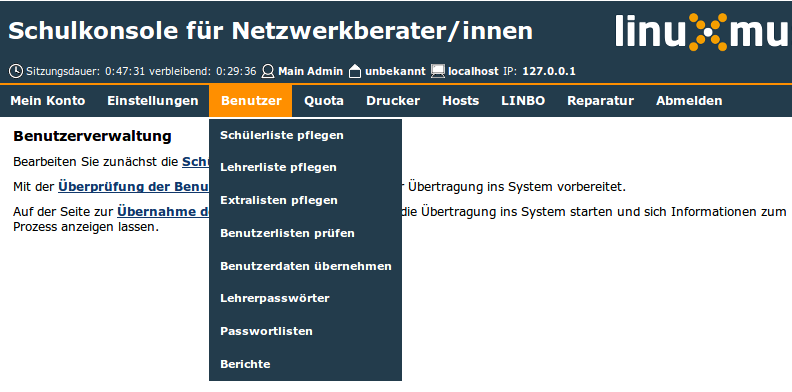
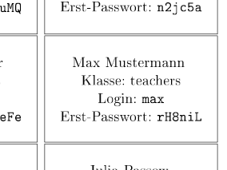

.. _howto-change-teacher-passwords:

=============================================
Lehrer-Passwörter zurücksetzen und ausdrucken
=============================================

Melden Sie sich wie im Handbuch :ref:`schulekonsole-admin-label`
beschrieben an der Schulkonsole als ``administrator`` an.

Der Administrator hat in der *Schulkonsole* im Menü unter *Benutzer* ->
*Lehrerpasswörter* die gleichen Möglichkeiten für die Passwörter der
Lehrer, wie die Lehrer für die Passwörter der Schüler.

.. important::

   Der Administrator kann vom Lehrer geänderte Passwörter nicht
   einsehen. Sie werden grundsätzlich verschlüsselt gespeichert.

Passwortliste herunterladen und ausdrucken
==========================================

Laden Sie die komplette Passwortliste als PDF zum Ausdrucken herunter
oder als CSV-Datei zur Weiterverarbeitung.

Die PDF-Datei bietet kleine Rechtecke zum Ausschneiden und Austeilen
an die Lehrer an.
In der CSV-Datei werden die selben Informationen in Tabellenform angeboten.

Passwörter zurücksetzen
=======================

Wählen Sie in der Liste durch Setzen eines Häkchens den oder die
Lehrer aus, deren Passwort Sie zurücksetzen wollen.

.. figure:: media/teacher-passwords-row.png

Unterhalb der Liste können Sie unter "Schnellauswahl" mit dem Knopf
"An" auch alle Lehrer auswählen, wenn Sie allen das Passwort
zurücksetzen wollen.

Wählen Sie nun ganz unten auf dieser Seite

Passwort auf Erstpasswort setzen
  um das Passwort auf dessen Erstpasswort zurückzusetzen,

Passwort auf Erstpasswort setzen (Zufallswert)
  um dem Lehrer ein neues zufälliges Erstpasswort zuzuteilen und sein
  Passwort darauf zu setzen,

Passwort auf Erstpasswort setzen (Eingabewert):
  um dem Lehrer ein von Ihnen gewähltes Passwornt als Erstpasswort
  zuzuweisen.  Diese Eingabe ist nicht dafür geeignet, dass der Lehrer
  sein dauerhaftes Passwort setzt, weil das Erstpasswort nicht
  verschlüsselt abgespeichert wird und somit nicht geheim ist.

Erstpasswort anzeigen
=====================

Um ein einzelnes Passwort anzeigen zu lassen, drücken Sie in der Reihe
des entsprechenden Lehrers auf den Knopf "Erstpasswort anzeigen".

Weiterführende Informationen
============================

Weitere Informationen zum Thema finden Sie

  * im Handbuch zur Schulkonsole im Abschnitt :ref:`schulkonsole-admin-user-label`
