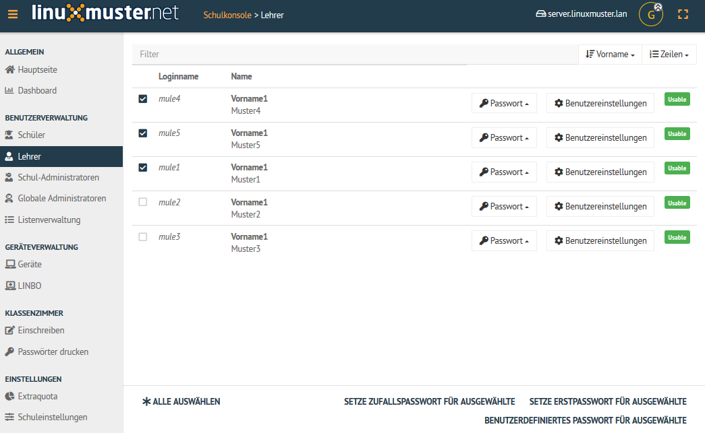
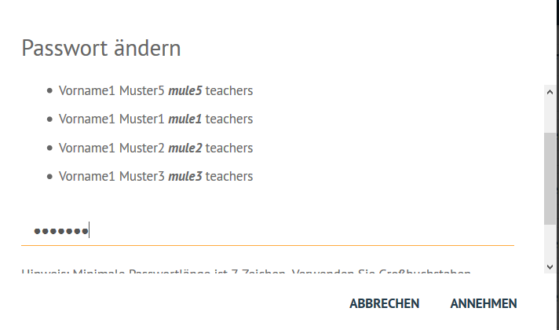
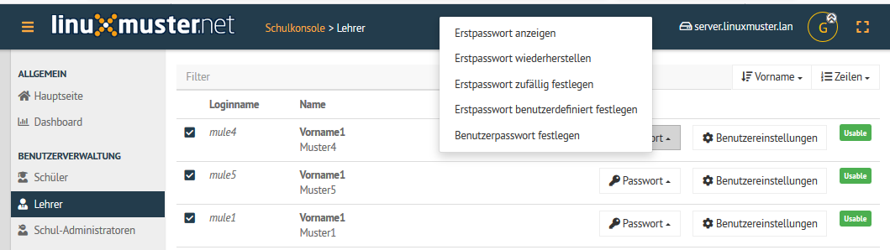
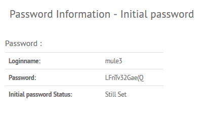
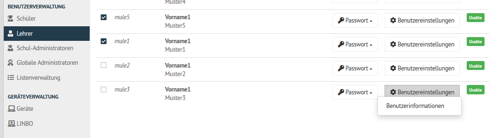
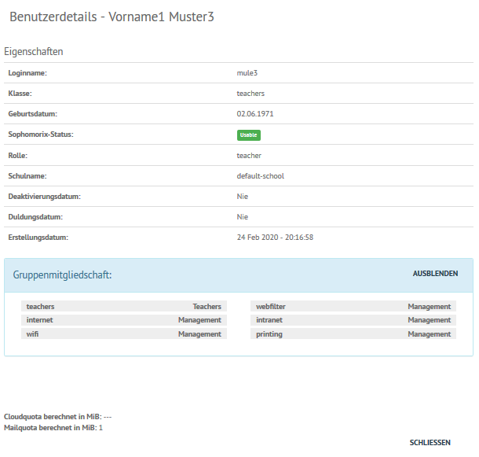

.. _howto-change-teacher-passwords:

==============================
Lehrer-Passwörter zurücksetzen
==============================

.. sectionauthor:: `@cweikl <https://ask.linuxmuster.net/u/cweikl>`_

Im Schulalltag tritt für den Netzwerkbeauftragten häufiger die Anforderung auf, einem oder mehreren 
Lehrern ein neues Kennwort zuzuweisen, oder ggf. allen neu angelegten Lehrern ein identisches 
Erstkennwort zuzuweisen, das diese nach der Erstanmeldung wieder ändern müssen.

Um für Lehrer Kennwörter neu zu setzen, melden Sie sich an der Schulkonsole als ``global-admin`` an.
Klicken Sie im Menü Benutzerverwaltung auf den Eintrag ``Lehrer``. Sie sehen dann alle derzeit im System
angelegten Lehrer-Accounts.

Bei der Ersteinrichtung der Lehrer erhalten diese i.d.R. ein Zufallskennwort als Erstkennwort. Um für Lehrer
das Kennwort neu zu setzen, markieren Sie die gewünschten Lehrer, indem Sie die Checkbox der Betreffenden auswählen.
Sollten alle Lehrer ein neues Kennwort bekommen, so können Sie unten den Eintrag ``Alle auswählen`` klicken, dann
wird bei allen Lehrern ein Auswahlhäkchen gesetzt.

Optionen für das Zurücksetzen
-----------------------------

Für die ausgewählten Lehrer haben Sie nun drei Optionen, um das Kennwort neu zu setzen:

1) **Setze Erstpasswort für Ausgewählte**: Diese Option setzt das Kennwort der ausgewählten Lehrer auf das Erstkennwort zurück, das diesen bei der Ersteinrichtung zugewiesen wurde. Von Lehrern geänderte Kennwörter werden so auf ein vom System gesetztes Erstkennwort zurückgesetzt.

2) **Setze Zufallspasswort für Ausgewählte**: Für die ausgewählten Lehrer wird per Zufallsverfahren ein neues Kennwort erstellt und diesen zugewiesen. Jeder Lehrer erhält so ein eigenes Zufallskennwort, was bisherige Kennworteinträge zurücksetzt.

3) **Benutzerdefiniertes Passwort für Ausgewählte**: Mit dieser Option kann für alle ausgewählten Lehrer ein vom Netzwerkbetreuer vorgegebenes Kennwort gesetzt werden, wodurch alle bisherigen Kennworteinträge auf das neu definierte Kennwort zurückgesetzt werden. Sollen alle neu eingerichteten Lehrer z.B. das Kennwort ``Muster!`` erhalten, was diese nach der Erstanmeldung ändern müssen, so hilft diese Option dabei für alle Lehrer ein identisches Kennwort vorzugeben.

Benutzerdefiniertes Passwort für Ausgewählte
--------------------------------------------

Haben Sie die Option 1.) oder 2.) geklickt, so sehen Sie nun eine Statusmeldung mit grüner Schrift, dass das ``Erstpasswort gesetzt`` oder das ``Zufallspasswort festgelegt`` wurde.

Bei der Auswahl der Option ``Benutzerdefiniertes Passwort für Ausgewählte`` erscheint danach ein Kontrollfenster, in dem alle ausgewählten Lehrer angezeigt werden. Zudem finden Sie in diesem Fenster ganz unten eine Eingabezeile zur Definition des von Ihnen festzulegenden Kennwortes. Hier müssen Sie je nach Anzahl der Ausgewählten nach unten scrollen, um die Eingabezeile zu sehen.

Danach verfügen alle ausgewählten Lehrer über das angegebene Kennwort.

Dies können Sie auch über den Aufruf einzelner Lehrer, wie nachstehend beschrieben, kontrollieren.

Einzelne Lehrer
---------------

In der Schulkonsole können Sie in der Benutzerverwaltung im Menü ``Lehrer`` als ``global-admin`` alle
im System eingerichteten Lehrer-Accounts einsehen.

Um nun einzelne Kennworter zurückzusetzen, Benutzerinformationen zu erhalten, oder stichprobenartig einzelne 
Kennwörter zu prüfen (z.B. nach dem Zurücksetzen vieler ausgewählter Lehrer) nutzen Sie hier pro Lehrer die Untermenüs des
Eintrags ``Passwort`` oder das Untermenü zu dem Eintrag ``Benutzereinstellungen``.

Klicken Sie auf den Eintrag ``Password``, erscheint ein Untermenü bei dem Sie mehrere Optionen für das Erstpasswort haben. Zudem
git es die Option, ein ``benutzerdefiniertes Passwort festzulegen``.

Wählen Sie den Eintrag Erstpasswort anzeigen aus, so erscheinen nachfolgende Informationen für den jeweiligen Lehrer:

Die weiteren Einträge sind analog zu o.g. Erklärungen zu nutzen.

Für jeden Benutzer gibt es bei der Einrichtung des Benutzer-Accounts immer ein Erstkennwort und später zusätzlich ein vom
Benutzer festgelegtes Kennwort. Entsprechend müssen Sie für das Zurücksetzen der Kennwörter die hierfür gewünschten 
Optionen auswählen.

Für jeden Benutzer können Sie die die ``Benutzerinformationen`` anzeigen lassen.

Klicken Sie auf ``Benutzereinstellngen``.

Wähle dann das Untermenü ``Benutzerinformationen`` aus. Es erscheinen dann für den jeweiligen Benutzer die zugehörigen 
Informationen, die im System erfasst sind. Hierzu gehören auch seine Gruppenzugehörigkeiten.

Es ist u.a. ersichtlich, ob der Account aktiviert ist, oder ob ein Duldungszeitraum für den Benutzer greift.

 
