.. _howto-manage-quota-label:

==================================================
Festplattenplatz für Benutzer einschränken (Quota)
==================================================

.. sectionauthor:: `@cweikl <https://ask.linuxmuster.net/u/cweikl>`_

Alle Benutzer im System dürfen Daten auf dem Server abspeichern. Es
kann also vorkommen, dass Schüler und Lehrer so viele Daten
abspeichern, dass der Festplattenplatz des Servers aufgebraucht ist, was
bis zur Einstellung des Betriebes führen kann. Außerdem kann eine übermäßige
Beanspruchung des Plattenplatzes des Servers auch via Internet z.B. durch
E-Mail-Bombing erfolgen.

Um dies zu verhindern, sollten Sie als Netzwerkbetreuer die Nutzung des 
Festplattenplatzes durch einzelne Nutzer oder Gruppen kontrollieren und beschränken.

Hierzu werden auf dem linuxmuster.net Server die sog. Quotas aktiviert. Dies erfolgt
bei der Ersteinrichtung automatisch. Für jede Partition auf die Quotas angewendet werden,
finden sich folgende Dateien:

.. code::

   -rw-------  1 root root 7.0K Feb 24 15:18 aquota.group
   -rw-------  1 root root 8.0K Feb 24 15:18 aquota.user

Zunächst ist zu prüfen, welcher Festplattenplatz - verteilt über die veschiedenen Partitionen -
zur Verfügung steht. Danach ist zu planen, welche Obergrenzen zur Belegung des Festplattenplattes pro 
Lehrer, Schüler und Schuladministrator festgelegt werden sollen. Danach kann ggf. eine individuelle 
Änderung der Quotas für einzelne Benutzer z.B. für einige Lehrer, die umfangreiches Material ablegen 
müssen, erfolgen.  

.. hint::

   Es ist darauf zu achten, dass die Summe der vergebenen „Quotas” nicht die Kapazität der 
   Festplatten des Servers übersteigt.

Quotavorgaben erstellen
-----------------------

Um die Quotas für alle Benutzer der Gruppen Lehrer, Schüler und Schuladministratoren in gleicher
Weise vorzugeben, melden Sie ich an der Schulkonsole als ``global-admin`` an.

Gehen Sie im Menü der Schulkonsole unter dem Menüpunt ``Einstellungen`` auf 
``Schuleinstellungen -> Reiterkarte Quota``. 

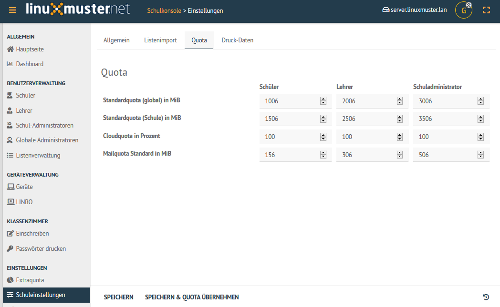

Hier legen Sie nun die gewünschten Quotas für die Benutzer der Gruppen Schüler, Lehrer und
Schuladministratoren fest. Die Angaben sind in der Einheit ``MiB`` vorzunehmen.

Danach müssen Sie die neuen Vorgaben anwenden, indem Sie die Option ``Speichern & Quota übernehmen`` auswählen.
Es öffnet sich ein neues Konsolenfenster, das den Verlauf der Anwendung der neuen Quotas darstellt. Ist
der Vorgang abgeschlossen, sehen Sie im Konsolenfenster einen Eintrag wie ``12 users smbquotas updated``.

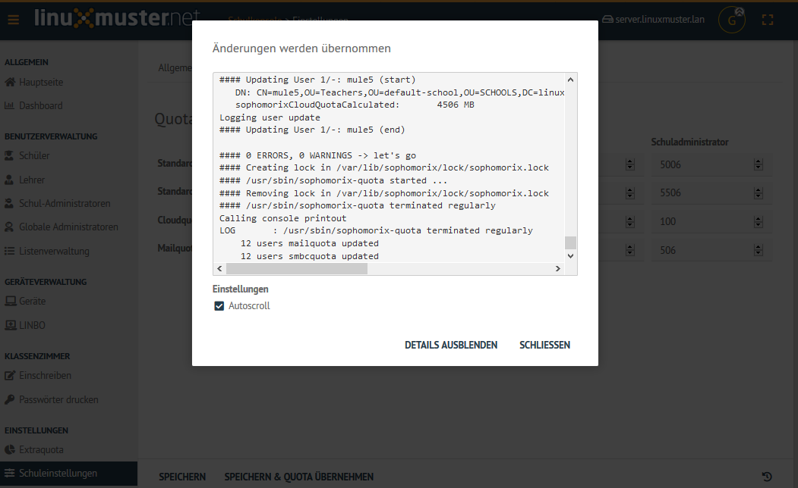

Quotas kontrollieren
--------------------

Nachdem die Änderungen angewendet wurden, sehen Sie die neuen Quotas in der Übersicht ``Schuleinstellungen -> Quota``.

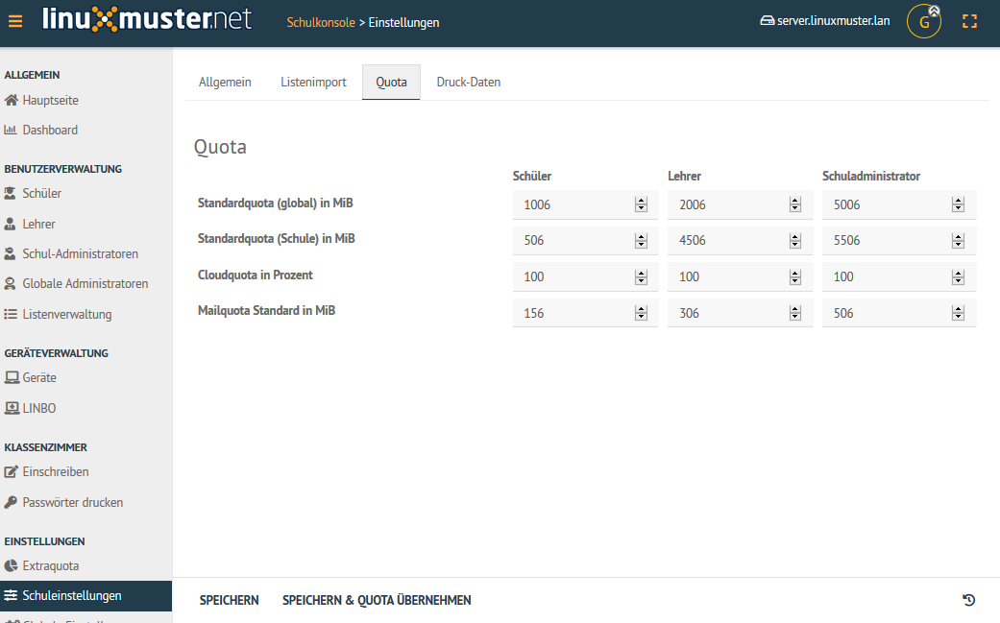

Die Quotas können Sie nun pro Benutzer kontrollieren. 

Hierzu wählen Sie im Menü der Schulkonsole im Bereich der Benutzerveraltung die Gruppe der Benutzer, 
für die Sie Quotas kontrollieren möchten.

Haben Sie z.B. für die Lehrer eine neue Quota-Richtlinie angewendet, so wählen Sie das Menü ``Lehrer`` aus und
klicken für einen exemplarischen Benutzer den Eintrag ``Benutzereinstellungen -> Benutzerinformationen``.
Es erscheint ein Fenster, in dem Informationen zum Benutzer dargestellt werden. Am unteren Rand des Fensters
werden ebenfalls die Cloud- und die Mail-Quotas, die für diesen Benutzer greifen, dargestellt. 

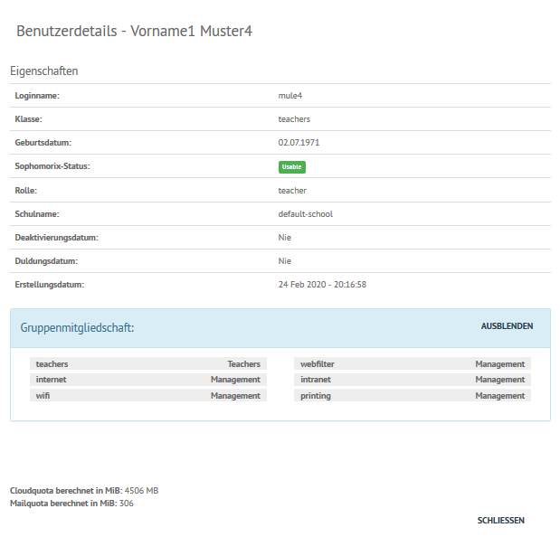

Gleiches können Sie auch für die Schüler durchführen, so dass Sie identische Informationen sehen.

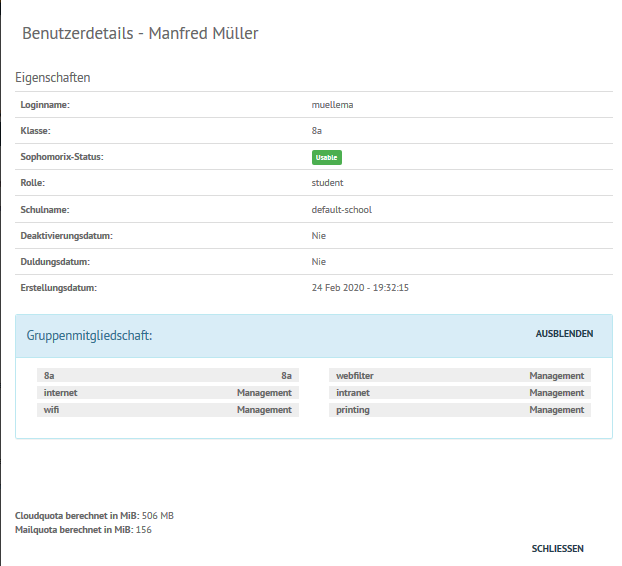

Quotas für einzelne Benutzer und Klassen anpassen
-------------------------------------------------

Haben Sie Quota-Vorgaben für die gesamte Schule vorgenommen, so können Sie nun diese für Sonderfälle oder
erforderliche Abweichungen anpassen.

Sind Sie als ``global-admin`` in der Schulkonsole angemeldet, so rufen Sie unter dem Punkt ``Einstellungen`` 
den Menüeintrag ``Extraquota`` auf.

Hier stehen zu Beginn i.d.R. keine Einträge. Sie können nun getrennt für einzelne Lehrer, Schüler, 
Schul-Administratoren, Klassen und Projekte gesonderte Quota-Vorgaben vornehmen, die die allgemeinen Vorgaben
für diese Benutzer überschreiben.

Lehrer
""""""

Haben Sie die Reiterkarte ``Lehrer`` gewählt, klicken Sie unten auf ``Search & add user``. Es erscheint ein
Konsolenfenster, in dem Sie einen Suchbegriff eingeben sollen, so dass passende Lehrer gefunden werden.

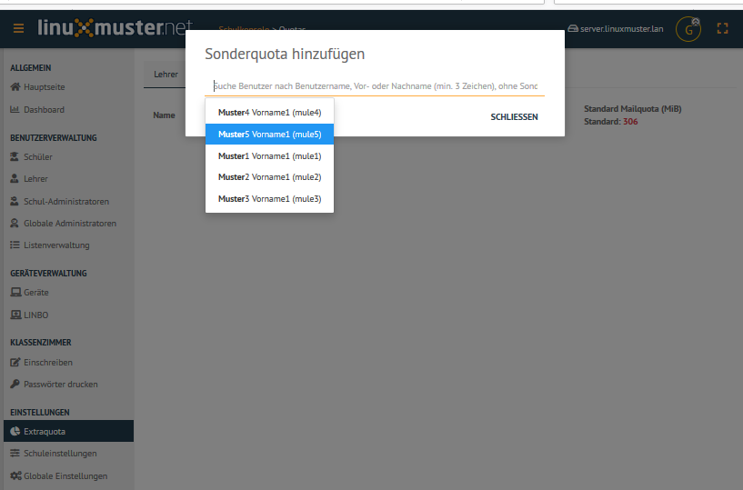

Wählen Sie aus der angezeigten Liste den gewünschten Benutzer aus und bestätigen Sie dies mit ``Schliessen``.

Danach sehen Sie in der Quota-Übersicht für Lehrer den Benutzer mit seinen bisherigen Quota-Eintragungen.

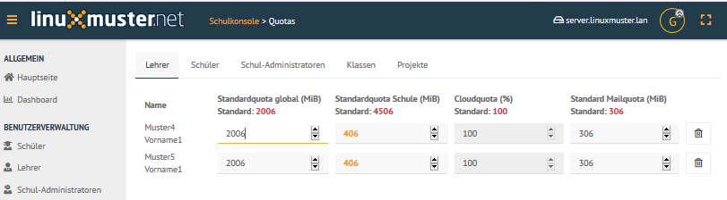

Passen Sie nun für die jeweiligen Benutzer, die Quotas wie gewünscht an. Änderungen gegenüber den bisherigen Vorgaben
werden farblich abgesetzt.

Schüler
"""""""

Haben Sie die Reiterkarte ``Schüler`` gewählt, klicken Sie unten auf ``Search & add user``. Es erscheint ein
Konsolenfenster, in dem Sie einen Suchbegriff eingeben sollen, so dass passende Schüler gefunden werden.

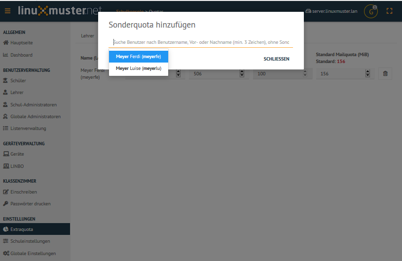

Wählen Sie aus der angezeigten Liste den gewünschten Benutzer aus und bestätigen Sie dies mit ``Schliessen``.

Danach sehen Sie in der Quota-Übersicht für Schüler den Benutzer bzw. die Benutzer mit seinen/ihren 
bisherigen Quota-Eintragungen.

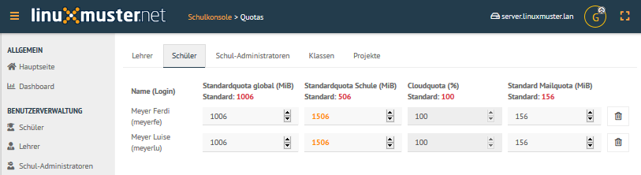

Passen Sie nun für die jeweiligen Benutzer, die Quotas wie gewünscht an. Änderungen gegenüber den bisherigen Vorgaben
werden farblich abgesetzt.

Klassen
"""""""

Um für Klassen Quota-Vorgaben zu erstellen bzw. klassenweise anzupassen, gehen Sie in der Schulkonsole unter ``Einstellungen``
auf ``Extraquota -> Klassen``. 

Es wird Ihnen dann eine Übersicht der im System vorhandenen Klassen angezeigt.

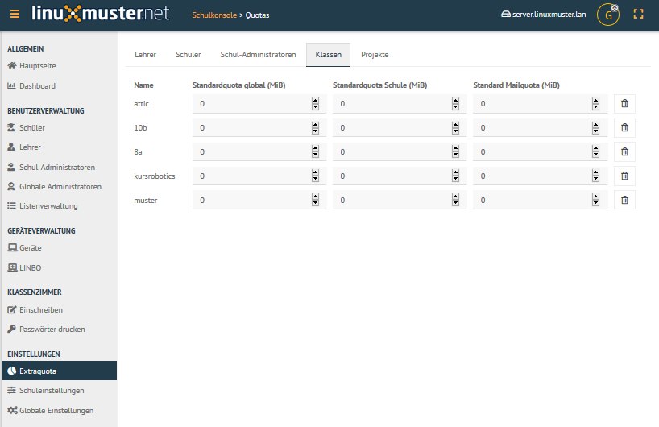

Nehmen Sie hier nun wie gewünscht die neuen Eintragungen für die Quotas der Klassen vor. Änderungen gegenüber den 
bisherigen Vorgaben werden farblich abgesetzt.

Extraquotas anwenden
""""""""""""""""""""

Um nun alle individuellen Anpassungen für Quota-Vorgaben von Lehrern, Schülern, Schul-Administratoren, Klassen und
Projekten vorzunehmen, wählen Sie unter ``Extraquota -> Reiterkarte -> Speichern & übernehmen``.

Danach erscheint ein Konsolenfenster, in dem die Anwendung der neuen Quotavorgaben dargestellt wird. Ist der Vorgang 
abgeschlossen, so erkennen Sie dies z.B. an Einträgen wie ``8 user smbquota updated``

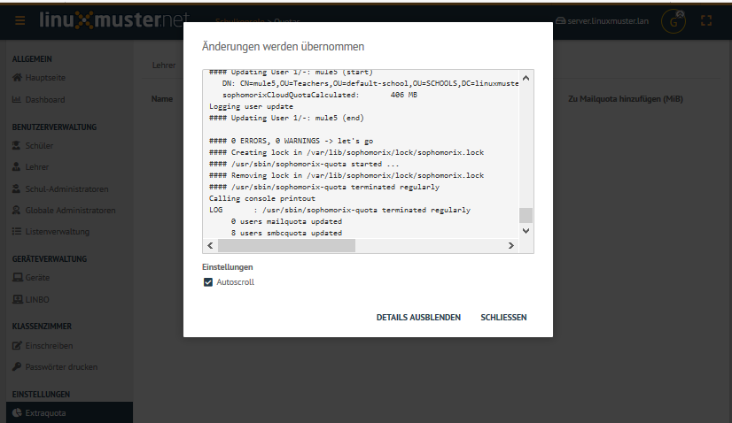

