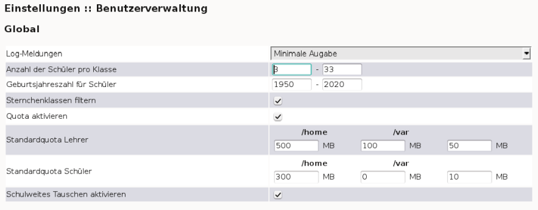

.. _howto-manage-quota-label:

=========================================================
(v6.2) Festplattenplatz für Benutzer einschränken (Quota)
=========================================================

Alle Benutzer im System dürfen Daten auf dem Server abspeichern. Es
kann also vorkommen, dass Schüler und Lehrer so viele Daten
abspeichern, dass der Festplattenplatz des Servers erschöpft ist, was
bis zur Einstellung des Betriebes führen kann. Außerdem kann das
„Vollmüllen“ des Servers auch vom Internet aus z.B. durch
E-Mail-Bombing erfolgen.

Einziger Ausweg: Sie beschränken ("quotieren") den Festplattenplatz
eines jeden Benutzers und achten darauf, dass die Summe der vergebenen
„Quota” nicht die Kapazität der Festplatten des Servers übersteigt.

Melden Sie sich wie im Handbuch :ref:`schulekonsole-admin-label`
beschrieben an der Schulkonsole als ``administrator`` an.

Standardeinstellungen ändern
============================

Im Abschnitt :ref:`manual-sk-admin-settings-user-label` des Handbuchs
zur Schulkonsole finden Sie eine Übersicht über alle
Einstellungsmöglichkeiten.

.. konsolenmodus

   Quota-Unterstützung ist auf dem Musterlösungsserver schon
   vorinstalliert. Die Zuteilung der Quota auf die einzelnen Benutzer
   wird von *Sophomorix* verwaltet.  Sie werden in der Datei
   ``quota.txt`` in ``/etc/sophomorix/user`` gespeichert.

Im Bereich Quotierung können Sie diese aktivieren (Standard) oder
deaktivieren. Ebenso können Sie für Schüler und Lehrer jeweils drei
Quotas angeben.

Ändern Sie die Einstellungen für ``/home``, dann beschränkt das den
Platz, den neue Lehrer oder versetzte Schüler auf ``Home_auf_Server``
bzw. unter ``H:\`` und ``Tausch_auf_Server`` bzw. unter ``T:\``
belegen können.

Ändern Sie die Einstellungen für ``/var``, dann beschränkt das den
Platz, den neue Lehrer oder versetzte Schüler auf
``Vorlagen_auf_Server`` bzw. unter ``V:\`` oder mit Dateien während
des Klassenarbeitsmodus belegen können.

Ändern Sie die Einstellungen in der dritten Spalte, dann beschränkt
das den Platz für Mails, die auf dem Server liegen.

.. attention::

   Wirksam sind die geänderten Werte erst nach einem Durchlauf zum
   *Anlegen/Versetzen/Löschen* von Benutzern. Auf das Quota
   bestehender Lehrer haben die Einstellungen keinen Einfluss.

.. konsolenmodus

   Der Benutzer administrator kann sich auf der Kommandozeile mittels
   des Befehls
   ``quota <Benutzername>``
   die Übersicht für einen einzelnen Benutzer anzeigen lassen.

Ändern von einzelnen Lehrerquota
================================

Der Administrator hat in der *Schulkonsole* im Menü unter *Quota* die
Möglichkeit, den Festplattenplatz für Lehrer und Schüler zu
beschränken.

.. image:: ../../appendix/school-console/admin/media/schulkonsole-quota.png

Benötigt ein Kollege mehr Platz, können Sie dessen Quota leicht über die *Schulkonsole* unter *Quota* -> *Lehrer* ändern:

.. image:: media/schulkonsole-quota-lehrer.png

Sind die Felder leer, gelten die Standardwerte. Mit einem Klick auf
die Schaltfläche *Änderungen übernehmen* werden die geänderten Werte
gleich gesetzt.

.. important::

   Beachten Sie auch, dass das gesetzte Quota immer für eine ganze
   Festplattenpartition auf dem Linux-Server gilt. Üblicherweise
   befinden sich alle Netzlaufwerke auf der selben Serverpartition
   ``/home``. Befindet sich z.B. das Kollegiumstauschverzeichnis auf
   der selben Serverpartition wie das Heimatverzeichnis ``H:``
   bzw. ``Home_auf_Server``, werden die Daten auf dem
   Tauschverzeichnis zum verbrauchten Plattenplatz hinzugerechnet.

   Ein Lehrer kann also auf allen Netzlaufwerken zusammen nicht mehr
   als das voreingestellte Quota belegen.

.. konsolenmodus
   in die Datei
   ``lehrer.txt`` übernommen und auch gleich gesetzt.

Ändern von Klassen- und Projektquota
====================================

Unter *Quota* -> *Klassen* können Sie die Quota für alle Schüler einer Klasse ändern.

Unter *Quota* -> *Projekte* können Sie zusätzliche Quota für alle Schüler eines Projektes vergeben.

Mit *Änderungen übernehmen* werden die geänderten Quotas in diesen beiden Fällen nicht in einer Datei abgelegt, sondern gleich in die
*Sophomorix*-Datenbank geschrieben und sind damit sofort gültig.

Sonderquota: Quota für Administratoren und einzelne Schüler
===========================================================

Mittels *Quota* -> *Sonderquota* in der *Schulkonsole* können Sie nun Quota für

*   einzelne Schüler,
*   Administratoren und
*   den max. für Homepages zur Verfügung stehenden Platz (Webspace)

festlegen.

Für den *Webspace* und die *Administratoren* können einfach die Werte überschrieben werden und dann mittels
*Änderungen übernehmen* gesetzt werden.

Für einzelne Schüler müssen Sonderquota erst neu angelegt werden,
indem der Login-Name und die gewünschten Quota eingegeben werden.
Nach einem Klick auf *Änderungen übernehmen* ist dann der Schüler in
einer Schülerliste unterhalb des Abschnitts für die Administratoren
aufgeführt.

Für bereits dort vorhandene Schüler können Sie einfach die Quotawerte überschreiben und dann mittels *Änderungen übernehmen* setzten.

.. important::

   Die obige wichtige Anmerkung gilt auch für Schüler: Befindet sich
   z.B. das Klassentauschverzeichnis eines Schülers auf der selben
   Serverpartition wie das Heimatverzeichnis ``H:``
   bzw. ``Home_auf_Server``, werden die Daten auf dem
   Tauschverzeichnis zum verbrauchten Plattenplatz hinzugerechnet.

   Ein Schüler kann also auf allen Netzlaufwerken zusammen nicht mehr
   als das voreingestellte Quota belegen.
