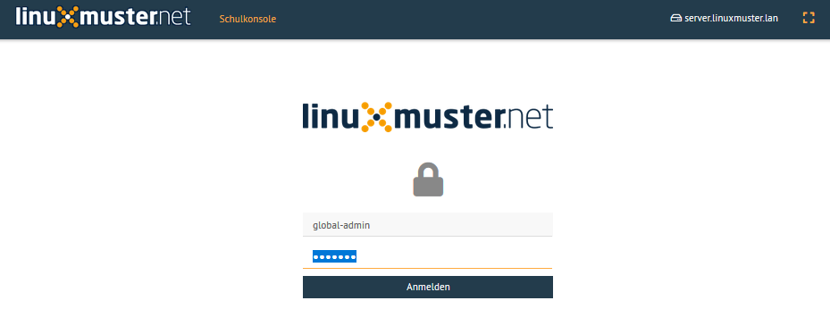
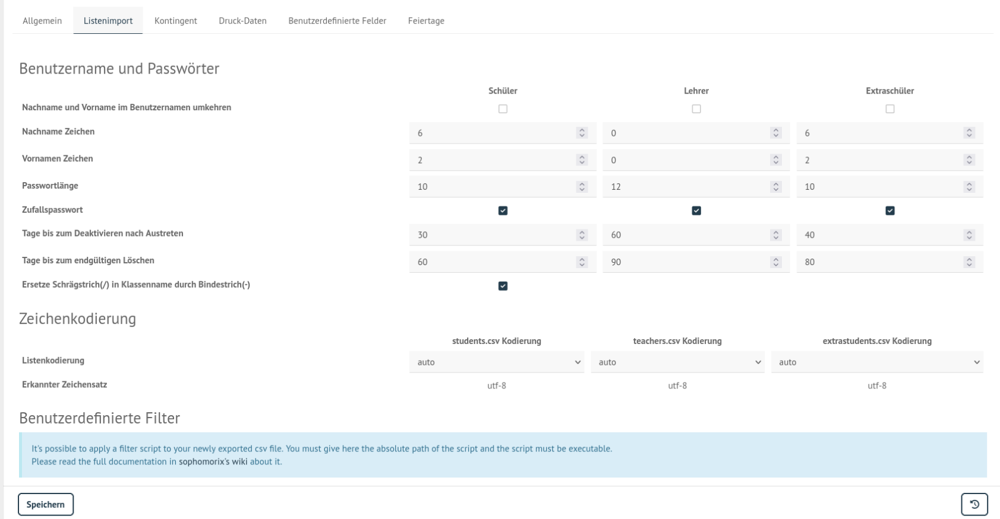
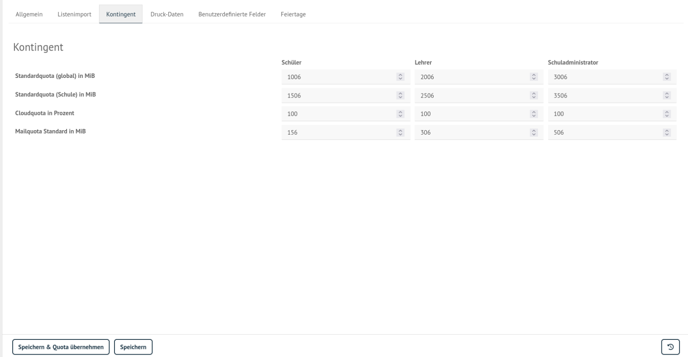
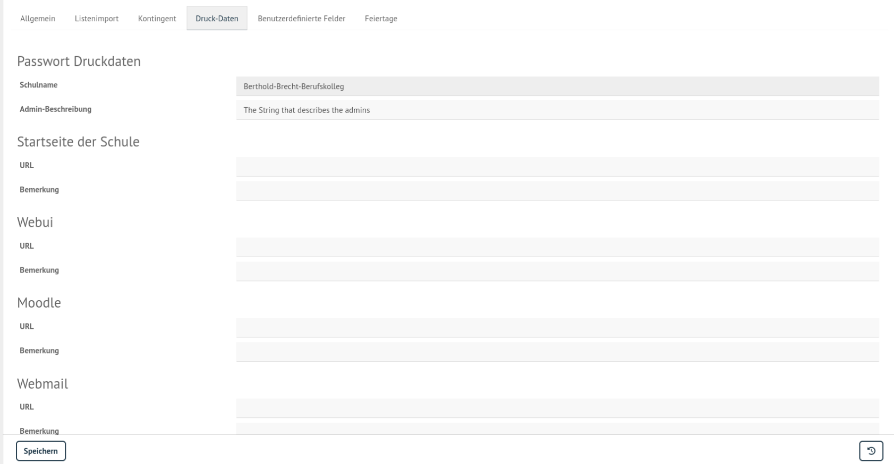

.. _commonworkflow-user-management:

Workflow zur Benutzerverwaltung
-------------------------------

.. sectionauthor:: `@cweikl <https://ask.linuxmuster.net/u/cweikl>`_

Die Benutzerverwaltung erfolgt in der aktuellen linuxmuster.net Version
mithilfe der Schulkonsole. Diese wiederum greift auf dem Server auf die 
Benutzerverwaltung `sophomorix4` zu, die konsolenorientiert das Benutzermanagement 
mithilfe von geeigneten Befehlen durchführt. Das Zusammenspiel folgt einem 
ausgearbeiteten Workflow. Dieser kann unter nachstehendem Link mit allen 
Details nachvollzogen werden: https://github.com/linuxmuster/sophomorix4/wiki/Workflows

Nachfolgend beschränken sich die Ausführungen auf die Grundlagen, die zum Verständnis 
und Durchführung der Benutzerverwaltung mithilfe der Schulkonsole erforderlich sind.

Der Ablauf zur Einrichtung von Benutzern verläuft wie folgt:

1) Hochladen einer CSV-Datei mit den Benutzern via Schulkonsole.
2) Speichern & prüfen der CSV-Datei.
3) Die Schulkonsole legt eine temporäre CSV-Datei an, die dann
   anhand von Kriterien geprüft wird. 
4) Verläuft der Prüfvorgang erfolgreich, so werden die Benutzer übernommen und
   es wird eine CSV-Datei geschrieben, die danach in der Schulkonsole im Editor 
   aufgerufen und geändert werden kann. Schritte 2 - 4 sind nach den Änderungen 
   erneut auszuführen.

Benutzergruppen in der linuxmuster.net
--------------------------------------

.. sectionauthor:: `@cweikl <https://ask.linuxmuster.net/u/cweikl>`_

Wenn man auf Dienste und Dateien des Servers zugreifen möchte, muss
man sich mit einem Benutzernamen (Loginname) und einem Kennwort
(Passwort) am Server anmelden (authentifizieren). Dabei sollen nicht
alle Benutzer am System auf die gleichen Dateien und Drucker zugreifen
oder an Dateien die selben Rechte haben können.

Es ist üblich, Benutzer, die gleiche Rechte haben sollen, zu
Benutzergruppen zusammenzufassen. In der *linuxmuster.net* gibt es,
angepasst auf Schulbedürfnisse, die folgenden Hauptbenutzergruppen 
(Schulkonsole):

*Schüler:*
Schüler sind Benutzer mit (halb)privatem Datenbereich. Es dürfen keinerlei
Systemdateien modifiziert werden.

*Lehrer:*
Lehrer sind Benutzer mit privatem Datenbereich. Es dürfen keine
Systemdateien modifiziert werden. Zusätzlich hat der Lehrer Zugriff
auf alle Klassentauschverzeichnisse und lesenden Zugriff auf die
Schüler-Homeverzeichnisse. Alle Lehrer können über die Schulkonsole
pädagogisch notwendige Aufgaben auf dem Server ausführen
(z. B. Dateien austeilen, Internetzugang abschalten)

*Schul-Administratoren:*
Dürfen alle für den reinen Schulbetrieb wichtigen Aufgaben am Server
durchführen. Diese Gruppe ist dann relevant, wenn ein Mehr-Schulbetrieb erfolgt,
da es dann pro Schule einen oder mehrere Administratoren gibt, die Vorgaben 
bzw. administrative Aufgaben getrennt nach Schule wahrnehmen.

*Globale Administratoren:*
Dürfen ohne Einschränkungen alle Aufgaben am Server via Schulkonsole
durchführen. Erfolgt kein Mehr-Schulbetrieb, so ist dies der eigentliche 
Administrator, der alle Einstellungen und administrative Tätigkeiten durchführt.

Konfigurationseinstellungen vor der Benutzeraufnahme
----------------------------------------------------

.. sectionauthor:: `@cweikl <https://ask.linuxmuster.net/u/cweikl>`_

Nach Installation des Servers solltest Du einige Konfigurationseinstellungen 
für Deine Schule festlegen.

Melde Dich an der *Schulkonsole* durch Eingabe von
https://10.0.0.1 in einen Browser als ``global-admin`` an. 

Listenimport
------------

Die für das Benutzermanagement relevanten Einstellungen können in der 
*Schulkonsole* im Menü unter *Einstellungen* -> *Schuleinstellungen* vorgenommen 
werden.

Hier legst Du fest, welche Vorgaben für den Listenimport von Benutzern mithilfe
von CSV-Dateien angewendet werden sollen. 

Für Schüler, Lehrer und Extra-Schüler können die Vorgaben getrennt eingestellt werden.
So können die Mindestanzahl an Zeichen für den Nachnamen, Vornamen und das Passwort 
vorgegeben werden.

Es kann festgelegt werden, ob beim Import ein Zufallskennwort pro Benutzer erstellt wird, 
oder ob ein Kennwort später in der Schulkonsole gesetzt wird. Zudem wird hier festgeschrieben,
wie mit Benutzern verfahren wird, die gelöscht werden sollen. Es wird hier mit einem
Duldungszeitraum gearbeitet, so dass für eine Übergangszeit diese Benutzer noch in dem System
in gesonderten Gruppen geführt und falls notwendig auch wieder reaktiviert werden können.

Zudem kann hier die Listenkodierung für die drei CSV-Dateien festgelegt werden, die genutzt
werden, um die Benutzer Schüler, Lehrer und Extra-Schüler aufzunehmen. Mit der Einstellung ``auto`` 
ist es möglich, dass die Schulkonsole das Kodierung (`encoding`) der Datei ermittelt und entsprechend anwendet.
Eine Änderung der Voreinstellung ist nur in besonderen Fällen erforderlich.

Quota
-----

In der Schulkonsole können im Menü ``Einstellungen -> Schuleinstellungen -> Quota Vorgaben`` zur zulässigen 
Festplattenbelegung getrennt nach den Gruppen Schüler, Lehrer und Extra-Schüler vorgenommen werden. 
Hierdurch wird definiert, bis zu welcher Obergrenze ein Benutzer der jeweiligen Gruppen Dateien auf dem 
Server ablegen darf. Sollte diese Obergrenze erreicht werden, so werden weitere Speichervorgänge des Benutzers 
verhindert. Erst nachdem dieser Dateien und Verzeichnisse gelöscht hat, kann dieser weiter Daten auf dem 
Server ablegen. 

Zur Ermittlung des belegten Speicherplatzes werden alle Dateien des Benutzers über alle sog. Partitionen
hinweg gezählt. Dies bedeutet, dass der belegte Speicherplatz aller Dateien des Benutzers im Verzeichnis 
der Klasse oder Schule als auch Dateien in seinem eigenen Home-Laufwerk, das ebenfalls auf dem Server liegt,
ermittelt wird.

Werden die Quota-Einstellungen geändert, so sind diese mit ``Speichern & Quota übernehmen`` anzuwenden.

Druck-Daten
-----------

Für Klassen können PDF-Drucker erstellt werden, um den Schülerinnen und Schülern Login-Karteikarten
ausgeben zu können. Um festzulegen, welche Rahmendaten der Schule mitgedruckt werden sollen, können
diese im Menü  ``Einstellungen -> Schuleinstellungen -> Druck-Daten`` gesetzt werden.

Die Anpassungen sind mit ``Speichern`` zu übernehmen.

