.. _create-delete-users:

Anlegen, Versetzen und Löschen von Benutzern
--------------------------------------------

.. sectionauthor:: `@cweikl <https://ask.linuxmuster.net/u/cweikl>`_
 
Normalerweise werden an einem Linux-Server die Benutzer durch Aufruf
eines Programms angelegt, dem man den Benutzernamen des anzulegenden
Benutzers und die Gruppe mitteilt, in welche der Benutzer zugeordnet
werden soll.

Für eine Schule ist dieses Vorgehen nicht praktikabel, da meist
mehrere hundert bis einige tausend Schüler als Benutzer angelegt
werden müssen. Deshalb übernimmt bei der *linuxmuster.net* das
Programm *sophomorix4* diese Aufgabe.

*Sophomorix4* liest alle Schüler aus Text-Dateien ein, die aus dem
Schulverwaltungsprogramm der Schule bezogen oder von Hand mit Hilfe
eines Editors erstellt wurden. Anschließend werden alle Schüler dieser
Liste, die im System noch nicht vorhanden sind, *angelegt*, solche mit
einer neuen Klasse *versetzt* und nicht mehr aufgeführte Schüler im
System *gelöscht*.

Mit der *Schulkonsole* gibt es für den Netzwerkbetreuer ein
webbasiertes Werkzeug, das ihm die Bedienung von *sophomorix4* sehr
erleichtert. Die einzelnen Schritte werden im Folgenden erläutert. Der
Netzwerkbetreuer muss nur noch in Ausnahmefällen mit der Kommandozeile
arbeiten.

Um Benutzer neu aufzunehmen, zu versetzen oder zu löschen müssen die
folgenden Schritte nacheinander ausgeführt werden:

1) Schüler und Lehrerliste aus dem Schulverwaltungsprogramm exportieren.
2) Die Benutzerlisten auf dem Server aktualisieren. Dazu gehört im Einzelnen:

    a)  die Listen getrennt nach Schülern und Lehrern in das System übertragen,
    b)  evtl. eine Extraliste für Gast- und Kooperationsschüler, die nicht in das Schulverwaltungsprogramm aufgenommen werden, pflegen,
    c)  evtl. eine Extraliste für Kurse mit schulfremden Teilnehmern pflegen.

3) Alle Benutzerlisten auf Fehleingaben, oder Ähnlichkeiten mit vorhandenen Benutzern prüfen.
4) Danach evtl. die Benutzerlisten entsprechend korrigieren.
5) Benutzerdaten übernehmen, d.h. Benutzer jetzt tatsächlich anlegen, versetzen oder löschen
6) Passwortlisten bzw. Anmeldekärtchen ausdrucken

Änderung von Benutzerdaten
""""""""""""""""""""""""""

Sind Sie an der *Schulkonsole* als ``global-admin`` angemeldet, erhalten Sie unter der Rubrik *Benutzerverwaltung* die folgenden Menüpunkte:

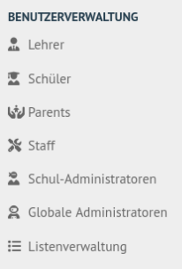

Export von Schüler- und Lehrerliste aus dem Schulverwaltungsprogramm
""""""""""""""""""""""""""""""""""""""""""""""""""""""""""""""""""""

Die meisten Schulverwaltungsprogramme bieten die Möglichkeit, eine Schüler- und eine Lehrerliste für die *linuxmuster.net* zu exportieren. Dabei werden die Daten mit dem benötigten Datensatzformat untereinander in eine Textdatei geschrieben. Für die Schülerliste gilt folgendes Format:

``Klasse;Nachname;Vorname;Geburtsdatum;Nr;``

``Class;Last name;First name;Birthday;ID;``

Dabei ist das letzte Feld optional. Es enthält die im Schulverwaltungsprogramm eindeutig vergebene Schülernummer. Ist sie vorhanden, sollte man sie unbedingt mit übernehmen, das sie die Identifikation des richtigen Datensatzes bei Versetzungen, Namensänderungen usw. erheblich erleichtert. Falls die Nummer nicht vorhanden ist, besteht jede Zeile nur aus den 4 Feldern

``Klasse;Nachname;Vorname;Geburtsdatum;``

``Class;Last name;First name;Birthday;``

Auch wenn Ihr Schulverwaltungsprogramm keine direkte Ausgabe für die Musterlösung vorsieht, können die Daten meist unter Angabe der benötigten Felder und mit dem Semikolon als Trennzeichen exportiert werden.

Für die CSV-Dateien sollte eine UTF-8 Kodierung verwendet werden. In den Voreinstellungen der Schulkonsole ist üblichweise eine
automatische Erkennng der Kodierung festgelegt.

.. hint::
 
   Die nachstehend dargestellten Benutzer sind alles *fiktive Testnutzer*, die nur zur Illustration eingetragen und auf den Screenshots 
   dargestellt werden. Es handelt um keine lebenden Personen. Die Daten dienen nur zu Test- und Dokumentationszwecken.

Pflege der Schülerdatei
"""""""""""""""""""""""

Die Schüler können Sie erstmals in das System aufnehmen, in dem Sie die vorbereitete students.csv Datei mithilfe der Schulkonsole
hochladen.

Gehen Sie hierzu in der Schulkonsole unter ``Benutzerveraltung`` in das Menü ``Listenverwaltung`` und klicken Sie auf die obere Reiterkarte 
``Schüler`` und dann unten auf den Eintrag ``CSV Laden``.

Es erscheinen dann schrittweise folgende Eingabefenster:

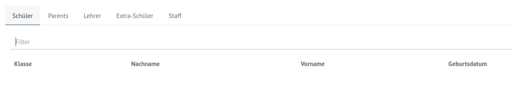

Es ercheint eine Warnmeldung, da der Upload einer neuen students.csv die bisherige Datei und damit deren Einträge überschreibt.

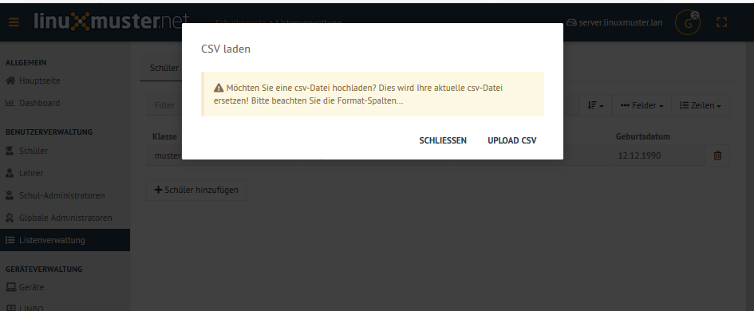

Nachdem Sie dies bestätigt haben, müssen Sie den Ort der hochzuladenden CSV-Datei angeben.

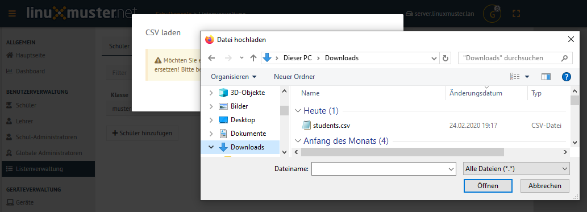

Haben Sie den Vorgang bestätigt, so wird nun die CSV-Datei überprüft und Sie sehen dann zur Kontrolle die ermittelten Klassen und Schüler:

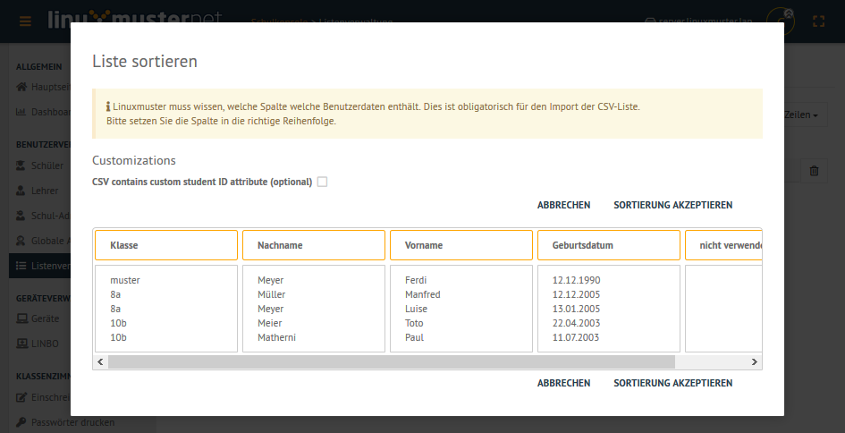

Falls erforderlich kann hier die Reihenfolge der Spalteneinträge noch angepasst werden. Zudem kann angegeben werden, ob die Datei
eine Schüler-ID verwendet.

Nach der Bestätigung der Sortierreihenfolge werden die Benutzer temporär importiert. Das Ergebnis wird Ihnen wie in der nachstehenden
Abbildung angezeigt.

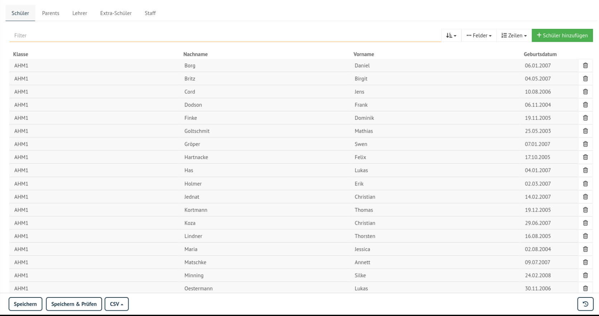

Entspricht dies dem gewünschen Import, so müssen Sie die Benutzer nun mithilfe des Eintrags ``Speichern & prüfen`` übernehmen.
Das Prüfergebnis wird Ihnen angezeigt und Sie müssen nun die Übernahme der neuen Benutzer bestätigen.

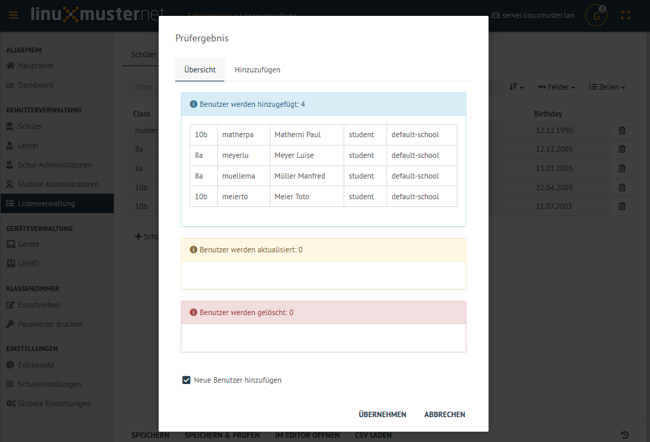

Nach der Bestätigung zur Übernahme der neuen Benutzer werden diese auf dem Server angelegt und eingerichtet. Nach Abschluss des 
Imports sehen Sie im dargestellten Konsolenfenster einen Eintrag wie ``4 users added`` - wir in der Abbildung zu erkennen ist.

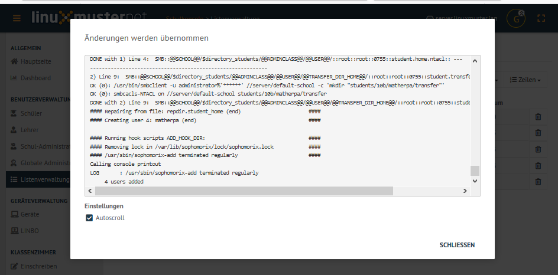

Die CSV-Dateien finden sich auf dem Server in folgendem Verzeichnis: ``/etc/linuxmuster/sophomorix/default-school``

Es gibt dort drei verschiedene CSV-Dateien:

- Schülerinnen und Schüler: students.csv
- Lehrerinnen und Lehrer: teachers.csv
- zusätzliche Nutzer: extrastudents.csv

Haben Sie die Benutzer angelegt, so können Sie später Änderungen auch direkt via Schulkonsle in der CSV-Datei vornehmen.
Wählen Sie hierzu im Menü ``Benutzerverwaltung -> Listenverwaltung -> Schüler -> Im Editor öffnen`` 

Es erscheint dann im Browser die CSV-Datei im Editiermodus, so dass Sie Ihre Anpassungen vornehmen können, diese 
speichern und danach auf ``speichern & prüfen`` gehen.

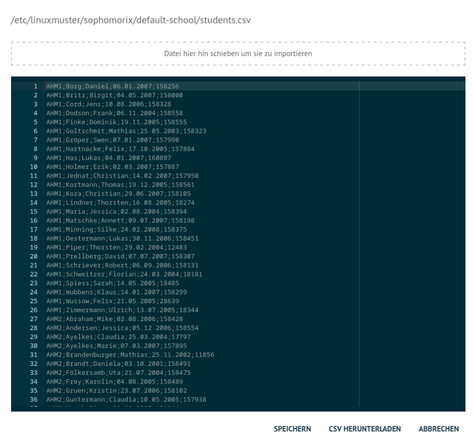

Pflege der Lehrerdatei
""""""""""""""""""""""

Für die Lehrer besteht die Möglichkeit, einen Wunschlogin-Namen anzugeben. Der Datensatz aus dem Schulverwaltungsprogramm wird also um ein Feld ergänzt. In der CSV-Datei muss kein Klassenname angegeben, dafür jedoch bei jedem Lehrer teachers vorangestellt werden. Es wird automatisch ein Import in die Gruppe ``Lehrer`` vorgenommen.

Das Format der Datei ``teachers.csv`` stellt sich wie folgt dar:

``teachers;Last name;First name;Birthday;Login;;;;;``

``Lehrer;Nachname;Vorname;Geburtsdatum;Wunschlogin;;;;;``

Von *sophomorix* werden noch die für einzelne Lehrer gesondert eingegebenen Quotas angehängt.

Aus diesem Grund macht es keinen Sinn, eine vorhandene Lehrerdatei mit derjenigen aus dem Schulverwaltungsprogramm zu überspielen, da Sie dann für alle Lehrer *Wunschlogin* und *Sonderquota* wieder neu eingeben müssten.

Der Import der teachers.csv erfolgt analog zu dem Vorgehen wie es zuvor bereits für die students.csv beschrieben wurde.

Rufen Sie im Menü unter der Benutzerverwaltung den Eintrag ``Listenverwaltung -> Lehrer -> CSV Laden`` auf.

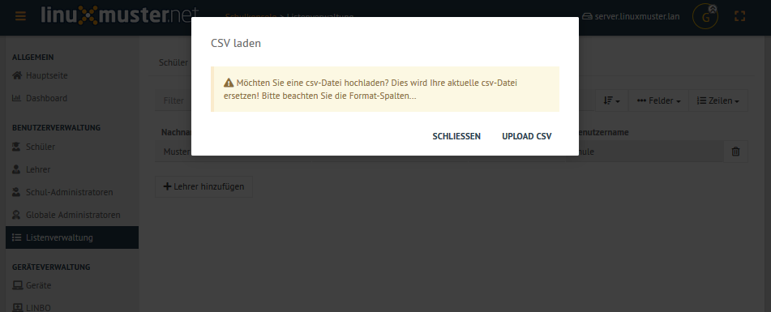

Danach wählen Sie dort den Dateinamen der hochzuladenden CSV-Datei aus.

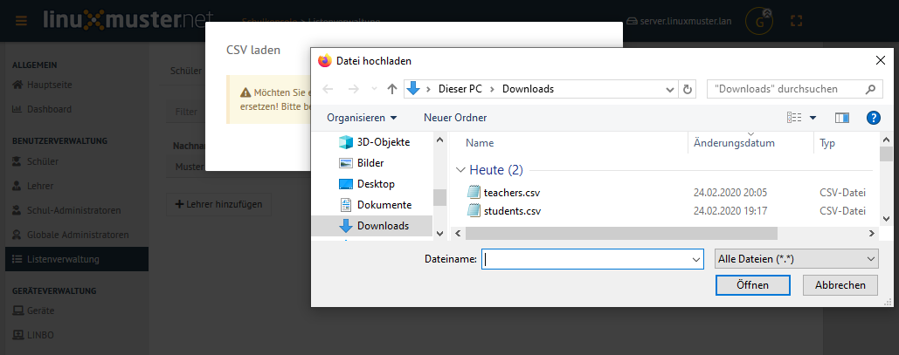

Die Einträge werden nun geprüft und das Prüfergebnis wird Ihnen angezeigt. Hier können Sie bereits falsche Spaltenzuordnungen oder eine
abweichende Spaltenreihenfole erkennen. Stimmt das dargestellte Ergebnis, so übernehmen Sie die Sortierreihenfolge.

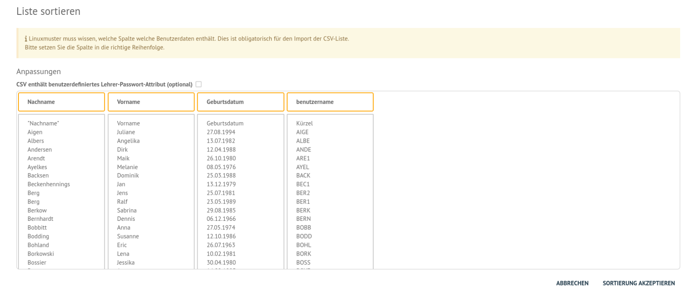

Nach dem Import der CSV-Datei werden die zu importierenden Lehrer wie folgt dargestellt:

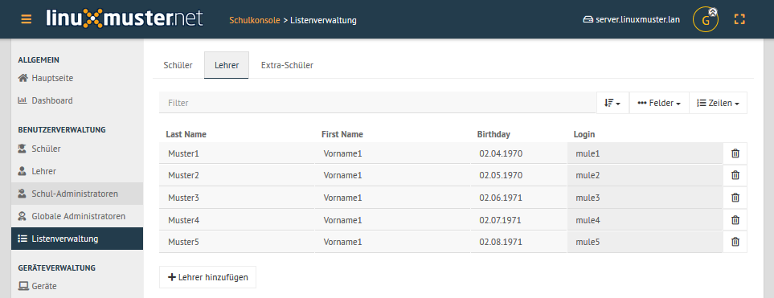

Klicken Sie nun auf ``Speichern & Prüfen``, um die importierten Lehrer dauerhaft in das System zu übernehmen. 
Es wird Ihnen dann vor der endgültigen Übernahme nochmals das Prüfergebnis dargestellt, aus dem hervorgeht, welche
Lehrer hinzugefügt, versetzt oder gelöscht werden.

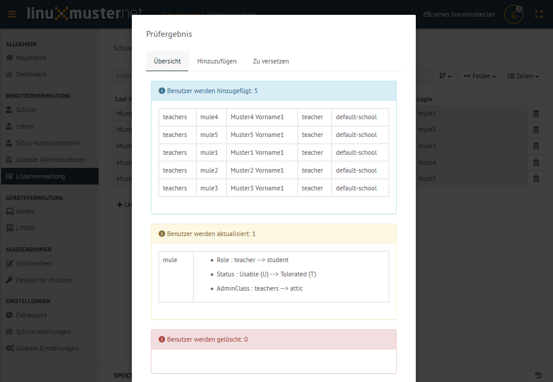

Nach der Bestätigung finden sich die Lehrer nun dauerhaft im System und werden wie folgt dargestellt: 

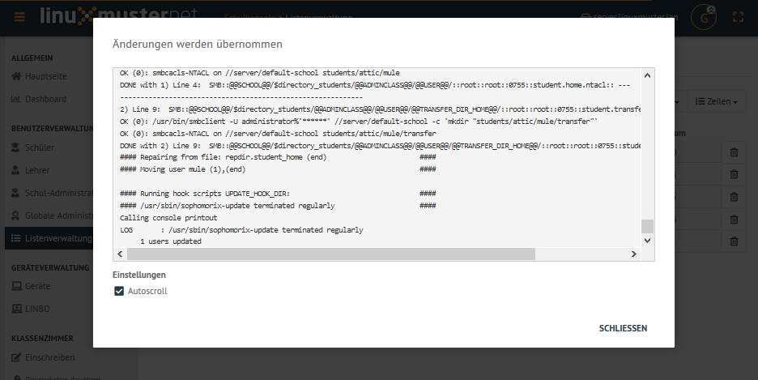

Pflege der Extraschüler
"""""""""""""""""""""""

Zur Verwaltung von Schülern, die nicht im Schulverwaltungsprogramm aufgenommen sind, gibt es in der *Schulkonsole* unter der Rubrik *Benutzerverwaltung* in der *Listenverwaltung* die Reiterkarte *Extra-Schüler*:

Im Bereich *Im Editor öffnen* können Schüler von Kooperationsschulen oder Austausch- bzw. Gastschüler eingegeben werden. 
Die Syntax ist wie bei der Schülerdatei, ergänzt um ein Feld für einen Wunschanmeldenamen:

``Class;Last name;First name;Birthday;Login;``

``Klasse;Nachname;Vorname;Geburtsdatum;Wunschlogin;``

Der Name für die Klasse ist frei wählbar, z.B: *koop* (für Kooperation) oder *at* (für Austausch). Es können aber, gerade auch bei Kooperationsschülern, die **bestehenden** Klassennamen verwendet werden. Dies ist wichtig, falls der Zugriff auf das Klassentauschverzeichnis der Klasse ermöglicht werden soll. Bei neuen Gruppennamen, wird auch ein neues Klassentauschverzeichnis angelegt.

Analog zu dem Import der CSV-Dateien für die Schüler und Lehrer erfolgt auh für die Extra-Schüler der Upload bzw. die Bearbeitung der Datei extrastudents.csv.

Die Benutzer werden wiederum mit ``Speichern & prüfen`` übernommen. Hierbei wird Ihnen wiederum das Prüfergebnis angezeigt:

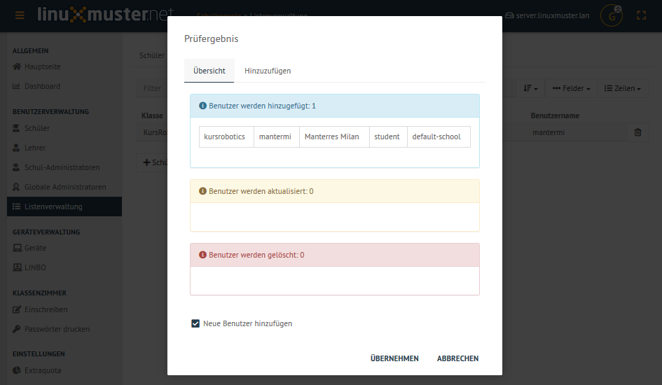

Nach dem Import sehen Sie in der dargestellten Konsole Hinweise wie ``1 users added``.

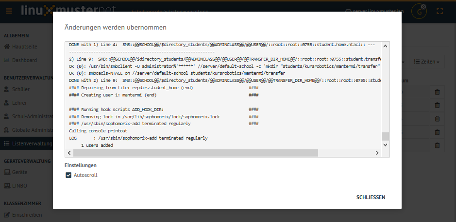

Die Extra-Schüler werden im System dann wie folgt dargestellt:

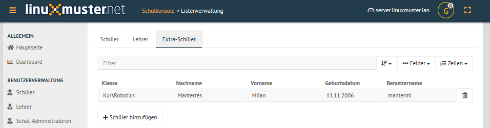

