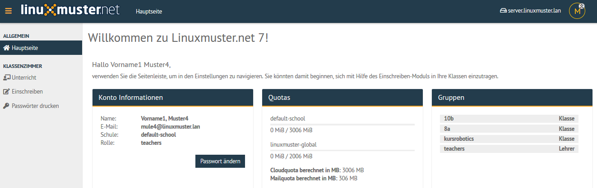
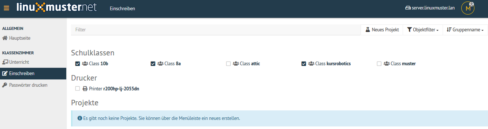
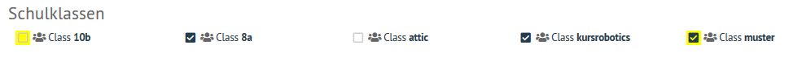
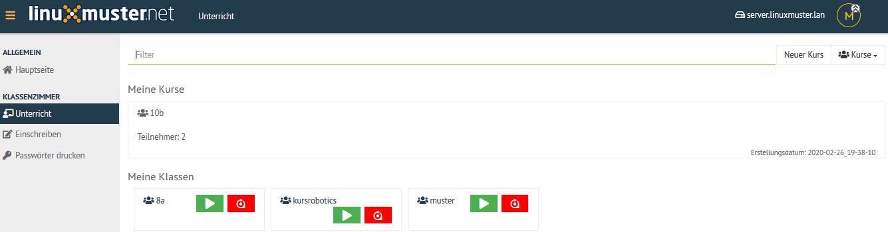

.. _linuxmuster-preparation-newterm-label:

=================================
Vorbereitung am Schuljahresanfang
=================================

.. sectionauthor:: `@cweikl <https://ask.linuxmuster.net/u/cweikl>`_

Klassenliste aktualisieren
--------------------------

Zu Schuljahresbeginn muss jeder Lehrer seine Klassenliste aktualisieren. Neu zu unterrichtende Klassen sind hinzuzufügen und nicht mehr unterrichtete Klassen sind auszutragen. Voraussetzung für die Zuordnung neuer Klassen ist, dass diese im linuxmuster.net System bereits existieren. Ihr Schuladministrator muss daher alle neuen Klassen- und Schülerdaten bereits aus der Schulverwaltung exportiert und in linuxmuster.net importiert haben.

Um die Klassenliste als Lehrer zu aktualisieren, erfolgt zunächst die Anmeldung in der Schulkonsole als Lehrer.

Klassenliste auswählen
----------------------

Um Klassenlisten zu aktualisieren, ist nach erfolgreicher Anmeldung als Lehrer das Menü ``Klassenzimmer -> Einschreiben`` auszuwählen. 

Jede Klasse, die dem Lehrer zugeordnet ist, ist mit einem Auswahlhäkchen markiert. Für Klassen, die nun dem Lehrer 
neu hinzugefügt werden sollen, ist das Häkchen vor der betreffenden Klasse zu setzen. Für Klassen, die im neuen 
Schuljahr nicht mehr dem Lehrer zugeordnet sein sollen, ist das Häkchen zu deaktivieren.

Danach sind die Änderungen unten auf der Seite mit ``Übernehmen`` dauerhaft anzuwenden.

Dies Änderungen stellen sich dann wie folgt dar:

Neue Anmeldung
--------------

Abschließend müssen Sie sich von Ihrem Client abmelden und wieder neu anmelden, damit die Netzlaufwerke korrekt zugeordnet werden.

Dies können Sie kontrollieren, indem Sie nach der erneuten Anmeldung mit dem Dateimanager prüfen, ob für die neue Klasse ein Tauschverzeichnis vorhanden ist.
