.. _howto-change-student-passwords-label:

==============================
 Schülerverwaltung als Lehrer
==============================

.. sectionauthor:: `@Tobias <https://ask.linuxmuster.net/u/Tobias>`_,

Als Lehrer hat man in der Schulkonsole mehrere pädagogische und
verwaltungstechnische Funktionen zur Verfügung.

Melde Dich an der Schulkonsole an, d.h. besuche mit dem Browser die
Webseite ``https://server.linuxmuster.lan`` oder die an Deiner Schule
äquivalent vom Administrator eingerichtete Seite und melde Dich mit
den Schulkontodaten an.

.. _student-management-overview-label:

Klassen, Projekte, Kurse - Einführung
=====================================

In der linuxmuster.net v7 gibt es zwei Kategorien von
Gruppierungen. Klassen und Projekte sind Gruppierungen,

- denen Schüler automatisch angehören (Klassen) oder denen sie
  angehören durch Anlegen eines Lehrers (Projekte)
- die einen Tauschordner besitzen
- über die eine Zuordnung auch außerhalb der lmn7 möglich ist (z.B. Nextcloud, Moodle)

Kurse dagegen sind Gruppierungen,

- die jeder Lehrer selbst anlegt
- die für Unterrichtsfunktionen wie Teilen/Einsammeln/Klassenarbeit verwendet werden
- die zum Zurücksetzen der Passwörter durch Lehrer verwendet werden

Es werden meist beide Kategorien für den täglichen Umgang benötigt. 

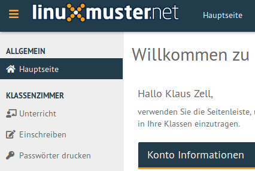

Solange ein Lehrer nur den automatisch angelegten Tauschordner der
Klasse verwenden will, muss er keine Kurse einrichten. Die
Konfiguration findet sich unter `KLASSENZIMMER/Einschreiben`.

Sobald ein Lehrer die Unterrichtsfunktionen verwenden will, die über
einen Tauschordner hinausgehen, muss er einen Kurs anlegen und die
gewünschten Schüler hinzufügen. Die Konfiguration findet sich unter
`KLASSENZIMMER/Unterricht`.

.. _password-printing-label:

Passwörter der Schüler ausdrucken
=================================

Für ein klassenweises Ausdrucken der Erstpasswörter gibt es einen
zusätzlichen Menüpunkt in der Schulkonsole. Unter dem Menüpunkt
`KLASSENZIMMER/Passwörter drucken` wähle aus der Liste aller Klassen
die entsprechende aus.

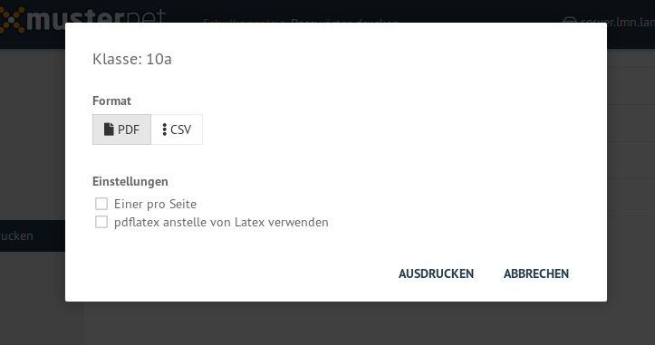

Das resultierende PDF enthält Benutzername und Erstpasswort aller
Schülerinnen und Schüler der Klasse und kann so ausgeteilt werden.

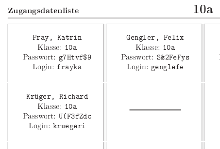

.. _class-and-projectmanagement-label:

In Klassen einschreiben und Projekte anlegen
============================================

Die folgende Anleitung brauchst Du dann, wenn Du mit einer gesamten
Schulklasse oder einem Teilnehmer einer Teilgruppe von Schülern
Dateien über einen gemeinsamen Ordner bearbeiten willst oder diese
Gruppierung in einer externen Anwendung gemeinsam ansprechen willst
(z.B. Nextcloudgruppe oder Moodlegruppe). Für alle
Unterrichtsfunktionen benötigst Du dagegen einen Kurs, siehe nächsten
Abschnitt.

In Klassen einschreiben
-----------------------

Unter ``KLASSENZIMMER/Einschreiben`` klicke auf die Klasse, der du
angehören willst. Die Veränderung wird gelb hinterlegt
angezeigt. Bestätige alle Änderungen mit ``ÜBERNEHMEN``, das sich am
unteren Ende der Seite befindet.

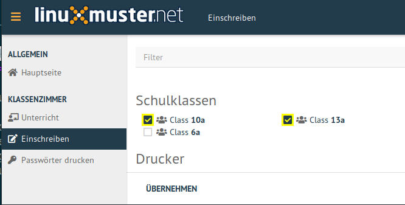

Das Austragen aus einer Klasse funktioniert analog mit Entfernen des
Hakens und Übernehmen der Änderung.

Projekte erstellen und beitreten
--------------------------------

Unter ``KLASSENZIMMER/Einschreiben`` klicke in der oberen Leiste auf
``Neues Projekt``.

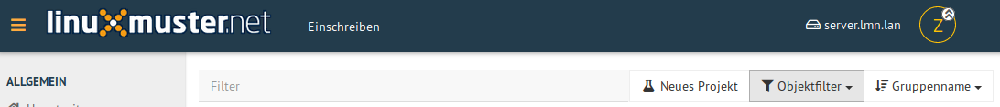

In dem sich öffnenden Eingabefeld kann der Projektname mit kleinen
Buchstaben (a-z, keine Umlaute oder Sonderzeichen) und Zahlen (0-9)
festgelegt werden. Die Schulkonsole meldet zurück, wenn das Projekt
erfolgreich erstellt wurde und es erscheint in der Liste der Projekte.

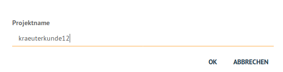

:fixme: Rest der Erstellung der Projekte

.. _session-setup-label:

Unterrichtskurs einrichten
==========================

Die folgende Anleitung brauchst Du für alle Unterrichtsfunktionen
(außer dem Tauschordner) und dafür musst Du nicht in der Klasse
eingeschrieben sein.

Unter ``KLASSENZIMMER/Unterricht`` klicke auf ``Neuer Kurs`` und gib
dem Kurs einen Namen. Im Kurs können sowohl Schülerinnen und Schüler
einer Klasse als auch verschiedener Klassen zusammengestellt
werden. Der Kurs ist auch nur für Dich sichtbar und verwendbar.

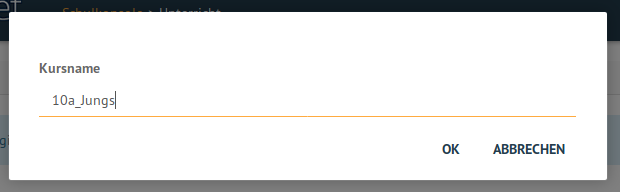

Der Kurs taucht nun in der Auflistung mittig auf. Klicke ihn an, er
ist zunächst leer. In der ersten Zeile kannst Du nun bei `Schüler
hinzufügen` einzelne Schülernamen eingeben oder bei `Klasse
hinzufügen` Klassennamen eingeben.

Die Schulkonsole beschränkt während der Eingabe die möglichen Benutzer
oder Gruppen des Systems und zeigt sie an. Klicke auf die angebotene
Gruppe (z.B. hier: `10a`) um die entsprechenden Benutzer hinzuzufügen.

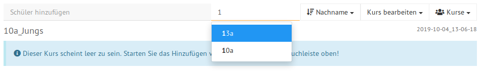

Die Schüler werden nun aufgelistet und können bei Bedarf über das
Symbol des Mülleimers einzeln aus der Liste wieder entfernt werden.

Ist die Liste vollständig klicke unten rechts auf `SPEICHERN &
ÜBERNEHMEN`.

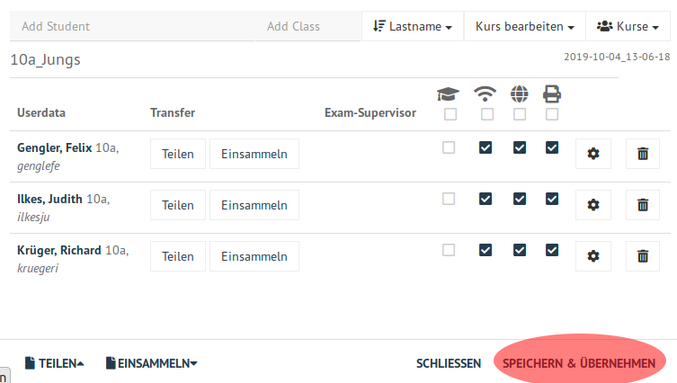

Rechts oben wird das erfolgreiche Speichern mit einem grünen Haken
zurückgemeldet.

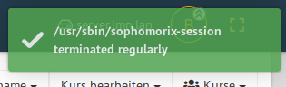

Der Kurs kann später an dieser Stelle auch umbenannt oder gelöscht
werden.

Folgende Unterrichtsfunktionen können jetzt genutzt werden:

- :ref:`exam-and-transfer-label`
- :ref:`classroom-access-control-label`

Passwörter zurücksetzen
-----------------------

Vergisst ein Schüler sein Passwort, kann jede Lehrkraft das Passwort
des Schülers über die Schulkonsole auf das Erstpasswort zurücksetzen
und dies dem Schüler mitteilen. Voraussetzung für die Passwortänderung
ist die Aufnahme des Schülers in einen Kurs. 

Öffne in der Schulkonsole unter ``KLASSENZIMMER/Unterricht`` den
angelegten Kurs.

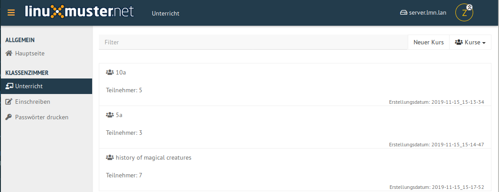

Die Liste mit Schülern des Kurses wird angezeigt. Klickst Du auf das
Zahnradsymbol in der Zeile des Schülers im Kurs, erscheinen die
Möglichkeiten

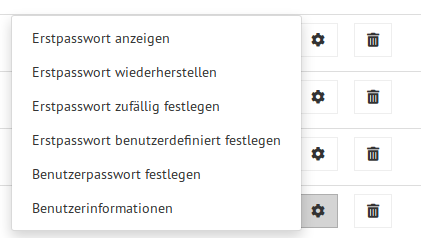

.. important:: 

   Das **Erstpasswort** ist ein Passwort, dass beim Anlegen des
   Schülers durch den Administrator oder durch eine Lehrperson in der
   Schulkonsole gesetzt wurde. Das Erstpasswort wird auch im Klartext
   gespeichert und ist daher nicht für die dauerhafte Verwendung
   geeignet. Die Schüler müssen es selbst ändern.

   Das **Benutzerpasswort** also das geheime vom Schüler geänderte
   Passwort kann weder von Lehrer noch Administrator eingesehen
   werden.  Diese Passwörter werden grundsätzlich nur verschlüsselt
   gespeichert.

Klicke auf
	  
Erstpasswort anzeigen
  um das aktuelle Erstpasswort anzuzeigen

Erstpasswort wiederherstellen
  um das Passwort des Schülers (wieder) auf das Erstpasswort
  zurückzusetzen

Erstpasswort zufällig festlegen
  um dem Schüler ein zufälliges neues Erstpasswort zu erzeugen und zu
  setzen

Erstpasswort benutzerdefiniert festlegen
  um dem Schüler ein selbstgewähltes neues Erstpasswort zu erzeugen
  und zu setzen. Der folgende Dialog enthält einen Hinweis auf die
  Komplexitätsregeln des Passworts.

Benutzerpasswort festlegen
  um direkt das Passwort des Schülers festzulegen. Das Erstpasswort
  wird dabei nicht geändert. Diese Option bietet sich an, wenn der
  Schüler selbst hier sein geheimes Passwort eingeben kann. Der
  folgende Dialog enthält einen Hinweis auf die Komplexitätsregeln des
  Passworts.

Nach Setzen des Erst- oder Benutzerpasswortes muss *nicht* mit
`SPEICHERN & ÜBERNEHMEN` abgeschlossen werden.

